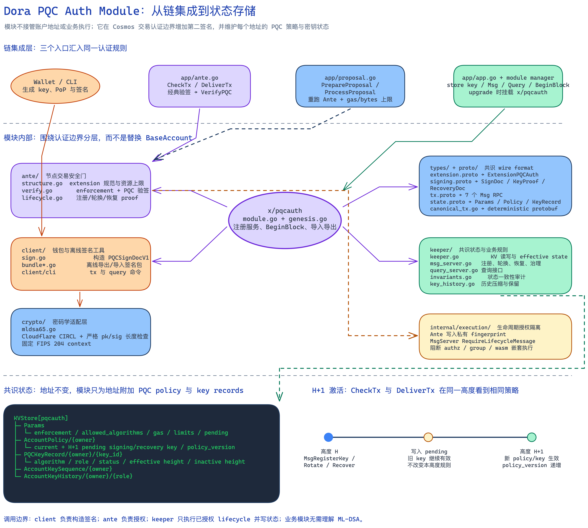
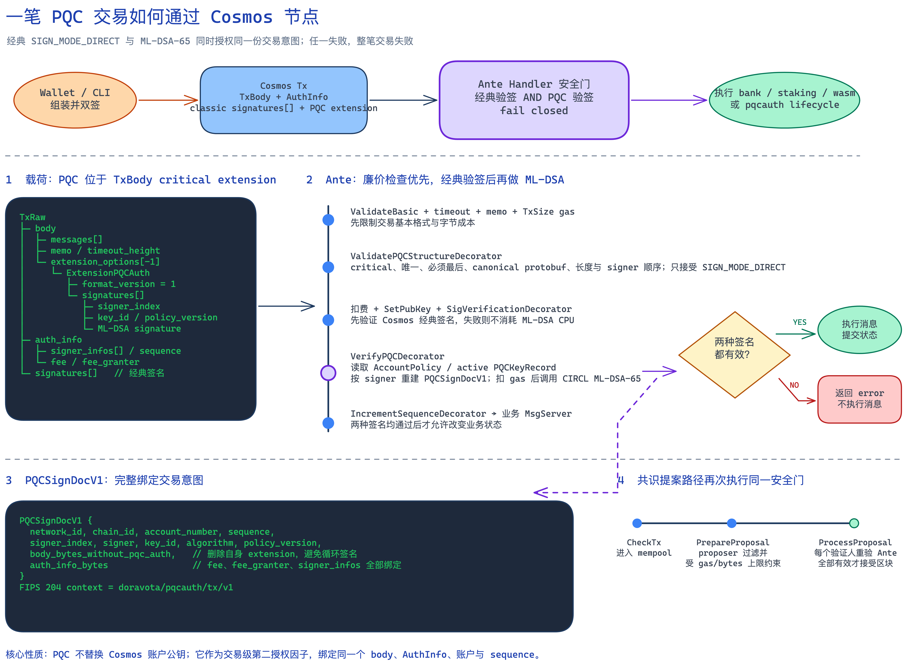

# 在运行中的 Cosmos 链上增加后量子交易认证

区块链的密码学迁移有一个很现实的难题：算法可以升级，但用户已经持有的地址、资产和使用习惯不能推倒重来。

Dora PQC Auth Module 的目标，就是在不改变现有 Dora 地址的前提下，为交易增加一个后量子签名因子。用户仍然用原来的 Cosmos 账户发起交易，但已经启用保护的账户必须同时给出经典签名和 ML-DSA-65 签名：

```text
经典 Cosmos 签名 AND ML-DSA-65 签名
```

它不是要一次性把整条链替换成一种全新的密码学系统，而是先解决最贴近用户资产的一层问题：**谁有权发出这笔交易。**

## 一、背景与痛点：为什么需要一个 PQC Module

### 1. 经典账户面临的长期风险

Cosmos 链上的普通账户通常使用 secp256k1。它依赖椭圆曲线离散对数问题，而足够强的量子计算机理论上可以用 Shor 算法破坏这类假设。

这并不意味着量子攻击已经可以发生，也不意味着所有账户今天处在同一风险等级。一个只接收资产、从未发出交易的新地址，链上通常只出现公钥哈希，风险相对较低；账户一旦发出过交易，公钥会随交易公开，未来攻击者便有更长的时间针对这个公钥。即便是新账户，第一次花费时也必须公开公钥，因此还存在公钥进入 mempool 后的短时暴露窗口。

真正需要提前准备的原因，是密码学迁移不可能在风险出现后的一天内完成。链端、钱包、浏览器、交易所、托管服务和硬件设备都要支持新的密钥与签名流程，用户也需要时间完成注册和备份。

2024 年，NIST 正式发布 [FIPS 204](https://csrc.nist.gov/pubs/fips/204/final)，将 ML-DSA 标准化为后量子数字签名算法。标准化让区块链项目可以从“研究哪种算法”进入“如何安全迁移”的工程阶段。

### 2. 对一条已经运行的 Cosmos 链，问题不只是换算法

如果从创世块开始设计一条新链，可以直接让地址由 PQC 公钥派生。但 Dora 已经有持续运行的经典账户体系。直接把 `BaseAccount` 的公钥替换成 ML-DSA 会带来一连串兼容性问题：

- 公钥变化会影响地址推导，原地址与原资产不能自然延续；
- Keplr、Ledger、交易所和现有 SDK 不会自动理解新的账户类型；
- 多签、authz、feegrant、CosmWasm 和 IBC 等组合路径都要重新检查；
- PQC 公钥和签名明显更大，交易大小、区块容量、验签 CPU 与 gas 都要重新定价；
- 如果强制切换过快，尚未升级钱包的用户会被锁在链外。

因此，我们面对的核心问题不是“能否验证一枚 ML-DSA 签名”，而是：

> 如何让同一个经典 Dora 地址逐步获得 PQC 保护，同时保持资产、地址和大部分 Cosmos 业务模块不变？

## 二、Cosmos 社区和其他区块链正在做什么

下面列的是截至 2026 年 8 月具有代表性的公开工作。它们大致分成三条路线：从创世开始使用 PQC、在现有交易上叠加或预留新签名能力、先保护某个特定协议层。

### 1. Cosmos 生态

Cosmos SDK 本身提供了可插拔公钥类型、Ante Handler 和交易扩展等基础能力，但较长时间没有一套统一的“经典账户原地址迁移”方案。

[Cosmos SDK v0.55](https://github.com/cosmos/cosmos-sdk/releases/tag/v0.55.0) 已经迈出重要一步：其 [changelog](https://github.com/cosmos/cosmos-sdk/blob/v0.55.0/CHANGELOG.md) 明确加入 ML-DSA-65 的用户账户密钥、交易签名与验签、keyring 恢复，以及验证者共识密钥和共识密钥轮换。这说明 PQC 已经进入 Cosmos SDK 的正式密码学能力范围。

不过，“支持一种新的账户公钥类型”与“给已经存在的经典地址增加第二签名因子”是两个不同的问题。前者更适合新账户或愿意迁移地址的用户；后者还需要独立处理原地址绑定、分阶段启用、恢复机制和旧钱包兼容。

[QoreChain](https://github.com/qorechain/qorechain-core) 则展示了另一种 Cosmos 应用链思路：在 `x/pqc` 中管理 PQC 状态，通过交易扩展携带 ML-DSA-87 签名，并提供 disabled、optional、required 等模式。它与我们的方向相近，都把 PQC 认证放在交易层，而不是要求 bank、staking 等模块分别改造。

### 2. 其他区块链的代表性路线

| 项目 | 已有工作 | 与本方案的主要区别 |
|---|---|---|
| [QRL](https://docs.theqrl.org/what-is-qrl/) | 从创世开始使用基于哈希的 XMSS 账户签名；每个 OTS 索引只能使用一次 | 原生 PQC 地址体系，不需要处理一条经典账户链的原地址升级，但钱包要管理有状态的一次性签名索引 |
| [Algorand](https://dev.algorand.co/concepts/protocol/state-proofs/) | State Proof 参与者使用 Falcon 密钥，为链历史生成量子安全证明 | 重点保护跨链/轻客户端验证的历史证明，不等同于把每个普通用户交易改为 PQC 签名 |
| [Bitcoin BIP-360](https://github.com/bitcoin/bips/blob/master/bip-0360.mediawiki) | 提议 P2MR 输出，移除易受长期暴露攻击的 key-path spend | 目前仍是 Draft，主要解决长期暴露；BIP 自己也说明短时暴露仍可能需要真正的 PQC 签名 |
| [Ethereum EIP-8197](https://eips.ethereum.org/EIPS/eip-8197) / [EIP-8052](https://eips.ethereum.org/EIPS/eip-8052) | 分别讨论密码学敏捷交易格式和 Falcon 验签预编译 | 仍处于提案阶段，重点是为 EVM 提供可插拔签名格式或高效验签原语，不是现成的账户迁移流程 |

这些工作说明，并不存在一条适用于所有链的唯一迁移路线：新链可以原生使用 PQC；已有链更倾向于先增加密码学敏捷性或混合认证；有些链则先保护共识、轻客户端或跨链证明。

对 Dora 来说，最重要的约束是保留现有地址和资产。因此我们选择的是**附加式、混合双因子认证**。

## 三、为什么这样设计，以及模块如何运作

### 1. 核心设计：不替换账户，而是为账户绑定第二把钥匙

`x/pqcauth` 不修改 `BaseAccount` 中的经典公钥，也不改变 Dora 地址。它另外保存某个地址对应的 PQC 公钥与保护策略。注册后，一笔受保护交易必须通过两套独立验证：

```text
经典私钥证明“我是这个 Dora 地址的控制者”
                    AND
ML-DSA 私钥证明“我持有该地址登记的 PQC Signing Key”
```

只拿到经典私钥或只拿到 PQC 私钥，都不足以单独转移资产。这样既保留了 Cosmos 账户兼容性，也避免在初始阶段把安全性完全押在一种新算法或一套新钱包实现上。

### 2. 为什么使用交易扩展和 Ante Handler

PQC 签名写入 `TxBody.extension_options` 中唯一的 critical extension：

```text
/doravota.pqcauth.v1.ExtensionPQCAuth
```

“Critical” 的含义是：不认识这个扩展的节点必须拒绝交易，不能忽略第二签名后继续执行。

节点在 Ante Handler 中验证它。Ante 位于业务消息执行之前，因此 bank 转账、staking 委托、治理投票或 CosmWasm 调用不需要分别实现 ML-DSA；只要交易认证没有通过，后面的业务状态就不会改变。



可编辑图源：[pqcauth-module-architecture.excalidraw](docs/pqcauth/diagrams/pqcauth-module-architecture.excalidraw)

代码按职责拆分如下：

| 位置 | 职责 |
|---|---|
| `x/pqcauth/types` | 定义 extension、PQC SignDoc、账户策略、key record、参数、错误和 store key |
| `x/pqcauth/crypto` | 封装 Cosmos SDK v0.55 原生 ML-DSA-65，固定算法、长度和协议域分离 envelope |
| `x/pqcauth/keeper` | 保存公钥、策略和历史记录，处理注册、轮换、恢复、撤销、查询与 invariant |
| `x/pqcauth/ante` | 校验交易结构、enforcement、生命周期 proof，并执行 PQC 验签 |
| `x/pqcauth/client` | 构造 PQC SignDoc、extension、离线签名 bundle 和 CLI 交易 |
| `x/pqcauth/internal/execution` | 阻止生命周期消息从 authz、group、wasm 等嵌套路径继承外层授权 |
| `proto/doravota/pqcauth/v1` | 定义链上 protobuf wire format |
| `app/ante.go` | 把 PQC 结构检查和验签接入标准 Cosmos Ante 链 |
| `app/proposal.go` | 在 `PrepareProposal` / `ProcessProposal` 中再次执行共识侧检查 |

### 3. PQC 签名究竟签了什么

模块不会简单地对交易 JSON 或某个消息摘要签名，而是构造确定性的 `PQCSignDocV1`。它绑定：

- `network_id`、`chain_id`；
- `account_number`、`sequence`；
- signer 地址、signer index、key ID 和 policy version；
- 移除 PQC extension 后的完整 `TxBody`；
- 完整 `AuthInfo`，包括 fee、gas、fee granter 和 signer infos。

这样一来，修改收款人、金额、memo、timeout、fee、fee granter、sequence 或 signer 顺序都会使 PQC 签名失效；签名也不能跨链、跨账户或跨 key version 重放。

### 4. 一笔受保护交易如何被验证

钱包先构造标准 `SIGN_MODE_DIRECT` 交易，再查询账户当前的 PQC policy 和 active key，生成 ML-DSA-65 签名并写入 extension，最后完成经典签名。

节点收到交易后，按以下顺序处理：

1. 标准 Cosmos 基础检查，并按交易字节数扣 gas；
2. 检查 PQC extension 是否 critical、唯一、位于最后、canonical，且大小和 signer 数没有超限；
3. 检查 fee 或 sponsor fee；
4. 先验证经典 Cosmos 签名；
5. 查询每个 signer 的账户策略和 active PQC key；
6. 根据全局 enforcement 和账户 `self_enforced` 判断谁必须提供 PQC 签名；
7. 节点自行重建 `PQCSignDocV1`，扣除固定验签 gas，再用 Cosmos SDK 原生 API 验证 ML-DSA-65；
8. 两个因子都通过后，才递增 sequence 并执行真正的业务消息。



可编辑图源：[pqcauth-transaction-flow.excalidraw](docs/pqcauth/diagrams/pqcauth-transaction-flow.excalidraw)

经典验签放在计算量更高的 ML-DSA 验签之前，可以尽早淘汰明显的垃圾交易。`ProcessProposal` 还会由每个验证人重新执行认证检查，因此出块节点不能把一笔绕过 mempool 的无效 PQC 交易直接带进区块。

### 5. 为什么需要 Signing Key、Recovery Key、H+1 和渐进模式

一个账户注册两把不同的 ML-DSA 密钥：

- **Signing Key** 用于日常交易，可以在线或连接钱包；
- **Recovery Key** 只用于恢复 Signing Key，应该离线、分片或由更严格的设备保存。

注册、轮换、恢复和策略变化都在 H+1 生效。高度 H 负责接受变更，高度 H+1 才切换 active 状态，避免同一高度的 CheckTx 和 DeliverTx 看到不同规则。

网络可以按阶段调整 enforcement：

| 模式 | 行为 |
|---|---|
| `DISABLED` | 不新增全局要求，但不能关闭账户已经启用的自保护 |
| `OPTIONAL` | 允许用户注册和试用；只要提供 extension，就必须完整验证 |
| `REQUIRED_FOR_REGISTERED` | 已经注册的账户必须双签，未注册账户暂时仍可使用经典交易 |
| `REQUIRED` | 普通交易的所有 signer 都必须双签；未注册账户只能发送受控的首次注册交易 |

即使网络进入 `REQUIRED`，新用户仍可以先创建经典地址，再用经典签名和两把新密钥的 proof of possession 完成首次注册。注册是唯一的 bootstrap 例外，不等于允许未注册账户继续发送普通转账。

`registration_cutoff_height=0` 表示首次注册窗口长期开放。对于需要持续接纳新用户的网络，这是合理的默认选择；只有未来不再信任经典签名承担首次身份绑定时，才需要设置不可逆 cutoff，并提前准备新的开户方案。

这套设计的直接收益是：地址和资产不迁移、业务模块改动小、用户可以渐进注册、密钥可以独立轮换和恢复，同时每个关键边界都按 fail-closed 处理。

## 四、实验：从经典账户迁移到 PQC 交易

### 1. 四验证节点真实网络

我们在独立服务器上启动了 4 个真实 CometBFT 验证节点，而不是只在单元测试中模拟 keeper。2026 年 8 月 2 日的基线测试运行 264 秒，执行 80 组成功上链交易，完成 150 项断言且 0 失败；网络最终到达高度 190，四个节点的 AppHash 完全一致。

完整、可复现的数据保存在 [四验证节点 E2E 报告](docs/pqcauth/e2e-simulation-report-2026-08-03.md)。这是一份带固定 commit 的历史基线；其后模块取消了 lifetime key quota，并强化了 signing/recovery 分离等规则，因此报告中的旧 quota 行为不能作为当前协议定义。

当前代码另设手写代码覆盖率门禁。`scripts/check-pqcauth-coverage.sh` 的最新运行结果为 **80.6%**，最低要求为 80%；覆盖率只代表测试执行到这些代码，不等同于形式化安全证明。

### 2. 一个经典账户的完整迁移流程

下面以已经持有资产并发送过经典交易的 Alice 为例。

#### 阶段 A：链升级，但账户暂时不变

验证人通过协调升级启用 `x/pqcauth`，网络先运行在 `OPTIONAL`。Alice 的地址、余额、account number、sequence 和经典私钥都不变，原有经典交易仍可使用。

#### 阶段 B：钱包生成两把 PQC 密钥

钱包为 Alice 生成一把日常 Signing Key 和一把独立 Recovery Key。Recovery Key 不参与日常签名，钱包应引导用户离线备份，而不是把两把私钥放在同一在线存储中。

#### 阶段 C：构造首次注册交易

钱包查询 Alice 的账户信息和 `pqcauth` 参数，构造唯一一条顶层 `MsgRegisterKey`。交易包含：

- Alice 的经典 Cosmos 签名；
- Signing Key 对注册意图生成的 proof of possession；
- Recovery Key 对各自角色生成的 proof of possession。

两份 PoP 都绑定 Alice 地址、chain/network、key role 和 proposed key ID，证明提交者真正控制这两把私钥。注册不能与其他业务消息混装，也不能经 authz、group 或 wasm 嵌套执行。

#### 阶段 D：H 接受注册，H+1 激活保护

注册在高度 H 上链后，key 与 policy 先进入 pending；到 H+1，Signing Key、Recovery Key 和 `self_enforced` 原子生效。钱包必须重新查询 active key 和 policy version，不能继续使用激活前生成的签名 bundle。

#### 阶段 E：发送第一笔 Hybrid PQC 交易

Alice 构造一笔普通 `MsgSend`。钱包对标准 Cosmos SignDoc 做经典签名，同时对 `PQCSignDocV1` 做 ML-DSA-65 签名。节点在 Ante 中先后验证两个因子，全部通过后，bank 模块才执行转账。

从这一刻开始，即使网络仍处于 `OPTIONAL`，Alice 的 `self_enforced` 也会使她的交易始终要求双签。治理不能用 `DISABLED` 静默把她降级回 classic-only。

#### 阶段 F：后续密钥生命周期

日常 Signing Key 需要更换时，Alice 使用 `MsgRotateKey`；Recovery Key 需要更换时，使用 `MsgRotateRecoveryKey`；日常密钥丢失或泄露时，使用离线 Recovery Key 通过 `MsgRecoverKey` 建立新的 Signing Key。当前 key 和 pending key 会被固定保留，历史终态记录按角色压缩，因此轮换 Recovery Key 不会误删仍在使用的 Signing Key。

### 3. 实验覆盖了哪些失败场景

除了成功路径，我们还直接构造 protobuf 原始交易，验证了以下输入会在 Ante 或 CheckTx 被拒绝：

- 缺失或伪造 ML-DSA 签名；
- signer 地址、signer index、key ID 或 policy version 不匹配；
- 未知算法、错误签名长度、空 entries；
- 把 PQC 放进 non-critical options；
- critical extension 不在最后、重复或非 canonical；
- 超过大小上限的 extension；
- 通过 authz 嵌套执行注册、轮换或恢复；
- H+1 后继续使用旧 policy 生成的预签交易；
- 暂停模式下继续进行被禁止的 key lifecycle 或 PQC 交易；
- 一个验证节点离线、恢复并追赶后的 AppHash 一致性。

### 4. 实测成本

历史基线中，同为单一 `MsgSend`：

| 交易 | Gas used | 原始交易大小 |
|---|---:|---:|
| 经典签名 | 76,707 | 314 bytes |
| 经典 + ML-DSA-65 | 368,220 | 3,730 bytes |

Hybrid 交易多消耗 291,513 gas，总 gas 约为经典交易的 4.80 倍；线宽约为 11.88 倍。目标服务器上的 CIRCL ML-DSA-65 Verify 平均约 84.1 微秒。

这些数字证明方案可以运行，也明确暴露了代价：PQC 不是免费的。上线前仍需要在实际验证人硬件、预期区块大小和恶意无效签名负载下重新标定 gas，并完成整链依赖升级、安全扫描和发布演练。

## 结语

Dora PQC Auth Module 的核心并不复杂：它不替换经典 Cosmos 账户，而是把 ML-DSA-65 作为同一地址的第二授权因子，并在交易进入业务模块之前统一验证。

这条路线适合已经运行的链，因为用户不需要搬迁资产，网络也可以从 `OPTIONAL` 开始，让钱包和用户逐步完成注册，再过渡到 `REQUIRED_FOR_REGISTERED` 或 `REQUIRED`。它先把用户交易授权升级为混合后量子认证，同时为未来账户、共识密钥、IBC 与钱包基础设施的进一步密码学迁移留下空间。
