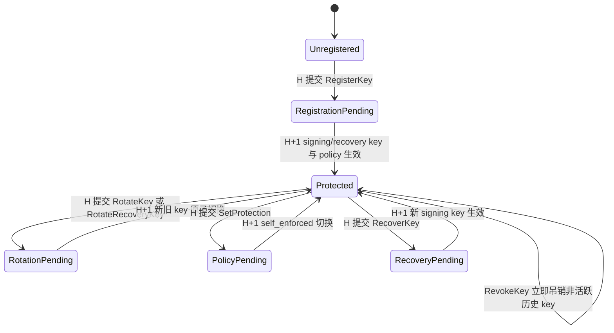
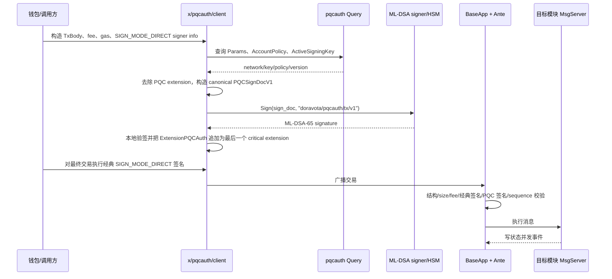

# x/pqcauth：交易级混合抗量子认证模块

`x/pqcauth` 为 Cosmos SDK 交易增加一个独立的后量子认证因子。v1
使用 Cloudflare CIRCL 提供的 ML-DSA-65，实现的授权条件是：

```text
现有 Cosmos 账户签名有效 AND 账户的 ML-DSA-65 签名有效
```

它不会替换 `BaseAccount` 的经典公钥，也不会改变账户地址派生方式。PQC
签名作为交易级第二因子，通过一个 critical transaction extension 携带，并在
AnteHandler 中与经典签名共同验证。

该模块保护的是账户发起的 Cosmos SDK 交易。它不保护：

- 验证人共识签名；
- CometBFT P2P 节点身份；
- IBC 轻客户端或对端签名；
- 智能合约内部自行定义的授权；
- 历史上已经完成的经典签名；
- 已经由账户主动授予的业务权限本身。

模块的核心安全原则是 fail-closed：只要账户当前策略要求 PQC，任何解析错误、
状态不一致、未知算法、签名错误或紧急暂停都只能拒绝交易，不能降级为
classic-only。

## 1. 模块提供的功能

### 1.1 交易认证

- 当前只支持 ML-DSA-65。
- 保留 Cosmos SDK 原有签名验证，PQC 是第二认证因子。
- 支持一个交易中的多个 signer，PQC entry 通过 `signer_index` 与
  `AuthInfo.signer_infos` 一一对应。
- 携带 PQC extension 或要求 PQC 的交易只允许 `SIGN_MODE_DIRECT`。
- PQC 签名绑定完整交易意图、费用、gas、fee payer/granter、账户号、sequence、
  signer 顺序、key ID、算法和 policy version。

### 1.2 密钥和账户策略

每个账户可以维护：

- 一个当前交易签名密钥；
- 一个必须存在且与交易签名密钥不同的离线恢复密钥；
- 每个角色最近若干条完整历史记录，以及更早记录的哈希链承诺；
- 当前及 H+1 待生效的账户保护策略；
- 单调递增、永不复用的 key ID 序列。

支持的生命周期操作：

- 原子注册一对不同的交易签名密钥和恢复密钥，并在 H+1 开启自保护；
- 轮换交易签名密钥；
- 轮换离线恢复密钥；
- 开启或关闭账户级自保护；
- 永久吊销已经不再活跃的历史密钥；
- 使用离线恢复密钥替换丢失的交易签名密钥；
- 由治理更新有界的模块参数。

### 1.3 离线签名

模块提供两种离线 bundle：

- `doravota.pqcauth/sign-bundle/v1`：普通受保护交易的离线 ML-DSA 签名；
- `doravota.pqcauth/recovery-sign-bundle/v1`：交易绑定的离线恢复签名。

在线端在广播前会重新查询账户、sequence、key、policy、network ID
并重建 sign document。任何链上状态变化都会让旧 bundle 失效。

### 1.4 查询、治理和运维

查询接口提供：

- 当前有效参数；
- 账户当前有效策略及活跃交易签名公钥；
- 指定 key ID；
- 账户保留的完整 key records，以及按 signing/recovery 角色划分的压缩历史摘要。

治理可以更新 enforcement mode、允许算法、验证 gas、大小/数量上限、
registration cutoff 和 emergency mode。参数更新以完整 bundle 在 H+1
原子生效；治理不能替账户更换密钥，`network_id` 在 genesis 后不可修改，
registration cutoff 一旦安排或生效也不可回退。

## 2. 共识状态模型

模块 KV store 中有五类状态：

| 状态 | 作用 |
|---|---|
| `Params` | 全局 enforcement、network ID、允许算法、gas、资源上限、cutoff、emergency mode，以及 H+1 pending 参数 |
| `AccountPolicy` | 当前/待生效 signing key、recovery key、自保护开关和 policy version |
| `PQCKeyRecord` | 当前、待生效和近期历史公钥记录，包含 owner、key ID、算法、角色、状态及生效高度区间 |
| `AccountKeySequence` | 为账户分配单调递增的 key ID，已经停用或吊销的 ID 不会回收 |
| `AccountKeyHistory` | 按 signing/recovery 角色记录已压缩条数、最后压缩 ID 和确定性哈希链承诺 |

key ID 没有小额终身配额，始终单调递增且永不复用。默认每个账户、每个角色保留
最近 16 条完整的 terminal key records（参数硬上限 64）；更早的记录按 key ID
递增顺序写入独立的 SHA-256 哈希链后删除完整记录。当前 signing、当前 recovery、
pending signing 和 pending recovery 四类 policy 引用永远被 pin，不计入历史保留数，
所以频繁轮换 recovery key 不会删除仍在使用的 signing key。

当前实现按“模块首次启用时没有旧 PQC policy”设计，不包含 signing-only PQC 状态的
兼容迁移。普通 Cosmos 账户不需要预迁移：它通过 `MsgRegisterKey` 一次性登记两把
不同的 key，随后在 H+1 成为受保护账户。

`PQCKeyRecord` 的有效区间为：

```text
status == LIVE
AND height >= effective_height
AND (inactive_from_height == 0 OR height < inactive_from_height)
```

## 3. 模块从启动到运行的生命周期

### 3.1 应用装配

链应用启动时：

1. `app/app.go` 创建 `pqcauth` KV store key。
2. 创建 `keeper.Keeper`，治理模块地址作为 authority。
3. 将 `AppModuleBasic` 和 `AppModule` 注册到 ModuleManager。
4. 注册 Msg service、Query service、gRPC-Gateway、CLI 和 invariant。
5. 将 `pqcauth` 放入 InitGenesis、BeginBlock 和 EndBlock 顺序。
6. `app/ante.go` 把结构检查和 PQC 验证插入全局 AnteHandler。
7. `app/proposal.go` 在 PrepareProposal 和 ProcessProposal 中重新执行 Ante
   验证，防止 proposer 绕开 CheckTx 直接放入无效交易。

对于已有链的 v1.0.0 升级：

1. upgrade store loader 增加 `pqcauth` store；
2. ModuleManager 执行模块迁移并初始化默认状态；
3. 写入 mainnet、testnet 或 rehearsal chain 专属的 `network_id`；
4. 对历史上无限制的 consensus block gas/bytes 设置有限上限。

### 3.2 InitGenesis

`InitGenesis` 会：

1. 严格验证 params、keys、policies 和 key sequences 的一致性；
2. 对新链从 chain ID 派生 network ID，升级链使用发布时固定的 launch ID；
3. 写入参数、密钥、策略和序列；
4. 如果 genesis 没有显式 key sequence，则从账户最大 key ID 推导
   `next_key_id`；
5. 状态不合法时直接 panic，拒绝以不一致的 PQC 状态启动。

### 3.3 BeginBlock

每个区块开始时，模块调用 `NormalizeParams`：

- 尚未到 activation height 的 pending params 原样保留；
- 已经到达 activation height 的完整参数 bundle 原子切换为 current；
- 已生效 pending 字段会从 store 中清除。

账户 policy 不需要在 BeginBlock 全量遍历。所有读取路径都会调用
`AccountPolicy.Effective(height)`，因此节点在目标高度立即看到相同的有效状态；
账户下一次执行生命周期操作时，再将已生效状态规范化写回 store。

### 3.4 EndBlock

当前版本 EndBlock 不产生额外状态变更。模块提供 state-consistency invariant，
用于验证 params、key records、policies 和 sequences 是否仍可组成合法 genesis
状态。

## 4. 账户密钥和策略生命周期

所有会改变认证边界的操作都遵循 H+1：



H+1 的原因不是 UI 延迟，而是共识一致性要求：PrepareProposal/ProcessProposal
会执行 Ante，但不会执行模块消息。如果密钥在同一高度立即生效，提案验证和
DeliverTx 可能看到不同的认证状态。

### 4.1 生命周期消息的授权条件

| 操作 | 需要的授权 | 状态结果 |
|---|---|---|
| `MsgRegisterKey` | 经典账户签名 + 不同的 signing/recovery key 各自的 proof | 两把 key 与 `self_enforced=true` 在 H+1 原子生效 |
| `MsgRotateKey` | 经典账户签名 + 当前 signing key 的 PQC 交易签名 + 新 signing key proof | 旧 key 在 H+1 失活，新 key 在 H+1 生效 |
| `MsgRotateRecoveryKey` | 经典账户签名 + 当前 signing key 的 PQC 交易签名 + 新 recovery key proof | recovery key 在 H+1 原子切换 |
| `MsgSetProtection` | 经典账户签名 + 当前 signing key 的 PQC 交易签名 | 开启和关闭都在 H+1 生效；关闭也不能绕开当前 PQC |
| `MsgRevokeKey` | 经典账户签名 + 当前 signing key 的 PQC 交易签名 | 立即永久吊销非活跃历史 key；active/pending/recovery key 不允许直接吊销 |
| `MsgRecoverKey` | 经典账户签名 + 当前 recovery key 对完整恢复交易的签名 + 新 signing key proof | 当前 signing key 在 H+1 失活，新 key 在 H+1 生效 |
| `MsgUpdateParams` | 治理 authority | 完整参数 bundle 在 H+1 生效 |

proof of possession 签名绑定：

- network ID 和 chain ID；
- owner；
- proposed key ID；
- 算法、公钥和 key role；
- register/rotate/recover purpose；
- 当前 policy version。

因此同一个 proof 不能跨链、跨账户、跨角色或跨生命周期目的复用。

### 4.2 首次注册的 bootstrap 边界

首次注册时账户还没有链上 PQC key，所以只能依靠：

```text
经典账户签名 + 新 PQC key 的 proof of possession
```

这只能在经典签名仍可信的迁移窗口内完成。如果未来攻击者已经可以伪造经典
签名，他也可以生成自己的 ML-DSA key 并抢先注册。因此模块支持不可逆的
`registration_cutoff_height`；cutoff 后不能再靠经典签名 bootstrap
未注册账户，治理也不能替某个地址直接分配 key。

### 4.3 恢复签名不是“只签新公钥”

`RecoverySignDocV1` 绑定完整恢复交易：

- owner、recovery key ID；
- replacement signing key ID、算法和公钥；
- 当前 policy version；
- network ID、chain ID、account number、sequence；
- signer address 和 signer index；
- 完整 `AuthInfo`；
- 除 PQC extension 和 recovery signature 自身外的完整 canonical `TxBody`。

构造 sign document 时只清空 `MsgRecoverKey.recovery_signature`
以消除循环依赖。独立签一个 replacement public key 的旧式恢复签名不会被接受。

## 5. 普通受保护交易的端到端生命周期

### 5.1 客户端构造和签名

客户端必须先冻结会进入 `AuthInfo` 的 signer info、sequence、fee 和 gas，再做
PQC 签名；PQC extension 附加完成后，最后再做经典签名。



客户端生成的 `PQCSignDocV1` 包含：

- `format_version`；
- immutable `network_id` 和 `chain_id`；
- account number、sequence；
- signer index 和 signer address；
- active key ID、algorithm、policy version；
- 去掉唯一 PQC extension 后的 deterministic `TxBody`；
- 完整 deterministic `AuthInfo`。

PQC sign document 不包含经典 signature bytes，也不包含 PQC signature 本身，
从而避免循环签名。经典签名是在 PQC extension 附加后生成的，所以经典签名也会
绑定最终 extension。

### 5.2 Extension 的 wire 约束

`ExtensionPQCAuth` 必须：

- 出现在 critical extension options 中；
- 最多出现一次；
- 是最后一个 critical extension；
- 使用 format version 1；
- protobuf 解码后重新编码必须与原始 bytes 完全一致；
- 不超过治理参数和代码绝对大小上限；
- signer entries 按 `signer_index` 严格递增；
- entry 数量不超过上限；
- signer、key ID、algorithm、policy version 和 signature 长度完整。

其他已有 critical/non-critical extensions 会被保留并纳入 sign document。

### 5.3 节点收到交易后的 Ante 顺序

同一套 Ante 逻辑会用于 CheckTx、ReCheckTx、PrepareProposal、
ProcessProposal 和最终 DeliverTx/FinalizeBlock 验证。应用中的关键顺序是：

| 顺序 | 阶段 | PQC 相关行为 |
|---:|---|---|
| 1 | SetUpContext / simulation gas limit / tx counter | 建立 gas meter 和执行上下文 |
| 2 | ExtensionOptionChecker | 只允许已知 PQC critical extension，其余交给应用 fallback checker |
| 3 | ValidateBasic / timeout / memo | 先执行 Cosmos SDK 基础检查 |
| 4 | ConsumeGasForTxSize | 在 protobuf PQC 解析和 canonical 重编码前先按交易大小收费 |
| 5 | `ValidatePQCStructureDecorator` | 检查 extension 唯一性、位置、canonical encoding、大小、entry 顺序和 DIRECT sign mode，并缓存解析结果 |
| 6 | sponsor authorization / fee deduction | 处理 sponsor、fee payer、fee granter 和费用规则 |
| 7 | SetPubKey / sig count / classic sig gas / classic verify | 完成原有 Cosmos 经典签名验证 |
| 8 | `VerifyPQCDecorator` | 检查生命周期 proof、有效策略、PQC 是否必需、entry 与 signer/key/policy 是否一致，重建 sign doc、扣 gas 并执行 ML-DSA 验签 |
| 9 | IncrementSequence | 只有两类签名都通过后才递增 sequence |
| 10 | IBC redundant relay check | 继续执行应用剩余 Ante 规则 |

把 ML-DSA 验证放在经典签名之后，可以避免一个完全没有有效经典签名的攻击者直接
消耗 ML-DSA 验证 CPU。

### 5.4 `VerifyPQCDecorator` 的决策过程

对交易中的每个 signer，节点执行：

1. 读取当前高度的 effective params 和 effective account policy。
2. 如果 policy 指向一个不存在、已吊销或当前高度无效的 signing key，
   返回 `ErrInconsistentState`，即使全局 mode 是 optional/disabled 也不会降级。
3. 根据全局 enforcement mode、账户 `self_enforced` 和生命周期消息类型，
   判断该 signer 是否必须有 PQC 授权。
4. 将 extension entry 的 signer index/address/key ID/algorithm/policy version
   与交易 signer 和链上状态逐项匹配。
5. 使用节点自己的 protobuf transaction 重建 canonical sign document。
6. 每次验证先消耗固定、受治理上下界约束的 verification gas。
7. 使用 CIRCL ML-DSA-65 和固定 FIPS 204 context 验签。
8. 任意一个 required signer 缺少 entry，或任意提供的 entry 无效，整笔交易失败。

全局 enforcement mode 的含义：

| Mode | 行为 |
|---|---|
| `DISABLED` | 不从全局要求 PQC，但已经设置 `self_enforced=true` 的账户仍然必须使用 PQC |
| `OPTIONAL` | 允许账户注册和试用；提供了 extension 就必须完整验证，自保护账户仍强制 |
| `REQUIRED_FOR_REGISTERED` | 所有已经有有效 signing key 的账户都必须使用 PQC |
| `REQUIRED` | 交易的所有 signer 都必须提供有效 PQC 授权；尚未注册的账户除受控注册流程外无法正常发交易 |

## 6. 生命周期消息执行时还会经历什么

普通业务交易在 Ante 通过后直接交给 bank、staking、wasm 等目标模块，
`pqcauth` 不改写业务消息。

如果是 `MsgRegisterKey`、`MsgRotateKey`、`MsgRotateRecoveryKey`、
`MsgSetProtection`、`MsgRevokeKey` 或 `MsgRecoverKey`，则有额外边界：

1. 生命周期消息必须是交易中唯一的 top-level message，不能 batch。
2. Ante 阶段完成 key proof、recovery signature 和所需 PQC transaction
   signature 的验证。
3. Ante 对“消息 type URL + canonical message bytes”计算 SHA-256 fingerprint，
   使用私有 context key 标记这一个精确消息已被授权。
4. pqcauth MsgServer 再调用 `RequireLifecycleMessage`，要求收到的消息 fingerprint
   与 Ante 标记完全一致。
5. 通过 `x/authz MsgExec`、group proposal、wasm、governance 或其他模块嵌套执行的
   lifecycle message 没有该标记，因此返回 `ErrNestedLifecycle`。
6. MsgServer 重复执行基础、权限、pending change 和有效 key 检查，然后写入状态。
7. 产生固定字段的 lifecycle event，供索引和运维监控。

该设计避免“普通外层交易通过 Ante，但内层生命周期消息绕过 key proof 或 recovery
signature”的授权继承漏洞。

## 7. CheckTx、提案和区块执行生命周期

一笔广播交易可能经历：

```text
客户端广播
  -> CheckTx：mempool 准入，执行完整 Ante
  -> ReCheckTx：新区块后按新 sequence/policy 重新检查
  -> PrepareProposal：proposer 再执行 Ante，仅选择合法且满足 block bytes/gas 的交易
  -> ProcessProposal：其他验证人再执行 Ante，任一非法交易会使 proposal 被拒绝
  -> DeliverTx/FinalizeBlock：再次执行 Ante，通过后执行 MsgServer
  -> Commit：提交业务状态、PQC policy/key/sequence 变化
  -> H+1：pending key/policy/params 在读取路径上成为 effective
```

PrepareProposal 和 ProcessProposal 不执行消息，所以模块不依赖同高度消息产生的
PQC 状态。H+1 保证同一个高度中的提议者、验证者和 DeliverTx 都按照同一组
key/policy 验证。

## 8. Gas simulation 生命周期

经典 Cosmos SDK simulation 会跳过真实经典签名验证。PQC simulation 与它保持
相同语义：

1. 客户端查询真实 active key 和 policy；
2. 构造 signer/key/algorithm/policy version 都正确、signature 长度也正确的
   全零 placeholder extension；
3. 节点仍执行 extension canonical/size/order、effective policy、key 状态、
   required signer、lifecycle message 和 proof 结构检查；
4. 节点不调用真实 ML-DSA Verify，但按真实次数消耗
   `signature_verification_gas` / `proof_verification_gas`；
5. 返回可用于最终交易的 gas estimate。

simulation 的 placeholder 在非 simulation 路径中不是合法签名，因此不能广播后
绕过认证。

## 9. 离线普通签名 lifecycle

普通离线签名流程是：

```text
在线 prepare
  -> 冻结 unsigned protobuf tx、PQCSignDocV1、链上公钥和两个 SHA-256
离线 review/sign
  -> 严格解码、canonical 重编码、重建 sign doc、核对 hash 和私钥对应公钥
在线 attach/broadcast
  -> 重新查询 chain/account/sequence/network/key/policy
  -> sign doc 必须逐字节相同
  -> 本地验 ML-DSA
  -> 附加 critical extension
  -> 经典签名
  -> broadcast
```

bundle 当前只支持单 signer index 0。共识 extension 和 Ante 可以验证多个 signer，
但多 signer 钱包/硬件编排还需要在客户端层补充。

## 10. 离线恢复 lifecycle

恢复流程与普通 bundle 分离：

1. 在线端创建仅包含一个 top-level `MsgRecoverKey` 的 unsigned transaction。
2. `recovery_signature` 先放入正确长度的全零 placeholder。
3. 查询 effective policy 和 recovery key，生成交易绑定的
   `RecoverySignDocV1`。
4. 离线恢复设备核对完整交易、hash、chain/network/account/sequence、旧 recovery
   key 和 replacement key 后签名。
5. 在线端重新查询全部可变状态；policy/key/sequence/network 任一变化都会拒绝。
6. 在线端把 recovery signature 写回消息，再重建 sign document，确认清空该字段后
   与离线签名的 bytes 完全相同。
7. 最后才做经典账户签名并广播。
8. Ante 验证 recovery signature 和新 key proof；MsgServer 安排新 signing key
   在 H+1 生效。

恢复是唯一允许在 policy 指向的 current signing key 缺失、已吊销或失效时继续执行的
逃生路径。Ante 必须先完整验证 recovery signature 和新 signing key proof，之后才会
豁免 current signing key 的一致性错误；普通交易和其他生命周期消息仍然 fail-closed。

## 11. Emergency mode

| Mode | 行为 |
|---|---|
| `NORMAL` | 正常运行 |
| `PAUSE_NEW_KEYS` | 暂停注册、signing/recovery key 轮换和恢复；已有 protected transaction 继续要求并验证 PQC |
| `PAUSE_PQC_TRANSACTIONS` | 暂停携带 PQC extension 的交易以及需要 PQC 的账户交易 |

紧急模式不会把 protected account 降级为 classic-only。
`PAUSE_PQC_TRANSACTIONS` 的含义是暂停，而不是绕开第二因子。

## 12. `x/pqcauth` 目录说明

```text
x/pqcauth/
├── ante/
├── client/
│   └── cli/
├── crypto/
├── internal/
│   └── execution/
├── keeper/
├── types/
├── genesis.go
├── module.go
└── *_test.go
```

### `ante/`

共识关键的交易前置验证：

- `structure.go`
  - 接受 PQC critical extension；
  - 做有界、状态无关的 extension 结构与 canonical encoding 检查；
  - 要求 PQC extension 唯一且位于 critical options 最后；
  - 校验 signer entry 顺序、数量、字段和 signature 长度；
  - 要求 `SIGN_MODE_DIRECT`；
  - 缓存已验证 extension，避免后续重复 unmarshal/marshal。
- `verify.go`
  - 读取 effective params、policy 和 active signing key；
  - 计算每个 signer 是否 required；
  - 匹配 signer/key/algorithm/policy version；
  - 重建 `PQCSignDocV1`；
  - 计 gas、调用 ML-DSA Verify；
  - 为精确的 top-level lifecycle message 创建执行授权。
- `lifecycle.go`
  - 验证注册/轮换/恢复 key proof；
  - 验证 transaction-bound recovery signature；
  - 禁止 lifecycle message batch；
  - 检查 registration cutoff、emergency mode、pending change 和 key ID 配额。
- `*_test.go`
  - 覆盖结构、策略矩阵、H+1、模拟、生命周期 proof、嵌套执行、
    malformed extension 和 gas 行为。

### `client/`

不进入共识的客户端构造和签名工具：

- `sign.go`
  - 定义可由本地文件、远程 signer、HSM 或硬件钱包实现的 `PQCSigner`；
  - 查询链上 key/policy；
  - 构造 canonical sign document；
  - 本地验证 signer 返回的公钥和签名；
  - 附加 `ExtensionPQCAuth`；
  - 构造 simulation placeholder。
- `bundle.go`
  - 普通交易 offline bundle 的 prepare、strict validation、sign、online
    revalidation 和 attach；
  - 绑定 unsigned tx 和 sign doc 的 SHA-256；
  - 防止过期 bundle、交易替换和 key/policy 替换。
- `recovery_bundle.go`
  - recovery bundle 的 prepare、offline sign、online revalidation 和 attach；
  - 验证全零 placeholder；
  - 确保恢复签名绑定完整交易，而不是只绑定新公钥。
- `*_test.go`
  - 测试 bundle round-trip、stale state、mutation、错误 key、文件权限和签名流程。

### `client/cli/`

`dorad tx pqcauth` / `dorad query pqcauth` 命令实现：

- `tx.go`：register、rotate、rotate-recovery、set-protection、revoke、recover；
- `query.go`：params、account、key、keys；
- `offline.go`：ML-DSA-65 keygen 和 key proof 创建；
- `broadcast.go`：在线 protected tx 的 gas simulation、PQC attach、经典签名和广播；
- `bundle.go`：普通 offline bundle 的 prepare/sign/broadcast；
- `recovery.go`：transaction-bound recovery bundle 的 prepare/sign/broadcast；
- `*_test.go`：CLI 参数冲突、文件安全、mutation flags 和输出格式测试。

### `crypto/`

ML-DSA-65 的最小密码学适配层：

- 基于 `github.com/cloudflare/circl/sign/mldsa/mldsa65`；
- 严格检查 public/private key 和 signature 固定长度；
- 封装 key generation、public key derivation、sign 和 verify；
- 使用 FIPS 204 context，context 最大 255 bytes；
- 默认钱包签名使用 randomized ML-DSA；
- deterministic 模式仅用于测试向量或明确要求的硬件实现；
- 不把 CIRCL 的具体 key 类型暴露给模块其他层。

### `internal/execution/`

生命周期消息的 Ante-to-MsgServer 授权桥：

- 对 exact top-level lifecycle message 计算 fingerprint；
- 使用不可由其他 Go package 构造的私有 context key；
- MsgServer 要求 fingerprint 完全匹配；
- 阻止 `authz`、group、wasm、governance 等嵌套路径继承外层交易的授权结果。

之所以放在 `internal/`，是为了让 Go 编译器限制可调用边界，减少其他模块伪造
“已由 Ante 验证”标记的可能。

### `keeper/`

共识状态和服务实现：

- `keeper.go`
  - params、policy、key record、key history、key sequence 的 KV 读写；
  - effective/normalize 逻辑；
  - active signing key 查询；
  - 不复用、无小额终身上限的单调 key ID 分配；
  - genesis/export/invariant 使用的安全迭代。
- `key_history.go`
  - 按 signing/recovery 角色独立压缩 terminal records；
  - 永久 pin 当前与 pending policy key；
  - 为 H+1 即将退休的 key 预留历史槽位；
  - 写入可审计的确定性哈希链承诺。
- `msg_server.go`
  - 所有 lifecycle Msg service；
  - 重复关键权限和状态检查；
  - 安排 H+1 key/policy/params；
  - 验证 key proof；
  - 限制 authority、immutable network ID 和 irreversible cutoff；
  - 发出 lifecycle events。
- `query_server.go`
  - params、account、key、keys gRPC 查询；account 查询同时返回压缩历史摘要。
- `invariants.go`
  - 将当前共识状态重新组织为 genesis 并执行完整一致性验证。
- `*_test.go`
  - 覆盖 store、Msg/Query、H+1、历史压缩/pinning、治理边界、revoke、恢复逃生口和 invariant。

### `types/`

共识 wire type、状态规则和 canonical signing 定义：

- `canonical_tx.go`：构造普通和恢复交易的 canonical body/AuthInfo；
- `signing.go`：固定 format、purpose、domain-separation context 和 sign-doc 校验；
- `params.go`：默认值、绝对上限、gas 下限、enforcement/emergency 和 H+1 params；
- `policy.go`：账户 policy 的 H+1 effective 计算和 key 有效区间；
- `messages.go`：所有 Msg 的 signer、ValidateBasic 和 legacy SDK 接口；
- `keys.go`：KV key prefixes 和 owner/key ID 编码；
- `codec.go`：Amino/interface registry；
- `errors.go`：稳定的模块错误码；
- `genesis.go`：跨 params、keys、policies、sequences 的严格 genesis 验证；
- `telemetry.go`：固定 cardinality 的验证耗时与成功/失败指标；
- `*.pb.go` / `*.pb.gw.go`：由 `proto/doravota/pqcauth/v1` 生成的 protobuf
  和 gRPC-Gateway 代码，不应手工修改；
- `*_test.go`：canonical binding、golden vector、params、policy、message 和 genesis 测试。

### 根目录文件

- `module.go`
  - Cosmos SDK `AppModuleBasic` / `AppModule`；
  - 注册 codec、Msg、Query、CLI、gateway 和 invariant；
  - Init/ExportGenesis；
  - BeginBlock params normalization；
  - 当前 EndBlock no-op；
  - consensus version。
- `genesis.go`
  - genesis 状态落库、network ID 派生、sequence 推导和 export。
- `*_test.go`
  - module wiring、genesis round-trip 和错误状态测试。

## 13. 模块之外的集成点

`x/pqcauth` 不是只靠注册 AppModule 就能保护交易，还依赖应用层集成：

| 路径 | 作用 |
|---|---|
| [`proto/doravota/pqcauth/v1`](../../proto/doravota/pqcauth/v1) | protobuf source of truth：state、extension、signing docs、Msg 和 Query |
| [`app/ante.go`](../../app/ante.go) | 把结构检查和 PQC Verify 放入经典签名流程的正确位置 |
| [`app/app.go`](../../app/app.go) | store、keeper、ModuleManager、genesis/block order、service 和 v1 handler 装配 |
| [`app/proposal.go`](../../app/proposal.go) | PrepareProposal/ProcessProposal 的 Ante 重验和 block gas/bytes 上限 |
| [`app/upgrades/v1_0_0`](../../app/upgrades/v1_0_0) | 升级增加 store、写入 launch-specific network ID |
| [`docs/pqcauth`](../../docs/pqcauth) | threat model、wire/signing spec、rollout plan 和 operator runbook |
| [`scripts/check-pqcauth-coverage.sh`](../../scripts/check-pqcauth-coverage.sh) | 手写代码覆盖率门禁 |

只复制 `x/pqcauth` 而没有 Ante、proposal、store upgrade 和 network ID
集成，不能得到同等的交易认证安全性。

## 14. 当前 v1 限制

- 只支持 ML-DSA-65。
- 只支持 `SIGN_MODE_DIRECT`。
- 共识层支持多 signer，但当前普通/recovery offline bundle 和 CLI
  只编排单 signer index 0。
- 不支持 threshold ML-DSA 或 Legacy Amino multisig。
- recovery key 可以恢复 PQC signing key，但不能在保持同一账户地址的同时替换丢失的
  经典 BaseAccount 私钥。
- `WeightedOperations` 目前为空；长期随机 simulation 覆盖仍可继续补充。
- 模块安全不等于整条链依赖安全，生产发布还需要处理 CometBFT、Wasmd、
  Cosmos SDK 等应用级依赖门禁。

## 15. 相关规范

- [Threat model](../../docs/pqcauth/threat-model-v1.md)
- [Signing and wire specification](../../docs/pqcauth/signing-spec-v1.md)
- [Implementation and rollout plan](../../docs/pqcauth/implementation-plan-v1.md)
- [Operator runbook](../../docs/pqcauth/operator-runbook-v1.md)
