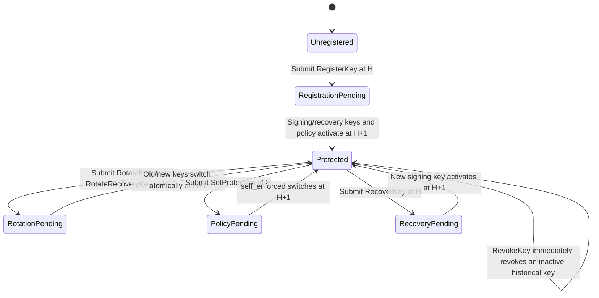
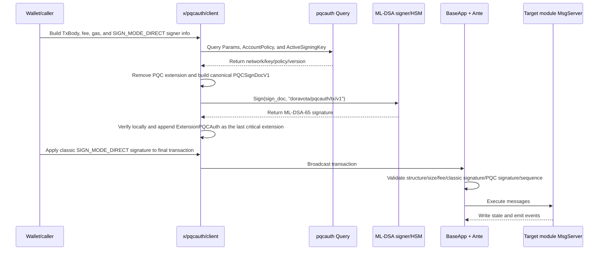

# x/pqcauth: Transaction-Level Hybrid Post-Quantum Authentication

`x/pqcauth` adds an independent post-quantum authentication factor to Cosmos
SDK transactions. Version 1 uses the native ML-DSA-65 key implementation in
Cosmos SDK v0.55, backed by CometBFT and CIRCL. Authorization requires:

```text
A valid existing Cosmos account signature
AND
A valid ML-DSA-65 signature registered for that account
```

The module does not replace the classic public key in `BaseAccount` and does
not change account address derivation. The PQC signature is carried as a
transaction-level second factor in a critical transaction extension and is
verified together with the classic signature in the AnteHandler.

The module protects Cosmos SDK transactions initiated by accounts. It does not
protect:

- validator consensus signatures;
- CometBFT P2P node identities;
- IBC light clients or counterparty signatures;
- authorization implemented independently inside smart contracts;
- classic signatures that were completed in the past; or
- business permissions that an account has already granted intentionally.

The core security rule is fail-closed. Once an account's effective policy
requires PQC authorization, parse failures, inconsistent state, unknown
algorithms, invalid signatures, and emergency pauses may only reject a
transaction. They must never downgrade it to classic-only authorization.

## 1. Features

### 1.1 Transaction authentication

- Version 1 supports ML-DSA-65 only.
- Existing Cosmos SDK signature verification remains in place; PQC is an
  additional authentication factor.
- A transaction may have multiple signers. Each PQC entry is bound to the
  corresponding `AuthInfo.signer_infos` entry through `signer_index`.
- Transactions that carry a PQC extension, or whose signers require PQC, must
  use `SIGN_MODE_DIRECT`.
- A PQC signature binds the complete transaction intent, fee, gas, fee payer
  and granter, account number, sequence, signer order, key ID, algorithm, and
  policy version.

### 1.2 Keys and account policies

Each account may maintain:

- one current transaction-signing key;
- one mandatory offline recovery key that must differ from the signing key;
- a bounded number of recent complete historical records per role, plus a hash
  chain commitment to older records;
- the current account protection policy and an H+1 pending policy; and
- a monotonically increasing key ID sequence whose IDs are never reused.

Supported lifecycle operations are:

- atomically register distinct signing and recovery keys and enable
  self-protection at H+1;
- rotate the transaction-signing key;
- rotate the offline recovery key;
- enable or disable account-level self-protection;
- permanently revoke an inactive historical key;
- use the offline recovery key to replace a lost signing key; and
- update bounded module parameters through governance.

### 1.3 Offline signing

The module defines two offline bundle formats:

- `doravota.pqcauth/sign-bundle/v1` for offline ML-DSA signing of ordinary
  protected transactions; and
- `doravota.pqcauth/recovery-sign-bundle/v1` for transaction-bound offline
  recovery signatures.

Before broadcast, the online side re-queries the account, sequence, key,
policy, and network ID, then reconstructs the sign document. Any relevant
on-chain state change invalidates an old bundle.

### 1.4 Queries, governance, and operations

Query endpoints expose:

- the currently effective parameters;
- an account's effective policy and active signing public key;
- a key by ID; and
- the account's retained complete key records and compressed history summaries
  for the signing and recovery roles.

Governance may update the enforcement mode, allowed algorithms, verification
gas, size and count limits, registration cutoff, and emergency mode. Parameter
updates are activated atomically as complete bundles. Tightening changes that
would invalidate currently valid transactions must wait for the immutable
`governance_safety_delay_blocks` configured at genesis. Relaxations and
standalone emergency pauses activate at H+1.

Emergency pauses automatically expire after the immutable
`max_emergency_duration_blocks`. Governance cannot replace keys for an
account. The `network_id` and both safety durations are immutable after
genesis, and a registration cutoff cannot be rolled back after it has been
scheduled or activated.

## 2. Consensus state model

The module KV store contains five state categories:

| State | Purpose |
|---|---|
| `Params` | Global enforcement, network ID, allowed algorithms, gas, resource limits, cutoff, emergency mode, governance safety delay, pause duration, and pending parameters |
| `AccountPolicy` | Current and pending signing key, recovery key, self-protection flag, and policy version |
| `PQCKeyRecord` | Current, pending, and recent historical public-key records, including owner, key ID, algorithm, role, status, and effective height range |
| `AccountKeySequence` | Allocates monotonically increasing key IDs; inactive and revoked IDs are never recycled |
| `AccountKeyHistory` | Records the compressed count, last compressed ID, and deterministic hash-chain commitment separately for signing and recovery roles |

Key IDs do not have a small lifetime quota. They increase monotonically and
are never reused. By default, the module retains the most recent 16 terminal
key records per account and per role, with a parameter hard cap of 64. Older
records are appended to an independent SHA-256 hash chain in key-ID order
before their complete records are deleted.

Keys referenced by the current signing, current recovery, pending signing, or
pending recovery policy are always pinned and do not count toward the
historical retention limit. Repeated recovery-key rotation therefore cannot
delete a signing key that is still in use.

The current implementation assumes that no legacy PQC policy exists when the
module is first enabled. It does not include a compatibility migration for a
signing-only PQC state. Ordinary Cosmos accounts require no pre-migration:
they atomically register two distinct keys with `MsgRegisterKey` and become
protected at H+1.

A `PQCKeyRecord` is effective when:

```text
status == LIVE
AND height >= effective_height
AND (inactive_from_height == 0 OR height < inactive_from_height)
```

## 3. Lifecycle from application startup to normal operation

### 3.1 Application wiring

When the chain application starts:

1. `app/app.go` creates the `pqcauth` KV store key.
2. The application creates `keeper.Keeper` with the governance module address
   as its authority.
3. `AppModuleBasic` and `AppModule` are registered with the ModuleManager.
4. Msg services, Query services, gRPC-Gateway routes, CLI commands, and the
   invariant are registered.
5. `pqcauth` is added to InitGenesis, BeginBlock, and EndBlock ordering.
6. `app/ante.go` inserts structural validation and PQC verification into the
   global AnteHandler.
7. `app/proposal.go` runs Ante verification again in PrepareProposal and
   ProcessProposal so a proposer cannot bypass CheckTx and insert invalid
   transactions directly.

An existing chain currently running Cosmos SDK v0.47 and IBC-Go v7 cannot
place the v1.0.0 target binary directly at the upgrade height. The supported
production path is:

1. use a separate bridge release to upgrade from SDK v0.47 to SDK v0.53 and
   IBC-Go v10, completing historical migrations that still depend on legacy
   `x/params`, IBC capability, and Wasm migration code;
2. continue producing blocks after the bridge height and verify the app hash,
   IBC, Wasm, group, and account state;
3. upgrade to the SDK v0.55 and IBC-Go v11 target binary from this branch;
4. have the target store loader add the `sponsor` and `pqcauth` stores and
   remove the fully migrated `params`, `capability`, and `feeibc` stores;
5. have the v1.0.0 handler inspect the module version map before running any
   migration and fail closed if the chain is still in the v0.47 state;
6. let the ModuleManager execute cumulative v0.53-to-v0.55 migrations and
   initialize the default pqcauth state;
7. write the launch-specific `network_id` for mainnet, testnet, or a rehearsal
   chain; and
8. replace historically unlimited consensus block gas and byte limits with
   finite bounds.

The legacy chain's `group` store is not deleted. Cosmos SDK v0.55 removed the
built-in `x/group` source, so the application maintains a compatibility
implementation ported from SDK v0.53.6 to preserve existing group messages,
queries, state, and consensus version 2.

### 3.2 InitGenesis

`InitGenesis`:

1. strictly validates consistency across parameters, keys, policies, and key
   sequences;
2. derives the network ID from the chain ID for a new chain, while an upgraded
   chain uses a launch ID fixed by the release;
3. writes parameters, keys, policies, and sequences;
4. derives `next_key_id` from the account's maximum key ID if genesis does not
   contain an explicit key sequence; and
5. panics on invalid state, refusing to start with inconsistent PQC state.

### 3.3 BeginBlock

At the beginning of each block, the module calls `NormalizeParams`:

- pending parameters remain unchanged until their activation height;
- at the activation height, the complete pending parameter bundle atomically
  replaces the current bundle; and
- activated pending fields are cleared from the store.

Account policies do not require a full-store scan during BeginBlock. Every
read path calls `AccountPolicy.Effective(height)`, so all nodes observe the
same effective state immediately at the target height. The stored policy is
normalized when that account next performs a lifecycle operation.

### 3.4 EndBlock

The current EndBlock implementation does not produce additional state
changes. The module exposes a state-consistency invariant that verifies
whether the parameters, key records, policies, and sequences still form a
valid genesis state.

## 4. Account key and policy lifecycle

Every operation that changes the authentication boundary follows H+1
activation:



H+1 is a consensus-safety boundary, not a UI delay. PrepareProposal and
ProcessProposal execute Ante but do not execute module messages. If a key
became effective immediately in the same height, proposal verification and
DeliverTx could observe different authentication states.

### 4.1 Authorization requirements for lifecycle messages

| Operation | Required authorization | State result |
|---|---|---|
| `MsgRegisterKey` | Classic account signature plus separate proofs from distinct signing and recovery keys | Both keys and `self_enforced=true` activate atomically at H+1 |
| `MsgRotateKey` | Classic account signature, current signing key's PQC transaction signature, and new signing-key proof | Old key becomes inactive and new key activates at H+1 |
| `MsgRotateRecoveryKey` | Classic account signature, current signing key's PQC transaction signature, and new recovery-key proof | Recovery key switches atomically at H+1 |
| `MsgSetProtection` | Classic account signature plus current signing key's PQC transaction signature | Enable and disable both activate at H+1; disabling cannot bypass the currently effective PQC requirement |
| `MsgRevokeKey` | Classic account signature plus current signing key's PQC transaction signature | Immediately and permanently revokes an inactive historical key; active, pending, and recovery keys cannot be directly revoked |
| `MsgRecoverKey` | Classic account signature, current recovery key's signature over the complete recovery transaction, and new signing-key proof | Current signing key becomes inactive and new key activates at H+1 |
| `MsgUpdateParams` | Governance authority | Complete bundle activates at the consensus-computed height; tighter authentication waits for the safety delay, while an emergency pause activates at H+1 and expires automatically |

A proof-of-possession signature binds:

- network ID and chain ID;
- owner;
- proposed key ID;
- algorithm, public key, and key role;
- register, rotate, or recover purpose; and
- current policy version.

The same proof therefore cannot be reused across chains, accounts, roles, or
lifecycle purposes.

### 4.2 Bootstrap boundary for first registration

At first registration, the account has no on-chain PQC key. Authorization can
therefore only rely on:

```text
Classic account signature
+
Proof of possession from each new PQC key
```

This is safe only while the classic signature remains trustworthy. If an
attacker can already forge classic signatures, the attacker can generate an
ML-DSA key and front-run registration. The module therefore supports an
irreversible `registration_cutoff_height`. After the cutoff, an unregistered
account can no longer bootstrap using only its classic signature, and
governance cannot assign a key directly to a specific address.

### 4.3 A recovery signature does not merely sign the new public key

`RecoverySignDocV1` binds the complete recovery transaction:

- owner and recovery key ID;
- replacement signing key ID, algorithm, and public key;
- current policy version;
- network ID, chain ID, account number, and sequence;
- signer address and signer index;
- complete `AuthInfo`; and
- the complete canonical `TxBody`, excluding the PQC extension and the
  recovery signature field itself.

Sign-document construction clears only
`MsgRecoverKey.recovery_signature` to eliminate the circular dependency. A
legacy-style recovery signature over only the replacement public key is not
accepted.

## 5. End-to-end lifecycle of an ordinary protected transaction

### 5.1 Client construction and signing

The client must freeze signer information, sequence, fee, and gas in
`AuthInfo` before creating the PQC signature. It appends the PQC extension and
only then produces the classic signature.



The client-generated `PQCSignDocV1` contains:

- `format_version`;
- immutable `network_id` and `chain_id`;
- account number and sequence;
- signer index and signer address;
- active key ID, algorithm, and policy version;
- deterministic `TxBody` bytes with the unique PQC extension removed; and
- complete deterministic `AuthInfo` bytes.

The PQC sign document contains neither classic signature bytes nor the PQC
signature itself, avoiding a circular signature dependency. The classic
signature is produced after the PQC extension is appended, so it also binds
the final extension.

### 5.2 Extension wire constraints

`ExtensionPQCAuth` must:

- appear in critical extension options;
- appear at most once;
- be the last critical extension;
- use format version 1;
- re-encode to exactly the same bytes after protobuf decoding;
- remain within governance-configured limits and absolute code limits;
- contain signer entries in strictly increasing `signer_index` order;
- remain within the entry-count limit; and
- include complete signer, key ID, algorithm, policy version, and signature
  length fields.

Other existing critical and non-critical extensions are preserved and bound
into the sign document.

### 5.3 Ante order after a node receives the transaction

The same Ante logic is used for CheckTx, ReCheckTx, PrepareProposal,
ProcessProposal, and final DeliverTx/FinalizeBlock verification. The important
application order is:

| Order | Stage | PQC behavior |
|---:|---|---|
| 1 | SetUpContext / simulation gas limit / tx counter | Establish gas meter and execution context |
| 2 | ExtensionOptionChecker | Accept only the known PQC critical extension; delegate other options to the application's fallback checker |
| 3 | ValidateBasic / timeout / memo | Run Cosmos SDK baseline checks first |
| 4 | ConsumeGasForTxSize | Charge by transaction size before protobuf PQC parsing and canonical re-encoding |
| 5 | `ValidatePQCStructureDecorator` | Check extension uniqueness, position, canonical encoding, size, entry ordering, and DIRECT sign mode; cache the parsed extension |
| 6 | Sponsor authorization / fee deduction | Process sponsor, fee payer, fee granter, and fee rules |
| 7 | SetPubKey / sig count / classic sig gas / classic verify | Complete the original Cosmos classic-signature checks |
| 8 | `VerifyPQCDecorator` | Check lifecycle proofs, effective policy, whether PQC is required, entry-to-signer/key/policy consistency, reconstruct the sign document, charge gas, and run ML-DSA verification |
| 9 | IncrementSequence | Increment sequence only after both signature classes pass |
| 10 | IBC redundant relay check | Continue with the remaining application Ante rules |

Placing ML-DSA verification after classic signature verification prevents an
attacker with no valid classic signature from directly consuming ML-DSA
verification CPU.

### 5.4 `VerifyPQCDecorator` decision process

For each transaction signer, the node:

1. reads the effective parameters and account policy at the current height;
2. returns `ErrInconsistentState` if the policy references a missing, revoked,
   or height-invalid signing key, even when the global mode is OPTIONAL or
   DISABLED;
3. determines whether that signer requires PQC authorization from the global
   enforcement mode, account `self_enforced` setting, and lifecycle-message
   type;
4. matches the extension entry's signer index, address, key ID, algorithm, and
   policy version against the transaction and on-chain state;
5. reconstructs the canonical sign document from the node's own decoded
   protobuf transaction;
6. consumes a fixed verification-gas charge bounded by governance and hard
   code limits before each verification;
7. verifies the protocol-domain-separated message with the SDK-native
   ML-DSA-65 implementation; and
8. rejects the entire transaction if any required signer lacks an entry or any
   provided entry is invalid.

Global enforcement modes behave as follows:

| Mode | Behavior |
|---|---|
| `DISABLED` | Does not impose a global PQC requirement, but accounts with `self_enforced=true` still require PQC |
| `OPTIONAL` | Allows registration and trial use; a provided extension must verify completely, and self-protected accounts remain enforced |
| `REQUIRED_FOR_REGISTERED` | Every account with an effective signing key must use PQC |
| `REQUIRED` | Every transaction signer must provide valid PQC authorization; unregistered accounts cannot send ordinary transactions except through the controlled registration path |

## 6. Additional processing for lifecycle messages

After Ante succeeds, an ordinary business transaction proceeds directly to
its target module, such as bank, staking, or wasm. `pqcauth` does not rewrite
business messages.

`MsgRegisterKey`, `MsgRotateKey`, `MsgRotateRecoveryKey`,
`MsgSetProtection`, `MsgRevokeKey`, and `MsgRecoverKey` have additional
boundaries:

1. A lifecycle message must be the transaction's only top-level message and
   cannot be batched.
2. Ante verifies key proofs, the recovery signature, and any required PQC
   transaction signature.
3. Ante computes a SHA-256 fingerprint over the message type URL and canonical
   message bytes, then uses a private context key to mark that exact message as
   authorized.
4. The pqcauth MsgServer calls `RequireLifecycleMessage` and requires the
   received message fingerprint to match the Ante marker exactly.
5. A lifecycle message nested through `x/authz MsgExec`, a group proposal,
   wasm, governance, or another module has no such marker and returns
   `ErrNestedLifecycle`.
6. MsgServer repeats baseline, authorization, pending-change, and effective-key
   checks before writing state.
7. It emits lifecycle events with fixed fields for indexing and operational
   monitoring.

This prevents an authorization-inheritance bug in which an outer transaction
passes Ante while an inner lifecycle message bypasses a key proof or recovery
signature.

## 7. CheckTx, proposal, and block-execution lifecycle

A broadcast transaction may pass through:

```text
Client broadcast
  -> CheckTx: mempool admission with full Ante
  -> ReCheckTx: recheck against the new sequence and policy after a block
  -> PrepareProposal: proposer reruns Ante and selects only transactions within block byte/gas limits
  -> ProcessProposal: other validators rerun Ante and reject a proposal containing any invalid transaction
  -> DeliverTx/FinalizeBlock: rerun Ante, then execute MsgServer
  -> Commit: commit business state and PQC policy/key/sequence changes
  -> Scheduled height: H+1 key/policy or governance-computed pending parameters become effective
```

PrepareProposal and ProcessProposal do not execute messages, so the module
does not depend on PQC state produced by a message in the same height. H+1
key/policy boundaries and deterministic parameter activation heights ensure
that the proposer, validators, and DeliverTx all verify against the same
authentication state at a given height.

## 8. Gas simulation lifecycle

Standard Cosmos SDK simulation skips real classic-signature verification. PQC
simulation follows the same semantics:

1. The client queries the real active key and policy.
2. It constructs an all-zero placeholder extension with correct signer, key,
   algorithm, policy version, and signature length.
3. The node still validates extension canonical encoding, size, ordering,
   effective policy, key state, required signers, lifecycle-message rules, and
   proof structure.
4. The node does not call real ML-DSA verification, but consumes
   `signature_verification_gas` or `proof_verification_gas` for the real
   number of expected operations.
5. It returns a gas estimate suitable for the final transaction.

The simulation placeholder is not a valid signature outside simulation and
cannot be broadcast to bypass authentication.

## 9. Offline ordinary-signing lifecycle

The ordinary offline-signing flow is:

```text
Online prepare
  -> Freeze unsigned protobuf tx, PQCSignDocV1, on-chain public key, and two SHA-256 hashes
Offline review/sign
  -> Strictly decode, canonically re-encode, reconstruct sign document, verify hashes and private-key/public-key match
Online attach/broadcast
  -> Re-query chain/account/sequence/network/key/policy
  -> Require byte-for-byte identical sign document
  -> Verify ML-DSA locally
  -> Append critical extension
  -> Apply classic signature
  -> Broadcast
```

The current bundle format supports signer index 0 only. The consensus
extension and Ante can verify multiple signers, but multi-signer wallet and
hardware orchestration still require additional client work.

## 10. Offline recovery lifecycle

Recovery uses a separate bundle:

1. The online side creates an unsigned transaction containing exactly one
   top-level `MsgRecoverKey`.
2. It fills `recovery_signature` with an all-zero placeholder of the correct
   length.
3. It queries the effective policy and recovery key and creates a
   transaction-bound `RecoverySignDocV1`.
4. The offline recovery device reviews the complete transaction, hashes,
   chain, network, account, sequence, old recovery key, and replacement key
   before signing.
5. The online side re-queries all mutable state and rejects the bundle if the
   policy, key, sequence, or network has changed.
6. It writes the recovery signature back into the message, reconstructs the
   sign document, and confirms that clearing the same field produces bytes
   identical to those signed offline.
7. Only then does it apply the classic account signature and broadcast.
8. Ante verifies the recovery signature and new-key proof; MsgServer schedules
   the new signing key for H+1 activation.

Recovery is the only escape path allowed when the policy's current signing key
is missing, revoked, or ineffective. Ante must fully verify the recovery
signature and new signing-key proof before exempting the inconsistent current
signing key. Ordinary transactions and all other lifecycle messages remain
fail-closed.

## 11. Emergency modes

| Mode | Behavior |
|---|---|
| `NORMAL` | Normal operation |
| `PAUSE_NEW_KEYS` | Pause registration and ordinary signing/recovery-key rotations; existing protected transactions continue to require and verify PQC |
| `PAUSE_PQC_TRANSACTIONS` | Pause transactions carrying a PQC extension and ordinary account transactions that require PQC |

Emergency mode never downgrades a protected account to classic-only.
`PAUSE_PQC_TRANSACTIONS` means pause, not bypass. Both pause modes
automatically return to `NORMAL` at `emergency_expires_height`. The module
computes this height from an immutable maximum duration, and governance cannot
choose or extend it indefinitely.

`MsgRecoverKey` is the only account-lifecycle escape hatch retained during a
pause. It must be the transaction's only top-level message, cannot carry an
ordinary PQC extension, and cannot be nested through authz, group, or wasm.
Ante still fully verifies the classic account signature, the registered
recovery key's signature over the complete transaction, and the replacement
signing key's proof of possession. Registration, ordinary rotation, policy
changes, and protected business transactions remain fail-closed.

## 12. Directory guide

```text
x/pqcauth/
├── ante/
├── client/
│   └── cli/
├── crypto/
├── internal/
│   └── execution/
├── keeper/
├── types/
├── genesis.go
├── module.go
└── *_test.go
```

### `ante/`

Consensus-critical pre-transaction validation:

- `structure.go`
  - accepts the PQC critical extension;
  - performs bounded, state-independent structural and canonical-encoding
    checks;
  - requires the PQC extension to be unique and last among critical options;
  - validates signer-entry order, count, fields, and signature length;
  - requires `SIGN_MODE_DIRECT`; and
  - caches the validated extension to avoid repeated unmarshal/marshal work.
- `verify.go`
  - reads effective parameters, policy, and active signing key;
  - determines whether each signer requires PQC;
  - matches signer, key, algorithm, and policy version;
  - reconstructs `PQCSignDocV1`;
  - charges gas and calls ML-DSA verification; and
  - creates execution authorization for an exact top-level lifecycle message.
- `lifecycle.go`
  - verifies registration, rotation, and recovery key proofs;
  - verifies the transaction-bound recovery signature;
  - forbids lifecycle-message batching; and
  - checks the registration cutoff, emergency mode, pending changes, and key
    ID constraints.
- `*_test.go`
  - covers structure, policy matrices, H+1, simulation, lifecycle proofs,
    nested execution, malformed extensions, and gas behavior.

### `client/`

Non-consensus client construction and signing tools:

- `sign.go`
  - defines `PQCSigner`, which can be implemented by a local file, remote
    signer, HSM, or hardware wallet;
  - queries the on-chain key and policy;
  - builds the canonical sign document;
  - verifies the returned public key and signature locally;
  - appends `ExtensionPQCAuth`; and
  - builds simulation placeholders.
- `bundle.go`
  - prepares, strictly validates, signs, revalidates online, and attaches an
    ordinary offline bundle;
  - binds the unsigned transaction and sign document through SHA-256; and
  - prevents stale bundles and transaction, key, or policy substitution.
- `recovery_bundle.go`
  - prepares, signs offline, revalidates online, and attaches a recovery
    bundle;
  - validates the all-zero placeholder; and
  - ensures the recovery signature binds the complete transaction rather than
    only the new public key.
- `*_test.go`
  - covers bundle round trips, stale state, mutation, wrong keys, file
    permissions, and signing flows.

### `client/cli/`

Implementation of `dorad tx pqcauth` and `dorad query pqcauth`:

- `tx.go`: register, rotate, rotate-recovery, set-protection, revoke, recover;
- `query.go`: params, account, key, keys;
- `offline.go`: ML-DSA-65 key generation and key-proof construction;
- `broadcast.go`: gas simulation, PQC attachment, classic signing, and
  broadcast for an online protected transaction;
- `bundle.go`: prepare, sign, and broadcast an ordinary offline bundle;
- `recovery.go`: prepare, sign, and broadcast a transaction-bound recovery
  bundle; and
- `*_test.go`: CLI flag conflicts, file safety, mutation flags, and output
  formats.

### `crypto/`

Minimal ML-DSA-65 cryptographic adapter:

- uses `github.com/cosmos/cosmos-sdk/crypto/keys/mldsa65`;
- takes fixed lengths from CometBFT `crypto/mldsa65` constants;
- strictly checks fixed public-key, private-key, and signature lengths;
- wraps key generation, public-key derivation, signing, and verification;
- encodes a protocol context of up to 255 bytes into a canonical message
  envelope;
- uses the deterministic pure-mode ML-DSA implementation from SDK/CometBFT;
  and
- does not expose concrete SDK, CometBFT, or CIRCL key types to other module
  layers.

The SDK-native implementation uses an empty FIPS 204 context. To preserve
domain separation among transactions, key proofs, and recovery, the adapter
actually signs `version || context_length || context || message`. This is
signature-byte incompatible with the earlier implementation that passed the
context directly to CIRCL, and therefore constitutes a consensus-format
change.

This replacement is safe only before PQC deployment. If a network has already
accepted transactions using the old format, it must use an explicit versioned
migration or verify both wire versions. It must not replace the format
silently.

### `internal/execution/`

Ante-to-MsgServer authorization bridge for lifecycle messages:

- fingerprints the exact top-level lifecycle message;
- uses a private context key that other Go packages cannot construct;
- requires an exact fingerprint match in MsgServer; and
- prevents nested authz, group, wasm, governance, and similar paths from
  inheriting the outer transaction's authorization result.

The code lives under `internal/` so the Go compiler constrains its call
boundary, reducing the possibility that another module can forge an
"Ante-verified" marker.

### `keeper/`

Consensus state and service implementation:

- `keeper.go`
  - reads and writes parameters, policies, key records, key history, and key
    sequences;
  - implements effective and normalization logic;
  - queries active signing keys;
  - allocates monotonic, non-reused key IDs without a small lifetime cap; and
  - safely iterates state for genesis, export, and invariants.
- `key_history.go`
  - compacts terminal records independently by signing and recovery role;
  - permanently pins current and pending policy keys;
  - reserves history capacity for keys that will retire at H+1; and
  - writes an auditable deterministic hash-chain commitment.
- `msg_server.go`
  - implements all lifecycle Msg services;
  - repeats critical authorization and state checks;
  - schedules H+1 key/policy changes and governance parameters with safety
    delays and automatic expiry;
  - validates key proofs;
  - constrains authority, immutable network ID, and irreversible cutoff; and
  - emits lifecycle events.
- `query_server.go`
  - implements params, account, key, and keys gRPC queries; account queries
    also return compressed history summaries.
- `invariants.go`
  - reconstructs genesis from the current consensus state and performs full
    consistency validation.
- `*_test.go`
  - covers store, Msg and Query services, H+1, history compaction and pinning,
    governance boundaries, revoke, the recovery escape hatch, and invariants.

### `types/`

Consensus wire types, state rules, and canonical signing definitions:

- `canonical_tx.go`: constructs canonical bodies and AuthInfo for ordinary and
  recovery transactions;
- `signing.go`: validates fixed formats, purposes, domain-separation contexts,
  and sign documents;
- `params.go`: defines defaults, hard limits, gas floors, enforcement and
  emergency modes, governance safety delay, automatic pause expiry, and
  pending parameters;
- `policy.go`: computes H+1-effective account policies and key validity
  intervals;
- `messages.go`: implements signers, ValidateBasic, and legacy SDK interfaces
  for all messages;
- `keys.go`: defines KV key prefixes and owner/key-ID encoding;
- `codec.go`: registers Amino and interface types;
- `errors.go`: defines stable module error codes;
- `genesis.go`: strictly validates parameters, keys, policies, and sequences
  together;
- `telemetry.go`: records fixed-cardinality verification latency and
  success/failure metrics;
- `*.pb.go` and `*.pb.gw.go`: generated protobuf and gRPC-Gateway code from
  `proto/doravota/pqcauth/v1`; do not edit manually; and
- `*_test.go`: covers canonical bindings, golden vectors, parameters, policy,
  messages, and genesis.

### Root files

- `module.go`
  - implements Cosmos SDK `AppModuleBasic` and `AppModule`;
  - registers codecs, Msg and Query services, CLI, gateway, and invariant;
  - implements InitGenesis and ExportGenesis;
  - normalizes parameters in BeginBlock;
  - keeps the current EndBlock as a no-op; and
  - declares the consensus version.
- `genesis.go`
  - writes genesis state, derives the network ID and key sequences, and exports
    state.
- `*_test.go`
  - covers module wiring, genesis round trips, and invalid-state handling.

## 13. Integration points outside `x/pqcauth`

Registering only the AppModule is not sufficient to protect transactions.
`x/pqcauth` depends on application-level integration:

| Path | Purpose |
|---|---|
| [`proto/doravota/pqcauth/v1`](../../proto/doravota/pqcauth/v1) | Protobuf source of truth for state, extension, signing documents, Msg, and Query |
| [`app/ante.go`](../../app/ante.go) | Places structural validation and PQC verification correctly within the classic-signature flow |
| [`app/app.go`](../../app/app.go) | Wires stores, keeper, ModuleManager, genesis/block order, services, and the v1 handler |
| [`app/proposal.go`](../../app/proposal.go) | Reruns Ante in PrepareProposal/ProcessProposal and enforces block gas/byte limits |
| [`app/upgrades/v1_0_0`](../../app/upgrades/v1_0_0) | Validates bridge state, changes stores, and writes the launch-specific network ID |
| [`docs/pqcauth`](../../docs/pqcauth) | Threat model, wire/signing specification, rollout plan, and operator runbook |
| [`scripts/check-pqcauth-coverage.sh`](../../scripts/check-pqcauth-coverage.sh) | Coverage gate for handwritten code |

Copying `x/pqcauth` without the Ante, proposal, store-upgrade, and network-ID
integration does not provide equivalent transaction-authentication security.

## 14. Current v1 limitations

- ML-DSA-65 is the only supported PQC algorithm.
- `SIGN_MODE_DIRECT` is the only supported sign mode.
- Consensus verification supports multiple signers, but the ordinary and
  recovery offline bundles and CLI currently orchestrate signer index 0 only.
- Threshold ML-DSA and Legacy Amino multisig are not supported.
- The recovery key can restore a PQC signing key, but it cannot replace a lost
  classic `BaseAccount` private key while preserving the same account address.
- `WeightedOperations` is currently empty; long-running randomized simulation
  coverage can be expanded.
- Module security does not imply dependency security for the whole chain.
  Production releases must still gate application-level dependencies such as
  CometBFT, Wasmd, and Cosmos SDK.
- The repository contains the v0.55 target binary source, but not a directly
  releasable v0.47-to-v0.53 bridge binary. The bridge release and a two-stage
  rehearsal against a real production snapshot remain release blockers.

## 15. Related specifications

- [Threat model](../../docs/pqcauth/threat-model-v1.md)
- [Signing and wire specification](../../docs/pqcauth/signing-spec-v1.md)
- [Implementation and rollout plan](../../docs/pqcauth/implementation-plan-v1.md)
- [Operator runbook](../../docs/pqcauth/operator-runbook-v1.md)
