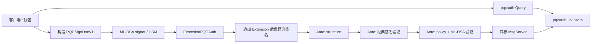

# `x/pqcauth` 实现导读

这是一份面向“初步了解 Cosmos SDK，但还不熟悉 AnteHandler、protobuf
transaction extension 和模块状态机”的代码阅读教程。

它不只是描述 `pqcauth` 有什么功能，而是尝试回答三个更适合代码 review 的问题：

1. 这部分代码解决什么问题？
2. 为什么选择现在这种实现方式？
3. 应该从哪个文件、哪个函数开始看？

阅读完本文后，你应该能够沿着一笔交易的完整调用链，理解：

- 客户端如何构造 ML-DSA 签名；
- PQC 签名为什么放在 `TxBody.extension_options`；
- Ante 如何决定哪些账户必须提供 PQC 签名；
- Ante 到底验证了哪些内容；
- 密钥注册、轮换和恢复如何修改链上状态；
- 为什么密钥和策略统一在 H+1 生效；
- 为什么模块还需要 `app/ante.go`、`app/proposal.go` 等应用层集成；
- review 安全代码时最应该关注哪些文件。

> 本文描述的是当前分支中的 v1 实现。协议和共识行为的 source of truth
> 始终是 protobuf 定义和 Go 实现，而不是本文。

## 1. 先建立整体认识

### 1.1 模块要解决的问题

普通 Cosmos SDK 账户依赖 secp256k1 或其他经典签名算法。量子计算机一旦能够攻击
这类算法，攻击者可能伪造账户签名。

`pqcauth` 没有替换 Cosmos 原有账户、公钥和地址体系，而是在原有认证之外增加一个
ML-DSA-65 认证因子：

```text
经典 Cosmos 签名有效
AND
ML-DSA-65 签名有效
=
受保护交易有效
```

这样设计的直接结果是：

- 现有地址不变；
- `x/auth`、`x/bank`、`x/staking`、wasm 等模块仍然按原来的账户体系工作；
- 只有经典私钥被攻破，不足以发送受保护交易；
- 只有 PQC 私钥被攻破，也不足以发送交易；
- PQC 可以按账户和全局策略逐步启用，不要求全链一次性更换地址。

这里的核心思想是“交易级第二因子”，不是“把 Cosmos 的公钥类型换成 ML-DSA”。

### 1.2 模块不保护什么

当前实现只保护 Cosmos SDK 账户发起的交易，不保护：

- CometBFT 验证人共识签名；
- P2P 节点身份；
- IBC 对端或轻客户端签名；
- 合约内部自己实现的授权逻辑；
- 已经通过 `x/authz` 主动授予给他人的业务权限；
- 丢失的经典 BaseAccount 私钥。

最后一点尤其重要：账户地址由经典公钥派生。Recovery Key 可以替换丢失的
PQC Signing Key，但不能在保持地址不变的情况下替换经典私钥。

### 1.3 最小 Cosmos 交易背景

一笔 protobuf Cosmos 交易可以简化成：

```text
TxRaw
├── body_bytes
│   └── TxBody
│       ├── messages
│       ├── memo
│       ├── timeout_height
│       ├── extension_options
│       └── non_critical_extension_options
├── auth_info_bytes
│   └── AuthInfo
│       ├── signer_infos
│       └── fee
└── signatures
```

节点执行交易时，主要经过两个阶段：

```text
AnteHandler
  ├── 检查交易格式、fee、sequence、经典签名、PQC 签名
  └── 失败时不执行消息

MsgServer
  ├── 执行 MsgSend、MsgDelegate、MsgRegisterKey 等业务消息
  └── 修改模块 KV store
```

`pqcauth` 同时使用了这两个阶段：

- Ante 负责所有会影响“交易是否有权执行”的密码学认证；
- pqcauth MsgServer 负责密钥、策略和参数的状态迁移。

这是理解整个实现最重要的分界。

## 2. 一张图看完整架构



代码按职责分布在：

| 位置 | 职责 |
|---|---|
| [`proto/doravota/pqcauth/v1`](../../proto/doravota/pqcauth/v1) | 定义 wire format、状态、Msg、Query 和签名文档 |
| [`types/`](types) | protobuf 生成类型之外的状态规则、canonical 编码和常量 |
| [`crypto/`](crypto) | Cloudflare CIRCL ML-DSA-65 的最小适配层 |
| [`keeper/`](keeper) | KV store、MsgServer、QueryServer、invariant |
| [`ante/`](ante) | 交易结构、策略、proof 和 ML-DSA 验证 |
| [`client/`](client) | 在线/离线签名、bundle、simulation placeholder |
| [`client/cli/`](client/cli) | `dorad tx/query pqcauth` 命令 |
| [`internal/execution/`](internal/execution) | Ante 到 MsgServer 的精确生命周期消息授权 |
| [`module.go`](module.go) | Cosmos `AppModuleBasic` / `AppModule` 接口 |
| [`genesis.go`](genesis.go) | genesis 导入与导出 |
| [`app/ante.go`](../../app/ante.go) | 把 PQC 校验接入全局 Ante 链 |
| [`app/app.go`](../../app/app.go) | store、keeper、module manager 和服务装配 |
| [`app/proposal.go`](../../app/proposal.go) | 提案阶段重新执行 Ante，并限制区块资源 |
| [`app/upgrades/v1_0_0`](../../app/upgrades/v1_0_0) | 已有链升级时增加 store 和固定 network ID |

一个常见误区是：只注册 `AppModule` 就能保护所有交易。

实际上不能。普通 bank、staking、wasm 交易不会进入 pqcauth 的 MsgServer，它们只能
通过全局 AnteHandler 被保护。因此 `app/ante.go` 是安全边界的一部分，不是普通的
装配代码。

## 3. 推荐的代码阅读顺序

如果你第一次 review，建议按下面顺序阅读：

1. [`proto/doravota/pqcauth/v1/state.proto`](../../proto/doravota/pqcauth/v1/state.proto)
2. [`proto/doravota/pqcauth/v1/extension.proto`](../../proto/doravota/pqcauth/v1/extension.proto)
3. [`proto/doravota/pqcauth/v1/signing.proto`](../../proto/doravota/pqcauth/v1/signing.proto)
4. [`types/policy.go`](types/policy.go) 和 [`types/params.go`](types/params.go)
5. [`types/canonical_tx.go`](types/canonical_tx.go) 和 [`types/signing.go`](types/signing.go)
6. [`crypto/mldsa65.go`](crypto/mldsa65.go)
7. [`client/sign.go`](client/sign.go)
8. [`ante/structure.go`](ante/structure.go)
9. [`ante/verify.go`](ante/verify.go)
10. [`ante/lifecycle.go`](ante/lifecycle.go)
11. [`keeper/keeper.go`](keeper/keeper.go)
12. [`keeper/msg_server.go`](keeper/msg_server.go)
13. [`internal/execution/authorization.go`](internal/execution/authorization.go)
14. [`app/ante.go`](../../app/ante.go) 和 [`app/proposal.go`](../../app/proposal.go)

先看 protobuf 和签名文档，再看 Ante，会比直接从 `VerifyPQCDecorator` 开始容易很多。

`types/*.pb.go`、`types/*.pb.gw.go` 是根据 proto 自动生成的代码。review 协议时应看
`proto/doravota/pqcauth/v1/*.proto`，不要从生成文件开始，也不要直接修改生成文件。

五个 proto 文件的分工是：

| Proto | 内容 |
|---|---|
| [`state.proto`](../../proto/doravota/pqcauth/v1/state.proto) | 参数、key record、账户 policy、key sequence 和 genesis |
| [`extension.proto`](../../proto/doravota/pqcauth/v1/extension.proto) | 放入交易 critical extension 的 PQC signer entries |
| [`signing.proto`](../../proto/doravota/pqcauth/v1/signing.proto) | 普通交易、key proof 和 recovery 的 canonical sign documents |
| [`tx.proto`](../../proto/doravota/pqcauth/v1/tx.proto) | 注册、轮换、保护、吊销、恢复和参数更新消息 |
| [`query.proto`](../../proto/doravota/pqcauth/v1/query.proto) | Params、Account、Key、Keys 查询服务 |

## 4. 第一核心部件：交易扩展 `ExtensionPQCAuth`

### 4.1 为什么使用 transaction extension

如果直接修改 Cosmos SDK 的标准 `Tx` 或 `BaseAccount`：

- 会侵入 SDK 核心代码；
- 钱包、硬件设备和其他模块兼容成本高；
- 很难按模块形式逐步部署；
- 账户地址和经典公钥迁移会变得复杂。

Cosmos `TxBody` 已经预留了扩展字段，所以当前实现把 PQC 授权放进 critical
`extension_options`。

这里需要区分字段名和语义：

- protobuf 字段名是 `extension_options`；
- Go 字段是 `TxBody.ExtensionOptions`；
- 它在 Cosmos 语义上是 critical extension options；
- `non_critical_extension_options` 是另一组可被旧节点忽略的扩展。

PQC 必须是 critical。节点如果不知道如何验证 PQC，就必须拒绝交易，不能把扩展忽略
后按 classic-only 交易执行。

### 4.2 Extension 里存了什么

协议定义在
[`extension.proto`](../../proto/doravota/pqcauth/v1/extension.proto)：

```protobuf
message ExtensionPQCAuth {
  uint32 format_version = 1;
  repeated SignerPQCSignature signatures = 2;
}

message SignerPQCSignature {
  string signer = 1;
  uint32 signer_index = 2;
  uint64 key_id = 3;
  Algorithm algorithm = 4;
  uint64 policy_version = 5;
  bytes signature = 6;
}
```

这里没有直接存公钥。节点通过 `signer + key_id` 从 pqcauth KV store 读取已经注册的
公钥。

每个字段都有明确作用：

| 字段 | 作用 |
|---|---|
| `format_version` | 允许未来升级 wire format，未知版本 fail-closed |
| `signer` | 防止 entry 被挪给另一个地址 |
| `signer_index` | 对应 `AuthInfo.signer_infos` 中的具体 signer |
| `key_id` | 指定本次使用哪一条链上 key record |
| `algorithm` | 防止算法解释歧义 |
| `policy_version` | 让旧策略下的签名在轮换后失效 |
| `signature` | detached ML-DSA 签名 |

多 signer 共识格式已经支持多个 `SignerPQCSignature`。当前客户端工具主要完成
single signer index 0 的编排，这是“共识能力”和“钱包能力”的区别。

### 4.3 为什么要求 PQC Extension 必须最后

客户端构造 sign document 时，会从 `TxBody` 中移除唯一的 PQC Extension，但保留
其他所有扩展。

要求它必须是最后一个 critical extension，有几个好处：

- 客户端追加 PQC 授权时不需要重排已有扩展；
- canonical removal 规则简单且唯一；
- 不允许恶意 builder 在 PQC Extension 后再追加未被预期处理的 critical option；
- 离线 bundle 更容易判断最终交易是否被修改。

对应检查在 [`ante/structure.go`](ante/structure.go) 的 `ExtractExtension`。

## 5. 第二核心部件：链上状态模型

状态定义在
[`state.proto`](../../proto/doravota/pqcauth/v1/state.proto)，KV key 编码在
[`types/keys.go`](types/keys.go)。

模块 store 中主要有五类数据。

### 5.1 `PQCKeyRecord`

`PQCKeyRecord` 是当前、待生效或近期历史的完整公钥记录：

```text
owner
key_id
algorithm
public_key
role
status
created_height
effective_height
inactive_from_height
```

`role` 分为：

- `SIGNING`：日常交易第二签名；
- `RECOVERY`：离线恢复 signing key。

一条 key 在高度 `H` 有效，需要满足：

```text
status == LIVE
AND H >= effective_height
AND (
  inactive_from_height == 0
  OR H < inactive_from_height
)
```

实现位于 [`types/policy.go`](types/policy.go) 的 `PQCKeyRecord.IsEffective`。

这里的 append-only 主要指 key identity：已经分配的 `key_id` 不会被另一把公钥复用，
`public_key`、algorithm 和 role 也不会被替换。轮换或吊销时，代码仍会更新旧记录的
`inactive_from_height` 或 `status`，用来表达它何时退出有效集合。

为什么不直接用同一个 key ID 覆盖旧公钥？

- 历史 key ID 不会重新指向另一把公钥；
- 旧签名不能因为 key ID 被复用而重新有效；
- 可以把近期完整记录与更早历史的哈希链承诺关联起来审计；
- genesis export 和 invariant 可以检查连续性；
- recovery、pending policy 和事件可以引用不可变 key record。

### 5.2 `AccountPolicy`

`AccountPolicy` 表示账户现在应该使用哪把 key：

```text
current_signing_key_id
recovery_key_id
self_enforced
policy_version

pending_signing_key_id
pending_recovery_key_id
pending_self_enforced
pending_policy_version
pending_effective_height
```

当前值和 pending 值放在同一个结构中，是为了表达 H+1 原子切换。

读取路径通过 [`types/policy.go`](types/policy.go) 的 `Effective(height)` 计算当前高度
实际生效的 policy，而不是要求 BeginBlock 遍历所有账户。

`policy_version` 会进入 PQC sign document。轮换 key、恢复 key 或修改保护状态后，
version 增加，因此旧版本签名不能重放到新策略。

### 5.3 `AccountKeySequence`

`AccountKeySequence.next_key_id` 为每个账户分配单调递增的 key ID。

[`keeper/keeper.go`](keeper/keeper.go) 的 `ReserveKeyIDs` 会检查：

- 调用者声明的 expected key ID 是否等于链上 next key ID；
- 是否发生 uint64 overflow；
- 单次操作分配数量是否为协议允许的一把或两把。

“expected key ID”也被 key proof 签名绑定。这样在 proof 离线生成后，如果链上已经有
其他轮换占用了该 ID，旧 proof 不会被悄悄用于另一个 ID。

key ID 不再有小额终身配额。完整 terminal records 按 signing/recovery 角色分别保留
最近若干条，更早记录由 [`keeper/key_history.go`](keeper/key_history.go) 写入
`AccountKeyHistory` 哈希链承诺后删除。当前和 pending policy 引用始终 pin，角色之间
互不挤占，所以大量 Recovery Key 轮换不会删除当前 Signing Key。

### 5.4 `AccountKeyHistory`

`AccountKeyHistory` 不是一把可用于验签的 key，而是已删除完整 terminal records 的
共识承诺。每个账户最多有 signing、recovery 两条摘要，包含：

```text
owner
role
compacted_count
last_compacted_key_id
accumulator
```

压缩按同一角色的 key ID 递增顺序执行。每一步把前一个 accumulator 与完整 record
的 owner、ID、algorithm、role、status、高度窗口和公钥 fingerprint 做域分离哈希。
这样链上状态保持有界，同时 export/import 和外部归档可以验证历史承诺没有变化。

保留数只作用于未被 policy 引用的 terminal records。四个引用
`current_signing`、`pending_signing`、`recovery`、`pending_recovery` 永远 pin。
当一次 H+1 轮换即将使 current key 退休时，压缩器会提前预留一个槽位，保证激活后
完整 terminal records 仍不超过参数上限。

### 5.5 `Params`

`Params` 控制全局策略：

- enforcement mode；
- 不可变 `network_id`；
- 允许的算法；
- signature/proof verification gas；
- extension 大小和 signer 数量上限；
- 每账户、每角色完整 terminal key record 保留数；
- registration cutoff；
- emergency mode；
- H+1 pending 参数 bundle。

验证和安全上下界在 [`types/params.go`](types/params.go)。

除了治理参数上限，代码还定义绝对上限和 gas 下限。原因是治理参数本身也不能被允许
把共识验证变成无界操作，或把昂贵的 ML-DSA 验证价格设置为接近零。

## 6. 第三核心部件：密码学适配层

### 6.1 为什么单独放在 `crypto/`

[`crypto/mldsa65.go`](crypto/mldsa65.go) 是对
`github.com/cloudflare/circl/sign/mldsa/mldsa65` 的薄封装。

它只负责：

- 获取固定 public key/private key/signature 长度；
- 生成 ML-DSA-65 密钥；
- 从私钥导出公钥；
- 使用 FIPS 204 context 签名；
- 验证 detached signature；
- 在进入 CIRCL 之前严格检查长度。

把适配层做小的原因是：

- 共识代码不需要依赖 CIRCL 的具体 Go key 类型；
- 算法枚举到实现的映射集中在一个位置；
- 输入长度检查不会散落在各调用方；
- 将来增加算法时，可以明确增加新的 wire algorithm ID，而不是改变旧 ID 的含义；
- 密码学测试向量可以独立于 Cosmos 状态机运行。

### 6.2 为什么使用固定 context

ML-DSA 支持 context string。当前实现为不同用途使用不同 context：

| 用途 | Context |
|---|---|
| 普通交易 | `doravota/pqcauth/tx/v1` |
| 首次注册 proof | `doravota/pqcauth/register/v1` |
| signing key 轮换 proof | `doravota/pqcauth/rotate/v1` |
| recovery key 轮换 proof | `doravota/pqcauth/rotate-recovery/v1` |
| 恢复时新 signing key proof | `doravota/pqcauth/recover-key-proof/v1` |
| Recovery Key 授权 | `doravota/pqcauth/recovery/v1` |

常量位于 [`types/signing.go`](types/signing.go)。

context 是密码学 domain separation。即使两个业务流程偶然产生相同 message bytes，
某个流程的签名也不能被拿去另一个流程使用。

## 7. 第四核心部件：三种签名文档

签名不是直接对“交易 JSON”或“新公钥”执行的。协议定义了三种 canonical protobuf
sign document，位于
[`signing.proto`](../../proto/doravota/pqcauth/v1/signing.proto)。

### 7.1 `PQCSignDocV1`

用于普通交易的 PQC 第二签名，绑定：

- format version；
- `network_id`；
- `chain_id`；
- account number；
- sequence；
- signer index；
- signer address；
- key ID；
- algorithm；
- policy version；
- 移除 PQC Extension 后的完整 deterministic `TxBody`；
- 完整 deterministic `AuthInfo`。

构造代码在 [`types/canonical_tx.go`](types/canonical_tx.go)：

- `CanonicalBodyBytesWithoutPQCAuth`
- `CanonicalAuthInfoBytes`
- `NewCanonicalPQCTransaction`
- `NewPQCSignDocV1`
- `NewPQCSignDocV1FromCanonical`

这意味着 PQC 签名不仅保护 messages，也保护：

- memo 和 timeout；
- fee、gas limit、fee payer 和 fee granter；
- signer info 和 signer 顺序；
- sponsor 消息；
- authz 嵌套消息本身；
- 其他 critical/non-critical extensions。

### 7.2 为什么 PQCSignDoc 不包含自身 Extension

PQC signature 最终需要写进 `ExtensionPQCAuth`。如果 sign document 又包含这个
signature，就会产生循环依赖：

```text
要生成 signature
  -> 需要最终 TxBody
  -> 最终 TxBody 需要 signature
```

所以 canonical 规则是：

1. 保留 TxBody 中所有其他字段；
2. 只移除唯一的 `ExtensionPQCAuth`；
3. deterministic marshal；
4. 把结果写入 `PQCSignDocV1.body_bytes_without_pqc_auth`。

经典 Cosmos 签名在 PQC Extension 附加后才生成，因此经典签名会绑定最终
Extension。两种签名形成如下关系：

```text
PQC signature
  -> 绑定除自身 Extension 外的完整交易意图

经典 signature
  -> 绑定包含 PQC Extension 的最终交易
```

### 7.3 `KeyProofDocV1`

用于新 key 的 proof of possession，也就是证明提交人确实持有新公钥对应的私钥。

它绑定：

- network ID 和 chain ID；
- owner；
- proposed key ID；
- algorithm 和 public key；
- key role；
- register/rotate/recover purpose；
- current policy version。

因此 proof 不能跨链、跨账户、跨角色或跨生命周期操作复用。

只有提交一个公钥而没有 PoP 是不够的，否则可能把无法使用的公钥、别人的公钥或恶意
构造的数据写入账户策略。

### 7.4 `RecoverySignDocV1`

Recovery Key 的签名不是只签新公钥，而是绑定完整恢复交易：

- 当前 Recovery Key ID；
- replacement Signing Key ID、算法和公钥；
- 当前 policy version；
- network/chain/account/sequence/signer；
- 完整 `AuthInfo`；
- 除 PQC Extension 和 `recovery_signature` 自身外的完整 `TxBody`。

构造时只清空 `MsgRecoverKey.recovery_signature` 来解除循环依赖，其他字段全部保留。

代码在 [`types/canonical_tx.go`](types/canonical_tx.go) 的：

- `CanonicalRecoveryBodyBytes`
- `NewRecoverySignDocV1`

## 8. `network_id` 和 `chain_id` 为什么都要签

`chain_id` 是 Cosmos 原生的链标识，但某些 fork、rehearsal 或重新启动场景可能复用
相同 chain ID。

因此模块还维护一个写入 pqcauth params 的 `network_id`：

- 新链可以由 chain ID 派生；
- 生产升级使用写入二进制的 launch-specific ID；
- mainnet、testnet 和 rehearsal 使用不同 domain；
- genesis 后不允许治理修改。

普通交易、key proof 和 recovery sign document 都同时绑定二者。

相关代码：

- [`types/params.go`](types/params.go) 的 `NetworkIDForChain`
- [`app/upgrades/v1_0_0/store.go`](../../app/upgrades/v1_0_0/store.go) 的
  `PQCNetworkID`
- [`keeper/msg_server.go`](keeper/msg_server.go) 的参数更新限制

## 9. 第五核心部件：客户端如何生成受保护交易

主入口在 [`client/sign.go`](client/sign.go)。

### 9.1 正确的签名顺序

客户端必须按下面顺序执行：

```text
1. 构造 messages、memo、timeout、fee、gas
2. 放入空的经典 SignatureV2，以冻结 AuthInfo.signer_infos
3. 查询链上 effective params、policy、active signing key
4. 构造不含 PQC Extension 的 PQCSignDocV1
5. 调用 ML-DSA signer
6. 本地检查 signer 公钥是否等于链上 active key
7. 本地验证 signer 返回的 ML-DSA signature
8. 把 ExtensionPQCAuth 追加为最后一个 critical extension
9. 对最终交易执行经典 SIGN_MODE_DIRECT 签名
10. 广播
```

如果先做经典签名，再附加 PQC Extension，经典签名会因为 TxBody 被修改而失效。

如果在 fee/gas/signer info 尚未冻结时做 PQC 签名，之后任何这些字段变化都会让 PQC
签名失效。

关键函数：

- `prepareSingleDirectSigner`：建立 signer info，要求 `SIGN_MODE_DIRECT`
- `preparePQCSignDoc`：查询状态并生成 sign bytes
- `AttachPQCAuthWithSigner`：调用本地、远程或硬件 signer
- `attachPQCSignature`：追加唯一 PQC Extension

### 9.2 `PQCSigner` 抽象

`client/sign.go` 定义：

```go
type PQCSigner interface {
    Algorithm() types.Algorithm
    PublicKey(context.Context) ([]byte, error)
    Sign(context.Context, []byte, []byte) ([]byte, error)
}
```

客户端只把最终 sign bytes 和 context 交给 signer。这样可以接入：

- 本地私钥文件；
- 远程 signing service；
- HSM；
- 硬件钱包。

当前仓库提供本地 ML-DSA-65 实现，但没有把某一种远程传输协议写进共识模块。

调用外部 signer 后，客户端会：

1. 比较 signer 返回的公钥和链上 active public key；
2. 本地验证返回的签名；
3. 只有通过后才修改 TxBody。

这样可以尽早发现选错 HSM slot、错误远程 signer 或损坏签名。

### 9.3 私钥文件保护

`LoadPrivateKeyFile` 会：

- 要求普通文件；
- 拒绝 group/other 可读权限；
- 限制读取长度；
- 检查私钥固定大小。

这是客户端安全措施，不是共识规则。生产环境仍建议使用 HSM 或独立离线签名设备。

### 9.4 Simulation

Cosmos gas simulation 通常不会执行真实经典签名验证。为了让 PQC 账户也能估算 gas，
客户端构造一个 metadata 正确、signature 长度正确、内容全零的 placeholder
Extension。

[`client/sign.go`](client/sign.go) 的 `BuildPQCAuthSimulationExtension` 会绑定真实：

- signer；
- key ID；
- algorithm；
- policy version；
- signature size。

Ante 在 `simulate=true` 时：

- 仍做结构、状态、策略和 required 检查；
- 不调用真实 ML-DSA Verify；
- 按真实验证次数消耗固定 gas。

placeholder 在真实执行中一定无法通过密码学校验，因此不能用来广播绕过认证。

### 9.5 Offline bundle

[`client/bundle.go`](client/bundle.go) 和
[`client/recovery_bundle.go`](client/recovery_bundle.go) 实现两个独立的离线流程：

- 普通交易 PQC sign bundle；
- Recovery Key sign bundle。

bundle 包含 unsigned transaction、sign document、状态摘要和 hash。在线 attach 前会
重新查询 network、account、sequence、key 和 policy，并要求重建的 sign bytes
完全相同。

bundle 是传输和 review 工具，真正的安全边界仍然是最终被签名的 canonical sign
document。

## 10. 第六核心部件：Ante 集成

### 10.1 全局 Ante 顺序

实际顺序在 [`app/ante.go`](../../app/ante.go)：

```text
SetUpContext
Wasm simulation gas limit
Tx counter
ExtensionOptionsDecorator
ValidateBasic
TimeoutHeight
Memo
ConsumeGasForTxSize
ValidatePQCStructureDecorator
Sponsor authorization
Fee deduction
SetPubKey
ValidateSigCount
Classic signature gas
Classic signature verification
VerifyPQCDecorator
IncrementSequence
IBC redundant relay check
```

这个顺序包含几个安全考虑：

- `ConsumeGasForTxSize` 在 PQC protobuf 解析和 canonical 重编码之前执行；
- structure 检查先过滤 malformed/oversized 输入；
- fee 和经典签名验证先于昂贵的 ML-DSA Verify；
- 完全没有有效经典签名的攻击者不能直接让节点持续做 ML-DSA；
- sequence 只有在两类签名都通过后才递增。

Cosmos 的交易执行使用缓存 Context。后续 Ante 失败时，前面阶段的临时状态不会提交。

### 10.2 为什么拆成两个 Decorator

PQC Ante 被拆为：

1. [`ante/structure.go`](ante/structure.go)：便宜、状态无关、可在前面执行；
2. [`ante/verify.go`](ante/verify.go)：读取状态并执行昂贵密码学验证。

这样做不是为了代码形式整齐，而是为了安排成本顺序：

```text
先拒绝 malformed bytes
再验证经典签名
最后消耗 ML-DSA CPU
```

两个 Decorator 之间通过 Context 缓存已解析 Extension。缓存同时包含所有 critical 和
non-critical options 的 SHA-256 fingerprint。如果中间某个 Decorator 修改了
extension options，后面的 verify 不会错误复用旧解析结果，而是重新提取。

### 10.3 `ExtensionOptionChecker`

Cosmos SDK 的 `ExtensionOptionsDecorator` 默认需要知道某个 critical extension 是否
被应用支持。

[`ante/structure.go`](ante/structure.go) 的 `ExtensionOptionChecker`：

- 接受 `ExtensionPQCAuth` type URL；
- 其他 extension 继续交给应用已有 fallback checker；
- 不会因为引入 pqcauth 而禁用应用原有 extension。

### 10.4 Structure Decorator 做了哪些校验

`ValidatePQCStructureDecorator.AnteHandle` 和 `ExtractExtension` 检查：

- PQC 不能放入 non-critical extensions；
- 最多一个 PQC Extension；
- PQC Extension 必须是最后一个 critical extension；
- encoded bytes 不超过参数上限；
- protobuf 可以反序列化；
- 反序列化后重新 marshal 必须与原始 bytes 完全相同；
- format version 必须是 v1；
- signer entry 数量不超过上限；
- entry 必须按 signer index 严格递增；
- signer、key ID、policy version 不能为空或零；
- algorithm 必须被实现支持；
- signature 长度必须严格等于算法固定长度；
- 携带 PQC Extension 时所有 signer 必须使用 single
  `SIGN_MODE_DIRECT`。

“解码后重新编码必须相同”用于拒绝 unknown fields、重复字段或其他非 canonical
protobuf 表达，避免客户端和节点对“相同逻辑消息”的签名字节产生不同理解。

### 10.5 Verify Decorator 的主流程

[`ante/verify.go`](ante/verify.go) 的 `VerifyPQCDecorator.AnteHandle` 可以概括为：

```text
读取当前高度 effective params
验证生命周期 proof
读取交易 signers 和 SignatureV2
解析 signer_index -> PQC entry

对每个交易 signer:
  读取 effective policy 和 active signing key
  如果 policy 指向不可用 key -> fail closed
  计算该 signer 是否 required
  检查是否有 entry 或合法 lifecycle substitute

对每个提供的 PQC entry:
  signer index 不越界
  signer address 匹配
  active key 存在
  key ID / algorithm / policy version 匹配
  algorithm 当前仍被 params 允许
  Cosmos account 存在

构造 canonical transaction
为每个 entry 构造 signer-specific PQCSignDocV1
先扣固定 gas
调用 CIRCL ML-DSA Verify

如为生命周期消息:
  在 Context 写入 exact-message authorization

继续执行下一个 Ante decorator
```

### 10.6 “哪些账户必须签 PQC”

`ante/verify.go` 的 `pqcRequired` 根据全局 mode 和账户 policy 判断：

| Mode | 行为 |
|---|---|
| `DISABLED` | 全局不要求，但 `self_enforced` 账户仍要求 |
| `OPTIONAL` | 允许试用；`self_enforced` 账户仍要求 |
| `REQUIRED_FOR_REGISTERED` | 有 active PQC key 的账户要求 |
| `REQUIRED` | 所有 signer 要求 |
| 未知 mode | fail-closed，按 required 处理 |

几个容易误解的边界：

- `OPTIONAL` 不代表“无效 PQC 签名可以忽略”；
- 只要交易提供了 entry，该 entry 就必须完整验证；
- 已注册 policy 指向的 active key 不存在或无效时，不能退回 classic-only；
- `self_enforced` 不会被全局 `DISABLED` 取消；
- rotate、set protection、revoke 等敏感生命周期操作强制使用当前 active PQC。

### 10.7 Entry 为什么同时有 index 和 address

只使用 address，可能无法明确它对应 `AuthInfo` 中哪一个 signer 的 sequence。

只使用 index，恶意 builder 可能尝试调整 signer 顺序。

因此当前实现同时校验：

```text
entry.signer_index
entry.signer
tx.GetSigners()[index]
AuthInfo.signer_infos[index]
```

并把 index、address 和该 signer 的 sequence 一起放入 sign document。

## 11. 第七核心部件：密钥生命周期 Proof

生命周期 proof 在 [`ante/lifecycle.go`](ante/lifecycle.go) 验证。

所有 pqcauth 生命周期消息必须是交易中唯一的 top-level message，不能和其他消息
batch。

### 11.1 为什么 proof 必须在 Ante 验证

如果只在 pqcauth MsgServer 验证 proof：

- CheckTx 可能接受最终一定失败的昂贵交易；
- proposer 可能把无效 proof 放入 proposal；
- authz/group 等嵌套执行可能产生不同授权边界；
- proposal validation 和最终执行对合法性的理解可能不同。

因此 proof 是交易授权的一部分，必须和经典/PQC 签名一样进入 Ante。

### 11.2 生命周期消息矩阵

| 消息 | 它解决什么 | 认证要求 | 状态结果 |
|---|---|---|---|
| `MsgRegisterKey` | 首次加入 PQC | 经典签名 + 不同的 Signing/Recovery Key 各自 PoP | 两把 key 与 self-enforcement 在 H+1 原子生效 |
| `MsgRotateKey` | 正常更换日常 Signing Key | 经典签名 + 当前 PQC Signing Key + 新 key PoP | 新旧 Signing Key 在 H+1 切换 |
| `MsgRotateRecoveryKey` | 主动更换离线 Recovery Key | 经典签名 + 当前 PQC Signing Key + 新 Recovery Key PoP | Recovery Key 在 H+1 切换 |
| `MsgSetProtection` | 开/关账户 `self_enforced` | 经典签名 + 当前 PQC Signing Key | policy 在 H+1 变化 |
| `MsgRevokeKey` | 永久吊销非活跃历史 key | 经典签名 + 当前 PQC Signing Key | 立即将历史 key 标为 revoked |
| `MsgRecoverKey` | Signing Key 丢失后恢复 | 经典签名 + Recovery Key 交易签名 + 新 Signing Key PoP | Signing Key 在 H+1 切换 |
| `MsgUpdateParams` | 治理修改模块参数 | governance authority | 完整参数 bundle 在 H+1 生效 |

### 11.3 首次注册的特殊性

注册前账户没有链上 active PQC key，因此不可能要求“当前 PQC key 给注册交易签名”。

首次注册使用：

```text
经典账户签名
+
新 PQC key 的 proof of possession
```

这是 bootstrap 信任边界：必须在经典签名仍被认为可信时完成。如果攻击者已经可以
伪造经典签名，他也能生成自己的 PQC key 和 proof，抢先为未注册账户注册。

所以参数中有不可逆的 `registration_cutoff_height`。迁移窗口结束后，未注册账户不能
继续只靠经典签名 bootstrap。

### 11.4 `MsgRecoverKey` 为什么能替代普通 PQC entry

RecoverKey 就是为“当前 Signing Key 已丢失”设计的。如果仍要求当前 Signing Key
对恢复交易做 PQC 签名，恢复功能就没有意义。

因此 Verify Decorator 允许一个严格限定的 substitute：

```text
有效 Recovery Key 对完整 RecoverySignDocV1 的签名
```

它只替代当前 Signing Key 的交易 PQC 签名，不替代经典 Cosmos 签名，也不替代新
Signing Key 的 PoP。

### 11.5 H+1 为什么必要

所有改变认证边界的 key、policy 和 params 都在下一高度生效。

原因是 PrepareProposal 和 ProcessProposal 会执行 Ante，但不执行 MsgServer。如果同一
高度内前一笔消息立即改变 key，可能出现：

```text
提案阶段看到旧 key
最终执行阶段前一笔交易写入新 key
后一笔交易在同一高度看到新 key
```

这会让 proposer、validator proposal check 和 DeliverTx 的验证视图变复杂。

使用 H+1 后：

```text
高度 H 的所有交易都使用 H 开始时的认证状态
高度 H+1 再统一看到 pending 状态生效
```

`AccountPolicy.Effective(height)` 和 `Params.Effective(height)` 保证读取路径在激活高度
看到相同结果。

## 12. 第八核心部件：Ante 到 MsgServer 的授权桥

这是最容易在初次阅读时忽略，但安全上非常关键的一层。

问题场景是：

```text
外层交易 MsgExec 通过普通 Ante
  -> authz 在内部执行 MsgRecoverKey
  -> 内层消息不会重新跑整套 Ante
```

如果 pqcauth MsgServer 只看到一个形式正确的 `MsgRecoverKey` 就执行，攻击者可能绕过
该消息本应需要的 recovery proof 或当前 PQC 授权。

当前实现使用
[`internal/execution/authorization.go`](internal/execution/authorization.go)：

1. Ante 确认生命周期消息是唯一 top-level message；
2. 对 `type URL + protobuf message bytes` 计算 SHA-256 fingerprint；
3. 使用私有 Context key 保存 fingerprint；
4. pqcauth MsgServer 调用 `RequireLifecycleMessage`；
5. MsgServer 收到的消息必须与 Ante 授权的 exact message 完全一致。

因此：

- `authz.MsgExec` 内层消息没有对应 marker；
- group、wasm、gov 或其他模块嵌套调用也没有 marker；
- 即使消息类型相同，只要内容变化，fingerprint 也不匹配。

代码放在 Go `internal/` 目录，并使用未导出的 Context key，目的是限制其他 package
伪造“Ante 已经验证”的标记。

## 13. 第九核心部件：Keeper 和 MsgServer

### 13.1 Keeper 的职责

[`keeper/keeper.go`](keeper/keeper.go) 负责：

- Params get/set/normalize；
- AccountPolicy get/set/effective/normalize；
- PQCKeyRecord get/set/iterate；
- AccountKeyHistory get/set/iterate；
- active Signing Key 查询；
- AccountKeySequence get/set；
- 单调且永不复用的 key ID 计算；
- 按角色压缩 terminal key history，并 pin 当前/pending key；
- query pagination。

Keeper 不持有私钥。链上只保存 public key、policy 和生命周期元数据。

store key 前缀定义在 [`types/keys.go`](types/keys.go)：

```text
0x01 Params
0x02 AccountPolicy
0x03 PQCKeyRecord
0x04 AccountKeySequence
0x05 AccountKeyHistory
```

owner 地址使用长度前缀，key ID 使用 big-endian uint64，避免不同 key 空间或地址编码
发生前缀碰撞。

### 13.2 MsgServer 的职责

[`keeper/msg_server.go`](keeper/msg_server.go) 实现：

- `RegisterKey`
- `RotateKey`
- `RotateRecoveryKey`
- `SetProtection`
- `RevokeKey`
- `RecoverKey`
- `UpdateParams`

六个账户密钥/策略生命周期 MsgServer 首先：

1. `ValidateBasic`；
2. `RequireLifecycleMessage`；
3. 读取当前 effective params/policy/key；
4. 重复检查 pending change、key role 和有效高度等状态条件；
5. 写入新 key/policy/sequence；
6. 发出固定字段事件。

密码学 proof 已经在 Ante 验证。MsgServer 的重点是防止状态迁移违反不变量，并确保
它只能执行 Ante 精确授权过的顶层消息。

`MsgUpdateParams` 不是账户生命周期消息，不使用上述 Context marker；它单独要求
`msg.authority` 等于 Keeper 配置的 governance authority，并限制 network ID、cutoff
和 pending schedule。

### 13.3 为什么 Ante 和 MsgServer 都有检查

两层检查目的不同：

- Ante 回答：“这笔交易现在是否有权进入执行？”
- MsgServer 回答：“执行这个状态迁移是否仍满足模块状态机规则？”

MsgServer 不能假设所有调用路径都来自普通交易；Ante 也不应该直接承担最终状态写入。

两层都检查 `pending change`、key role、有效高度等关键条件，可以让失败更靠近授权边界，
同时让 MsgServer 本身保持 fail-closed。

### 13.4 各状态迁移的写入方式

以 `RotateKey` 为例：

```text
高度 H:
  旧 key.inactive_from_height = H+1
  新 key.effective_height = H+1
  policy.pending_signing_key_id = 新 key ID
  policy.pending_effective_height = H+1
  policy.pending_policy_version = 当前 version + 1

高度 H+1:
  Effective(H+1) 返回新 key 和新 policy version
```

`RotateRecoveryKey` 使用相同模式切换 recovery key。

`RecoverKey` 会让旧 Signing Key 在 H+1 失效，并安排 replacement Signing Key 在 H+1
生效；Recovery Key 本身保持不变。

`RevokeKey` 只允许撤销非 active、非 pending、非 recovery 边界上的历史 key，避免通过
revoke 间接破坏当前认证状态。

## 14. 第十核心部件：治理、紧急模式和 rollout

### 14.1 Enforcement mode

全局 mode 支持逐步上线：

```text
DISABLED
  -> 不从全局要求 PQC，但账户 self_enforced 仍有效

OPTIONAL
  -> 允许注册、测试和账户自保护

REQUIRED_FOR_REGISTERED
  -> 已注册账户统一强制

REQUIRED
  -> 所有 signer 强制
```

治理不能通过切换全局 mode 关闭某个账户已经启用的 `self_enforced`。

### 14.2 Emergency mode

| Mode | 行为 |
|---|---|
| `NORMAL` | 正常运行 |
| `PAUSE_NEW_KEYS` | 暂停注册、轮换和恢复，但已有受保护交易继续验证 |
| `PAUSE_PQC_TRANSACTIONS` | 暂停携带或要求 PQC 的交易 |

紧急模式是 pause，不是降级。系统不会因为 PQC 组件出现问题就自动允许
classic-only 交易。

### 14.3 参数为什么整包 H+1 更新

`MsgUpdateParams` 不直接修改当前字段，而是安排完整 `ScheduledParams` bundle 在
H+1 生效。

整包更新避免某些节点或某些读取路径看到：

```text
新 enforcement mode
+ 旧 allowed algorithms
+ 旧 gas
```

`network_id` 不在可调度字段中，治理不能修改。registration cutoff 也不能回退，避免
重新打开已关闭的经典 bootstrap 窗口。

## 15. 第十一核心部件：Genesis、Module 和 Query

### 15.1 Genesis

[`types/genesis.go`](types/genesis.go) 做跨对象一致性验证，例如：

- params 合法；
- owner 地址 canonical；
- key ID、role、status 和有效高度合法；
- policy 引用的 key 存在且 role 正确；
- sequence 大于已经使用的最大 key ID；
- pending key/policy 状态一致；
- 不存在重复 owner/key。

[`genesis.go`](genesis.go) 负责落库和导出：

- 新链设置 network ID；
- 写入 params、keys、policies、sequences；
- genesis 未显式提供 sequence 时，从最大 key ID 推导；
- 非法 genesis 直接 panic，拒绝以不一致认证状态启动。

### 15.2 AppModule

[`module.go`](module.go) 提供标准 Cosmos 模块接口：

- codec/interface 注册；
- default/validate genesis；
- Msg/Query server 注册；
- CLI 和 gRPC-Gateway；
- invariant；
- BeginBlock 参数 normalize；
- consensus version。

当前 EndBlock 不做额外状态变更，simulation `WeightedOperations` 也尚未实现。

### 15.3 Query

[`keeper/query_server.go`](keeper/query_server.go) 提供：

- `Params`
- `Account`
- `Key`
- `Keys`

Query 返回当前查询高度的 effective params/policy。客户端签名前必须查询这些接口，而
不是假设本地缓存的 key、policy version 或 network ID 仍然有效。

### 15.4 `types/` 中其他辅助文件

`types/` 还包含几类容易被忽略的共识接口：

- [`types/messages.go`](types/messages.go)：Msg 的 `GetSigners`、`ValidateBasic`
  和旧版 SDK 接口；
- [`types/codec.go`](types/codec.go)：把 Msg 和 `ExtensionPQCAuth` 注册到 interface
  registry；
- [`types/errors.go`](types/errors.go)：稳定的模块错误码；
- [`types/telemetry.go`](types/telemetry.go)：记录 transaction/proof/recovery
  验证耗时和结果，并控制 metric label 的 cardinality。

`ValidateBasic` 只做地址、非零 ID 和固定长度等不需要链上状态的检查。active key、
policy、authority 和 proof 是否有效，仍由 Ante/Keeper 在有 `sdk.Context` 时判断。

## 16. 第十二核心部件：应用层集成

### 16.1 `app/app.go`

应用层需要：

- 创建 pqcauth KV store key；
- 创建 Keeper，并把 governance module address 作为 authority；
- 注册 `AppModuleBasic` 和 `AppModule`；
- 加入 BeginBlock、EndBlock、InitGenesis、ExportGenesis 顺序；
- 注册 Msg/Query service；
- 把 Keeper 传入 Ante handler；
- 为已有链升级增加 store。

相关位置在 [`app/app.go`](../../app/app.go)。

如果缺少 store upgrade，旧链升级启动时无法打开 pqcauth store。

### 16.2 `app/ante.go`

[`app/ante.go`](../../app/ante.go) 决定了 PQC 实际保护所有模块交易的顺序。

review 时必须确认：

- structure 在 tx-size gas 之后；
- ML-DSA verify 在经典签名之后；
- PQC verify 在 sequence increment 之前；
- ExtensionOptionChecker 不会静默忽略 PQC；
- sponsor/fee 逻辑使用的 AuthInfo 也被 PQC sign document 绑定。

### 16.3 `app/proposal.go`

不能假设所有区块交易都经过本地 mempool `CheckTx`。恶意 proposer 可以直接把任意
transaction bytes 放进 proposal。

[`app/proposal.go`](../../app/proposal.go) 在：

- `PrepareProposal` 中重新执行 Ante，只选择合法交易；
- `ProcessProposal` 中让其他 validator 重新验证，并拒绝含非法交易的 proposal；
- 同时限制 proposal 总 bytes 和 declared gas；
- 对旧链无限 block limit 提供有限 fallback。

这使 PQC 验证不依赖“交易曾经进入诚实节点 mempool”这个假设。

### 16.4 链升级

[`app/upgrades/v1_0_0`](../../app/upgrades/v1_0_0)：

- 增加 pqcauth store；
- 运行 module migration；
- 写入 launch-specific network ID；
- 对历史无限 block gas/bytes 设置有限值。

PQC 签名验证会增加 CPU 成本，所以有限区块资源是生产安全模型的一部分。

## 17. 一笔普通受保护交易的完整生命周期

下面以受保护账户发送 `MsgSend` 为例。

### 17.1 客户端

1. 钱包构造 `MsgSend`。
2. 设置 memo、timeout、fee 和 gas。
3. 放入 `SIGN_MODE_DIRECT` signer info。
4. 查询 `QueryAccount` 得到 active Signing Key 和 policy version。
5. 查询 `QueryParams` 得到 network ID、allowed algorithm 和 emergency mode。
6. 从 TxBody 中移除 PQC Extension；此时通常还没有该 Extension。
7. deterministic marshal TxBody 和 AuthInfo。
8. 构造 signer index 0 的 `PQCSignDocV1`。
9. ML-DSA signer 使用 `doravota/pqcauth/tx/v1` context 签名。
10. 客户端本地验签。
11. 创建 `ExtensionPQCAuth` 并追加到 critical extensions 最后。
12. 用经典 Cosmos 私钥签最终交易。
13. 广播 `TxRaw`。

### 17.2 CheckTx / Ante

1. Cosmos 基础检查和 tx-size gas。
2. structure decorator 验证 Extension wire 约束。
3. sponsor/fee 检查。
4. 经典签名验证。
5. Verify decorator 读取 signer 的 effective policy 和 active key。
6. 判断 signer 是否 required。
7. 比对 entry 的 address/index/key/algorithm/policy。
8. 节点自己重建 `PQCSignDocV1`。
9. 扣除 ML-DSA verification gas。
10. 使用链上 public key 验证签名。
11. 两种签名都通过后递增 sequence。

### 17.3 Proposal 和最终执行

1. proposer 在 PrepareProposal 再跑 Ante。
2. validators 在 ProcessProposal 再跑 Ante。
3. FinalizeBlock/DeliverTx 再次执行 Ante。
4. Ante 通过后，`MsgSend` 进入 bank MsgServer。
5. bank 修改余额。
6. Commit 提交状态。

普通业务消息不会进入 pqcauth MsgServer；pqcauth 的作用已经在全局 Ante 阶段完成。

## 18. 一笔 `MsgRotateKey` 的完整生命周期

`MsgRotateKey` 比普通交易多两项认证：

```text
当前 Signing Key 对整笔交易的 PQC signature
+
新 Signing Key 对 KeyProofDocV1 的 PoP
```

流程如下：

1. 客户端生成新 ML-DSA key pair。
2. 查询 expected next key ID 和当前 policy version。
3. 新 key 对 `KeyProofDocV1` 签名。
4. 构造唯一 top-level `MsgRotateKey`。
5. 当前 active Signing Key 按普通 PQC 流程签整笔交易。
6. 经典 Cosmos key 最后签名。
7. Ante 验证经典签名、当前 PQC 签名和新 key proof。
8. Ante 为 exact `MsgRotateKey` 写入 Context authorization。
9. MsgServer 要求 fingerprint 匹配。
10. MsgServer 将旧 key 的失效高度和新 key 的生效高度都设为 H+1。
11. policy pending version 增加。
12. H+1 开始，交易必须使用新 key ID 和新 policy version。

## 19. 一笔 `MsgRecoverKey` 的完整生命周期

RecoverKey 的目标是假设当前 Signing Key 已不可用。

需要三份能力：

```text
经典 Cosmos 私钥
+
当前 Recovery Key 私钥
+
新 Signing Key 私钥
```

流程如下：

1. 生成 replacement Signing Key。
2. replacement key 生成 `KeyProofDocV1` PoP。
3. 构造唯一 top-level `MsgRecoverKey`，先放入固定长度全零
   `recovery_signature` placeholder。
4. 构造清空该字段后的 `RecoverySignDocV1`。
5. 离线 Recovery Key 签名。
6. 将 recovery signature 写回消息。
7. 经典 Cosmos key 签最终交易。
8. Ante 检查 Recovery Key 是 policy 当前登记的有效 recovery key。
9. Ante 验证 replacement key PoP。
10. Ante 重建 transaction-bound recovery sign doc 并验证 Recovery Key 签名。
11. recovery proof 严格替代缺失的当前 Signing Key PQC entry。
12. MsgServer 安排 replacement Signing Key 在 H+1 生效。

Recovery Key 不会在这个流程中被更换或消耗；如需更换 Recovery Key，应使用
`MsgRotateRecoveryKey`。

## 20. 测试应该怎么读

测试不是按文件数量追求“看起来很多”，而是围绕协议不变量组织。

### 20.1 Crypto 和 golden vectors

看：

- [`crypto/mldsa65_test.go`](crypto/mldsa65_test.go)
- [`crypto/vector_test.go`](crypto/vector_test.go)
- [`types/signing_vector_test.go`](types/signing_vector_test.go)

关注：

- deterministic vector 是否稳定；
- message/context/key/signature mutation 是否失败；
- 长度和未知算法是否 fail-closed；
- sign document bytes 是否跨版本意外变化。

### 20.2 Canonical binding

看：

- [`types/canonical_bindings_test.go`](types/canonical_bindings_test.go)
- [`types/signing_validation_test.go`](types/signing_validation_test.go)

关注 fee granter、sponsor fields、authz nested message、AuthInfo 和 TxBody mutation 是否都
改变签名结果。

### 20.3 Ante

看：

- [`ante/verify_test.go`](ante/verify_test.go)
- [`ante/coverage_test.go`](ante/coverage_test.go)

重点测试：

- hybrid happy path；
- missing PQC；
- fee tampering；
- optional/self-enforced/required matrix；
- unavailable active key fail-closed；
- non-canonical extension；
- extension cache mutation；
- lifecycle proof substitution；
- nested authz 不能继承 authorization；
- simulation 计 gas 但不真验签。

### 20.4 Keeper 和生命周期

看：

- [`keeper/keeper_test.go`](keeper/keeper_test.go)
- [`keeper/invariants_test.go`](keeper/invariants_test.go)
- [`keeper/query_server_test.go`](keeper/query_server_test.go)

重点测试：

- H+1 边界；
- pending change；
- 无终身 key-ID 锁死、历史按角色压缩且 active/pending key 永不删除；
- wrong chain proof；
- rotate/recovery/revoke；
- authority 和参数约束；
- invariant 检测不一致状态。

### 20.5 Client 和 offline bundle

看：

- [`client/sign_test.go`](client/sign_test.go)
- [`client/bundle_test.go`](client/bundle_test.go)
- [`client/recovery_bundle_test.go`](client/recovery_bundle_test.go)
- [`client/cli`](client/cli) 下的测试

重点测试 stale policy、transaction mutation、wrong signer、strict JSON、文件权限和
online revalidation。

### 20.6 Coverage gate

[`scripts/check-pqcauth-coverage.sh`](../../scripts/check-pqcauth-coverage.sh) 对
`x/pqcauth/...` 手写代码执行 coverage gate，并排除生成的 protobuf/gRPC 文件。

覆盖率只能说明代码是否被执行，不能证明安全性。安全 review 仍应围绕：

- 有没有未经过 Ante 的执行路径；
- sign document 是否绑定完整意图；
- 状态切换高度是否一致；
- unknown/malformed 状态是否 fail-closed；
- resource limit 和 gas 是否足够。

## 21. Review 时建议逐项回答的问题

### 21.1 Wire format

- PQC 是否只能出现在 critical extension？
- 是否唯一且必须最后？
- 是否拒绝 non-canonical protobuf？
- 是否对 entry 数量、bytes 和 signature 长度设上限？
- signer entries 是否严格排序且不重复？

入口：[`ante/structure.go`](ante/structure.go)。

### 21.2 Sign document

- 是否绑定 TxBody、AuthInfo、fee、gas 和 signer info？
- 是否绑定 chain/network/account/sequence？
- 是否绑定 signer index/address/key/policy？
- 是否只清除解决循环依赖所必需的字段？
- context 是否按用途隔离？

入口：[`types/canonical_tx.go`](types/canonical_tx.go) 和
[`types/signing.go`](types/signing.go)。

### 21.3 Policy decision

- `self_enforced` 是否能被全局 mode 绕过？
- 已注册但 key 不可用时是否 fail-closed？
- 提供的 optional entry 无效时是否拒绝？
- unknown mode/algorithm/version 是否拒绝？
- lifecycle 强制 PQC 和 recovery substitute 是否只在精确场景发生？

入口：[`ante/verify.go`](ante/verify.go)。

### 21.4 Lifecycle

- 新 key 是否提供 PoP？
- proof 是否绑定 role、purpose 和 policy version？
- recovery 是否绑定完整交易？
- 是否禁止 lifecycle batch 和 nested execution？
- 旧新 key 是否在同一个 H+1 边界切换？
- pending change 是否阻止并发状态迁移？

入口：[`ante/lifecycle.go`](ante/lifecycle.go)、
[`internal/execution/authorization.go`](internal/execution/authorization.go) 和
[`keeper/msg_server.go`](keeper/msg_server.go)。

### 21.5 Application wiring

- Ante 顺序是否正确？
- proposal 阶段是否重新验证？
- store 和 upgrade 是否注册？
- network ID 是否按 launch 固定？
- block bytes/gas 是否有限？

入口：[`app/ante.go`](../../app/ante.go)、
[`app/proposal.go`](../../app/proposal.go)、
[`app/app.go`](../../app/app.go) 和
[`app/upgrades/v1_0_0`](../../app/upgrades/v1_0_0)。

## 22. 常见“为什么”

### 为什么不直接把 ML-DSA 公钥放进 BaseAccount？

因为那会改变地址、公钥接口、钱包和 SDK 兼容边界，也不利于已有账户渐进迁移。
当前目标是独立模块形式的交易第二因子。

### 为什么只允许 `SIGN_MODE_DIRECT`？

canonical sign document 依赖明确的 protobuf TxBody/AuthInfo 和 signer metadata。
Legacy Amino、TEXTUAL 和 multisig 有不同的签名表示和嵌套语义。v1 选择只支持一条
容易审计的路径，而不是让未完整定义的模式静默降级。

### 为什么经典签名先验，PQC 后验？

ML-DSA 验证更昂贵。先验证经典签名可以减少无效请求直接消耗 PQC CPU 的 DoS 面。
最终仍然要求两者都通过。

### 为什么有 `policy_version`，只有 key ID 不够吗？

策略变化不一定更换 Signing Key，例如开启/关闭 `self_enforced`。把 policy version
签进去，可以让旧策略语义下准备的签名失效。

### 为什么 `network_id` 之外还要 `chain_id`？

chain ID 是用户和 Cosmos 原生交易可见的链标识；network ID 用来进一步区分可能复用
chain ID 的 launch/fork。两者同时绑定比只依赖一个更清楚。

### 为什么不在 PQC 故障时自动降级 classic-only？

因为这会让攻击者把“让 PQC 组件不可用”变成绕过第二因子的手段。紧急模式只能暂停，
不能降低账户认证要求。

### 为什么 key ID 永不复用？

复用会让历史签名、proof、日志和审计记录重新指向另一把公钥，增加重放和解释歧义。

### 为什么 Module 之外还有这么多 app 代码？

因为 AnteHandler 和 proposal handler 属于应用，而不是某个普通模块的 MsgServer。
要保护 bank/staking/wasm 等所有交易，必须在应用层接入。

## 23. 当前实现边界

review 时应把“有意限制”和“遗漏”区分开：

- v1 只支持 ML-DSA-65；
- v1 只支持 `SIGN_MODE_DIRECT`；
- 共识层支持多 signer，当前常用客户端/offline bundle 主要编排单 signer；
- 不支持 threshold ML-DSA；
- Recovery Key 不能更换经典 BaseAccount 私钥；
- simulation operations 还没有完整的长期随机状态机；
- 模块安全不代表 Cosmos SDK、CometBFT、Wasmd 等应用依赖已经没有漏洞；
- 生产上线仍需要 benchmark、跨架构一致性、升级演练、snapshot/recovery
  演练和外部审计。

更完整的安全边界和运维要求见：

- [Threat model](../../docs/pqcauth/threat-model-v1.md)
- [Signing specification](../../docs/pqcauth/signing-spec-v1.md)
- [Implementation plan](../../docs/pqcauth/implementation-plan-v1.md)
- [Operator runbook](../../docs/pqcauth/operator-runbook-v1.md)

## 24. 最后总结

可以把当前实现记成五层：

```text
Wire 层
  -> critical ExtensionPQCAuth，唯一、最后、canonical、有界

Signing 层
  -> PQCSignDoc / KeyProofDoc / RecoverySignDoc 绑定完整上下文

Ante 层
  -> 经典签名 AND 策略判断 AND ML-DSA/proof 验证

State 层
  -> monotonic key identity + retained/committed history + versioned policy + H+1 transition

Application 层
  -> Ante 顺序、proposal 重验、store upgrade、有限资源
```

如果只 review 某一层，很容易错过跨层漏洞。例如：

- Extension 正确，但 Ante 顺序错误；
- Ante 验签正确，但 sign document 没绑定 fee；
- 生命周期状态正确，但 authz 可以嵌套绕过；
- CheckTx 正确，但 proposer 可以跳过 mempool；
- key rotation 正确，但 H 与 H+1 看到不同认证状态。

因此推荐始终沿着下面这条链做最终 review：

```text
proto wire format
  -> client sign bytes
  -> node canonical reconstruction
  -> Ante policy decision
  -> cryptographic verification
  -> exact lifecycle authorization
  -> Keeper state transition
  -> proposal/final execution
```
