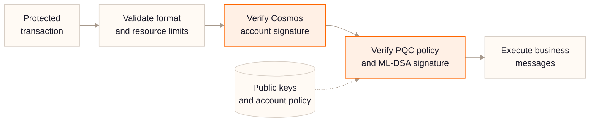
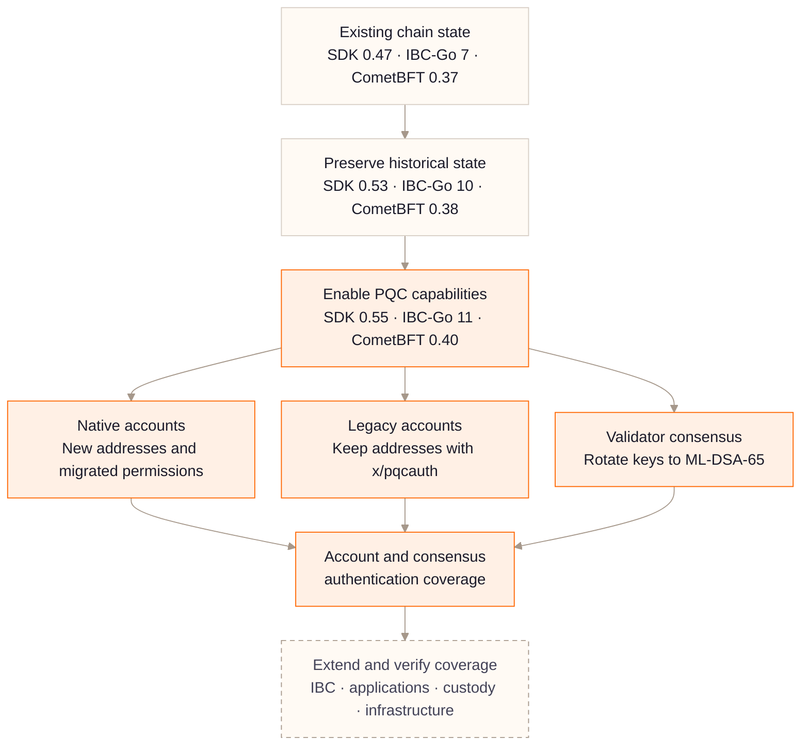
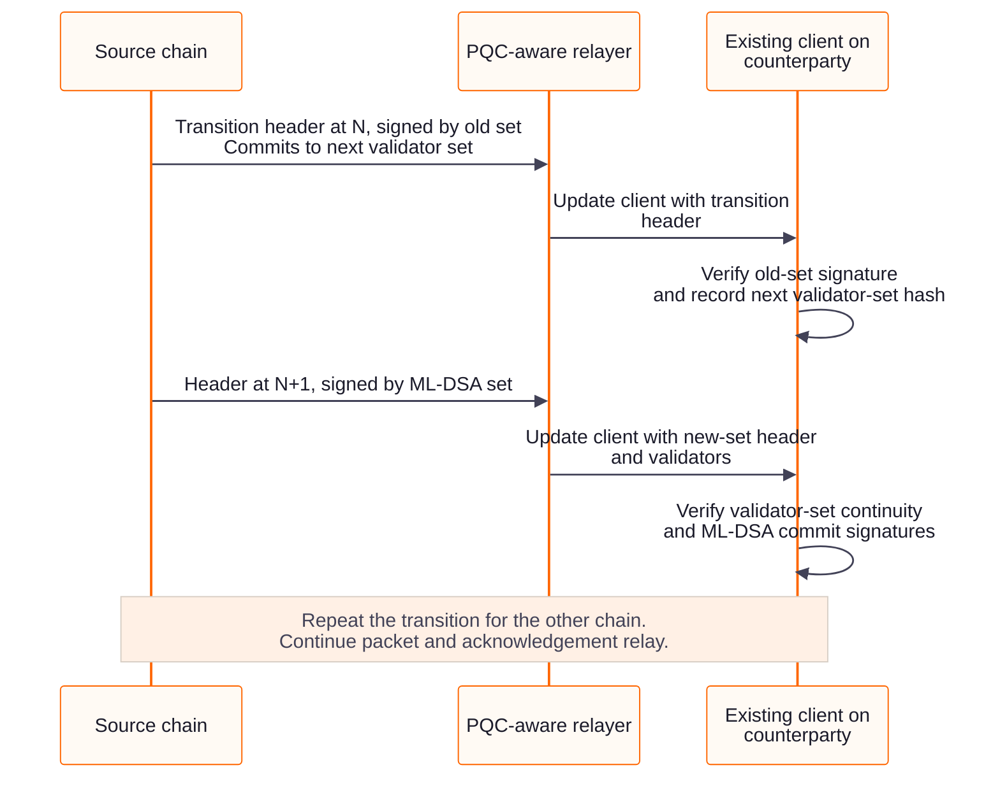

# Dora Vota Post-Quantum Migration: Architecture, Implementation, and Validation

Dora Vota's migration combines **native ML-DSA-65 accounts and consensus keys** with **hybrid authentication for legacy accounts that must keep their addresses**. The aim is to upgrade the chain's signing systems while preserving its history and giving users a practical way to migrate address-bound assets and permissions.

This article explains the staged upgrade path and the results of our account, consensus, and IBC tests. The tests demonstrate these capabilities in isolated networks; production migration and broader end-to-end security still require further validation.

## 1. Why Account Migration Needs Two Paths

The classical starting point uses secp256k1 for most account signatures and Ed25519 for validator consensus signatures. A sufficiently capable quantum computer running Shor's algorithm could break the discrete-logarithm assumptions behind both schemes. An account's public key is normally revealed when it first signs an on-chain transaction and may also be exposed elsewhere. A hidden public key is therefore not a substitute for migrating authentication.

For an existing chain, changing the signature algorithm also changes how users control their assets. A native ML-DSA public key derives a new account address. Balances, staking positions, contract administration, authz grants, feegrant allowances, and external account mappings do not automatically follow it.

| Account situation | Migration path | Address outcome |
|---|---|---|
| New account | Use native ML-DSA-65 through the SDK | New ML-DSA address |
| Existing account whose assets and permissions can move | Create a native account, then migrate each supported asset and permission | New ML-DSA address |
| Existing account that must retain its address | Register ML-DSA keys with `x/pqcauth` and require hybrid authorization | Existing address retained |

Validator consensus keys follow a separate migration path. Rotating them changes the validator's consensus address, while preserving its staking operator identity. Protecting an operator account's transactions and protecting the validator's consensus votes are distinct tasks.

## 2. Native ML-DSA Support

The [target dependencies](https://github.com/DoraFactory/doravota/blob/pqc-auth/go.mod) use Cosmos SDK v0.55.0 and CometBFT v0.40.0. Their ML-DSA-65 support is built on Cloudflare CIRCL's implementation of the algorithm standardized in [NIST FIPS 204](https://csrc.nist.gov/pubs/fips/204/final). ML-DSA relies on module-lattice problems and is designed to resist both classical and quantum attacks.

| Component | Responsibility |
|---|---|
| [Cloudflare CIRCL](https://github.com/cloudflare/circl/tree/main/sign/mldsa/mldsa65) | ML-DSA-65 key generation, signing, and verification |
| [CometBFT `crypto/mldsa65`](https://github.com/cometbft/cometbft/tree/v0.40.0/crypto/mldsa65) | Consensus-key interfaces, encoding, and signature verification |
| [Cosmos SDK `crypto/keys/mldsa65`](https://github.com/cosmos/cosmos-sdk/tree/v0.55.0/crypto/keys/mldsa65) | Account-key interfaces, protobuf codecs, keyring integration, mnemonic recovery, and address derivation |
| [Cosmos SDK `x/auth`](https://github.com/cosmos/cosmos-sdk/blob/v0.55.0/x/auth/ante/sigverify.go) | Native account-signature verification in transaction processing |

### 2.1 Native Account Signing

An upgraded `dorad` can create a native ML-DSA account:

```bash
dorad keys add alice-pqc \
  --key-type ml_dsa_65 \
  --keyring-backend os \
  --home ~/.dora
```

The SDK derives the account address from the ML-DSA public key, signs transactions with the corresponding private key, and verifies them through `x/auth`.

**Native ML-DSA accounts do not need an `x/pqcauth` second factor.** The current [Ante implementation](https://github.com/DoraFactory/doravota/blob/pqc-auth/x/pqcauth/ante/verify.go) recognizes a verified native ML-DSA signature as satisfying the global PQC requirement, including `REQUIRED` mode. Such accounts cannot register `pqcauth` keys or attach a `pqcauth` authorization for themselves. This keeps the native and legacy authentication paths distinct.

### 2.2 Native Consensus Signing

Once governance permits the `ml_dsa_65` validator public-key type, validators can sign proposals and votes with ML-DSA-65. Other nodes verify these signatures using the validator set, and commits contain the resulting consensus signatures.

The migration retains CometBFT's consensus protocol and each validator's operator identity. The SDK's [`MsgRotateConsPubKey`](https://github.com/cosmos/cosmos-sdk/blob/v0.55.0/docs/architecture/adr-016-validator-consensus-key-rotation.md) schedules a new consensus key, and an ABCI validator update changes the active validator set. This protects signing with the new keys; it does not re-sign historical blocks or replace P2P node identities. The operational sequence is described in Section 4.2.

## 3. Preserving Legacy Addresses with `x/pqcauth`

[`x/pqcauth`](https://github.com/DoraFactory/doravota/blob/pqc-auth/x/pqcauth/README.md) adds ML-DSA authorization to eligible classical accounts without replacing their `BaseAccount` public key or changing their address. An ordinary protected transaction must carry **both the existing Cosmos account signature and a valid ML-DSA-65 signature**.

### 3.1 Transaction Verification

The second signature is carried in [`ExtensionPQCAuth`](https://github.com/DoraFactory/doravota/blob/pqc-auth/proto/doravota/pqcauth/v1/extension.proto), inside **`TxBody.extension_options`**, the SDK's critical extension field. It is not placed in `non_critical_extension_options`, whose unrecognized entries may be ignored. Each PQC entry identifies the protected signer and its position in `AuthInfo.signer_infos`; native ML-DSA signers do not receive second-factor entries.



*Figure 1. The protected transaction path. Any failed authentication check rejects the transaction before business-message execution; it never falls back to classical-only authorization. Registration and recovery use dedicated lifecycle proofs, described below.*

The [AnteHandler](https://github.com/DoraFactory/doravota/blob/pqc-auth/app/ante.go) validates extension placement and encoding, bounds transaction resources and verification work, verifies the standard signature, and then checks the second factor through [`VerifyPQCDecorator`](https://github.com/DoraFactory/doravota/blob/pqc-auth/x/pqcauth/ante/verify.go). Bank, staking, and Wasm messages run only after transaction authentication succeeds; business modules do not need to implement the same second-factor check independently.

The ML-DSA signature covers a deterministic [`PQCSignDocV1`](https://github.com/DoraFactory/doravota/blob/pqc-auth/x/pqcauth/types/canonical_tx.go). It binds the network and chain, account number and sequence, signer identity and order, key ID, policy version, transaction body, and `AuthInfo`, including fee and gas. The PQC extension itself is removed from the canonical body to avoid signing a document that contains its own signature. Clients add the resulting extension before producing the standard Cosmos signature over the final transaction.

These bindings prevent a valid authorization from being moved to another chain, account, sequence, key-policy version, or altered transaction. Protected transactions use `SIGN_MODE_DIRECT`.

### 3.2 Registration, Rotation, and Recovery

Registration atomically installs **two distinct ML-DSA public keys**: a routine signing key and a mandatory recovery key. It also enables account-level self-protection. The module stores public-key records and policy state, never private keys. Clients should keep the recovery private key offline and use it only for its authorized lifecycle operations.

Account-key and protection-policy changes submitted at height H normally become effective at H+1. Transactions within H therefore cannot start using a newly registered or rotated key halfway through the block. Governance parameter changes have their own activation rules, including a safety delay for tightening changes.

The [lifecycle messages](https://github.com/DoraFactory/doravota/blob/pqc-auth/proto/doravota/pqcauth/v1/tx.proto) support registration, signing-key and recovery-key rotation, protection changes, revocation of inactive keys, and recovery of a lost signing key. Recovery authorizes a specific replacement transaction; it does not remove the requirement for the account's standard Cosmos signature. Lifecycle messages must execute directly at the top level, with authorization bound to the exact message, so authz, group, or contract nesting cannot bypass their proofs.

First registration has a separate trust boundary: no PQC key is yet bound to the account, so it relies on the classical signature plus proof of possession of both new keys. Registration must occur while that classical authorization remains trustworthy. The module supports an irreversible registration cutoff to restrict later enrollment; it cannot use a newly presented ML-DSA key to establish the rightful owner of an already compromised classical account. See the [bootstrap policy](https://github.com/DoraFactory/doravota/blob/pqc-auth/x/pqcauth/README.md#42-bootstrap-boundary-for-first-registration).

### 3.3 What This Layer Protects

`x/pqcauth` protects account-initiated SDK transactions. It does not itself replace consensus signatures, IBC light-client verification, P2P identities, or signature checks implemented inside contracts. Existing delegated permissions also need review; registering a key does not automatically revoke them.

[`PrepareProposal` and `ProcessProposal`](https://github.com/DoraFactory/doravota/blob/pqc-auth/app/proposal.go) enforce transaction verification and aggregate resource limits as well. A proposer cannot obtain valid-block acceptance for an invalid protected transaction merely by bypassing the mempool.

## 4. Migration Sequence

The migration separates **preserving chain state**, **upgrading account and consensus authentication**, and **extending coverage to the surrounding systems**. After the target software is available, account and consensus work can proceed in coordinated tracks rather than requiring every account to migrate at one height.



*Figure 2. Migration dependencies, not a completion chart. Native and hybrid account paths cover different account populations. Core account and consensus coverage does not imply end-to-end post-quantum security.*

### 4.1 Preserve Application and On-Chain State

The supported upgrade path for the existing SDK v0.47 chain uses an intermediate SDK v0.53 / IBC-Go v10 binary before the SDK v0.55 / IBC-Go v11 target. This bridge is a historical-state requirement, not a cryptographic prerequisite: a new chain starting directly on SDK v0.55 does not need it.

| Upgrade step | Purpose |
|---|---|
| Existing chain → bridge | Run legacy parameter, IBC, and Wasm migrations; move Dora's historical `upgrade/Consensus` state into the consensus store |
| Bridge → PQC target | Run the remaining supported module migrations and initialize the target PQC capabilities |

Some migrations needed by the older state no longer exist in the target dependencies. The target's [preflight check](https://github.com/DoraFactory/doravota/blob/pqc-auth/app/upgrades/v1_0_0/migration.go) therefore rejects an unsupported source module-version map before starting migration. It does not silently skip missing history.

### 4.2 Rotate Validator Consensus Keys

A consensus-key rotation requires both an on-chain update and a coordinated change to the validator's signing infrastructure:

1. **Permit the key type.** Governance executes `cosmos.consensus.v1.MsgUpdateParams` to add `ml_dsa_65` to the allowed validator key types while retaining types still in use.
2. **Prepare the replacement key.** Generate it in an isolated home with `dorad init --consensus-key-algo ml_dsa_65`, then export its public key with `dorad comet show-validator --home <isolated-home>`. Key generation alone does not change the active validator.
3. **Submit the rotation.** The operator submits `dorad tx staking rotate-cons-pub-key '<new-pubkey-json>' --from <operator>`. The SDK checks eligibility and charges the rotation fee. A protected classical operator account must use hybrid authorization; a native operator account signs through the native path.
4. **Coordinate activation.** Read `apply_height` from the committed transaction events. Stop the affected signer and install the replacement key using the rehearsed procedure, preserving its signing-state safeguards. Ensure the remaining online voting power can carry the chain across activation; do not run duplicate signers or reset signing state to force progress.
5. **Verify before continuing.** Check staking state, the CometBFT validator set at the relevant height, and a commit signed by the new consensus address. Confirm block production before rotating another validator.

In our four-validator tests, we rotated one validator at a time while the other three continued signing. Production scheduling must account for voting power, not only validator count, and keep more than two-thirds available. Use the reported activation height rather than assuming a fixed offset from transaction inclusion. The four-validator experiment observed H+2; Section 6 describes a separate single-validator transition.

### 4.3 Migrate Accounts and Tighten Policy

New accounts can use native ML-DSA as soon as compatible signing tools are available. Existing users who can change addresses need explicit procedures for balances, staking, contract administration, and delegated permissions. Users who must retain their addresses register `x/pqcauth` keys before the enrollment cutoff.

The relevant enforcement modes apply as follows to ordinary transactions:

| Mode | Classical account behavior | Native ML-DSA behavior |
|---|---|---|
| `OPTIONAL` | Unprotected accounts may use classical signatures; self-protected accounts still require PQC authorization | SDK signature satisfies PQC authentication |
| `REQUIRED_FOR_REGISTERED` | Registered accounts require PQC authorization | SDK signature satisfies PQC authentication |
| `REQUIRED` | Classical signers require PQC authorization; unregistered accounts need the controlled registration path | SDK signature satisfies PQC authentication |

An extension that is present must verify even in `OPTIONAL` mode. New registrations enable self-protection at H+1, so optional network-wide enforcement does not mean those accounts are unprotected. Policy tightening, wallet readiness, registration rules, and recovery procedures must be coordinated before enforcement expands.

## 5. Four-Validator Test Results and Measured Costs

We tested the migration with four isolated validator processes on one server, each with its own home, database, ports, and consensus key. The setup also included four user wallets and four operator accounts.

The tests confirmed:

- Completion of the SDK v0.47 → v0.53 → v0.55 upgrade, with matching App Hash values across the four nodes at the checked heights after each upgrade.
- Successful registration and hybrid transactions, with classical-only transactions from protected accounts rejected.
- Four Ed25519 → ML-DSA-65 consensus-key rotations, each observed at H+2, followed by continued block production after all nodes restarted.
- 53 successful on-chain transactions across the tests, including four transfers signed directly by two native ML-DSA accounts.

### 5.1 Transaction Size and Gas

The comparison used the same SDK v0.55 binary and standard `MsgSend`, with four successful transactions per group. Sizes are decoded raw protobuf transaction bytes from RPC, not JSON response sizes. These are small-sample measurements from this test configuration, not throughput or latency benchmarks.

| Account authentication | Consensus signing | Raw transaction size | Gas used |
|---|---|---:|---:|
| secp256k1 | Ed25519 | 314 B | 75,241 |
| secp256k1 + ML-DSA-65 via `pqcauth` | Ed25519 | 3,730 B | 376,597 |
| secp256k1 + ML-DSA-65 via `pqcauth` | ML-DSA-65 | 3,731 B | 376,607 |
| Native ML-DSA-65 | ML-DSA-65 | 5,483–5,485 B | First outgoing transaction: 282,691; subsequent: 228,941 |

Hybrid authentication adds a 3,309 B ML-DSA signature plus extension metadata: 3,416 B above the classical baseline in this sample. The tested SDK CLI's native transactions also include the 1,952 B public key in `SignerInfo`, making them larger than the hybrid transactions, whose PQC public keys are already registered in module state.

Native transactions nevertheless used less gas than hybrid transactions in this configuration. They avoid the additional classical-signature check and the separately configured 250,000-gas `pqcauth` verification charge. A native account's first outgoing transaction used an extra 53,750 gas to store its public key. Gas is an execution-accounting measure; these figures do not establish relative wall-clock signing or verification speed.

### 5.2 Consensus and Network Costs

Consensus signatures are outside the transaction bytes and account Ante gas path. The 1 B and 10 gas difference between the two hybrid rows comes from ordinary payload encoding, not an extra consensus-signature check on the transaction.

With four validators signing a commit, signature bytes alone increase from `4 × 64 = 256 B` for Ed25519 to `4 × 3,309 = 13,236 B` for ML-DSA-65: an additional **12,980 B per commit**, before encoding overhead. Larger validator sets increase that cost, and proposals and vote propagation also need measurement.

These single-server tests validate state-machine and rotation behavior. They do not measure inter-host latency, packet loss, failure-domain isolation, sustained throughput, or production-scale validator traffic.

## 6. IBC Compatibility Across Consensus-Key Rotation

We tested IBC compatibility by connecting two independent Dora chains on one server, **with one validator per chain**. We established IBC clients, a connection, and an ICS20 channel, then rotated both chains' consensus keys to ML-DSA-65 without recreating the clients.

The critical step was preserving the light client's trust transition. Before the first ML-DSA-signed header, the relayer submitted a transition header signed by the old validator set that committed to the next validator set.



*Figure 3. Header order in the tested transition. N denotes the transition header height, not the rotation transaction height. The relayer submits evidence; the counterparty light client verifies it.*

The PQC-aware relayer handled ML-DSA header encoding, and its native ML-DSA account signed relay transactions. Account signing and light-client verification are separate requirements.

| Check or measurement | Test result |
|---|---|
| ICS20 transfer, client update, `RecvPacket`, and `Acknowledgement` | Successful before rotation; successful in both directions after rotation |
| Existing IBC clients | Retained across the transition |
| ML-DSA validator sets and commits | Accepted by the tested client-verification path |
| Native ML-DSA relayer account | Successfully signed relay transactions |
| Serialized IBC header, single-validator topology | 855 B → 11,794–11,796 B, about 10.7 KiB additional data |

This demonstrates compatibility for the tested binaries and ICS20 flow. It does not establish compatibility with every counterparty or IBC application. Multi-validator transitions, ICA, contract IBC callbacks, timeout paths, cross-host failures, and sustained relayer load remain to be evaluated.

## 7. Work Remaining Beyond Account and Consensus Signing

The native and hybrid paths address different parts of transaction authentication. End-to-end security also depends on the systems that authorize, transport, and operate those transactions.

| Area | Remaining migration or validation work |
|---|---|
| Wallets and custody | Integrate native ML-DSA and critical extension signing, including offline signing, registration, rotation, and recovery in wallets, exchanges, hardware devices, and custody systems |
| Address-bound business state | Provide explicit migration procedures for staking, vesting, contract administration, authz, feegrant, DAOs, and ICA; inventory signature checks inside contracts |
| Validator operations | Validate remote signers, HSM support, backups, activation procedures, and incident recovery with ML-DSA |
| Interchain paths | Extend compatibility and failure testing to production-scale validator sets, other clients and counterparties, and IBC applications beyond the tested ICS20 flow |
| Addresses and hashes | Assess the target quantum-security level of the native implementation's 20-byte truncated SHA-256 address format and whether a longer, versioned format is needed |
| Network and release infrastructure | Inventory classical dependencies in P2P identities, RPC TLS, release signing, upgrade artifacts, and software distribution |
| Performance and assurance | Calibrate verification budgets, gas, block limits, bandwidth, and timeouts at production scale; complete independent cryptographic, application, and upgrade reviews |

The deployment plan should preserve historical state first, make both account paths usable, and rotate consensus keys under voting-power and signer-readiness constraints. Each expansion of coverage needs its own evidence; the account and consensus milestones alone do not certify the entire system as post-quantum secure.

For detailed behavior and implementation references, see the [PQC Auth module documentation](https://github.com/DoraFactory/doravota/blob/pqc-auth/x/pqcauth/README.md).
