# `x/pqcauth` 概念与实现要点

协议与共识行为的 source of truth 仍是 protobuf 与 Go 实现。  
相关阅读：[`implementation.md`](./implementation.md)、[`README.md`](./README.md)、[`docs/pqcauth/`](../../docs/pqcauth/)

## 目录

1. [signer 与 key_id](#1-signer-与-key_id)
2. [PQCSignDocV1 与 SignerPQCSignature](#2-pqcsigndocv1-与-signerpqcsignature)
3. [与 Cosmos 经典签名模型的关系](#3-与-cosmos-经典签名模型的关系)
4. [SignDoc 主体：经典 vs PQC](#4-signdoc-主体经典-vs-pqc)
5. [账户注册 PQC 密钥](#5-账户注册-pqc-密钥)
6. [PoP（Proof of Possession）](#6-popproof-of-possession)
7. [`keyChangeAllowed`](#7-keychangeallowed)
8. [`expected_key_id` 与 `next_key_id`](#8-expected_key_id-与-next_key_id)
9. [`AccountPolicy`](#9-accountpolicy)
10. [Recovery Key 与 Signing Key](#10-recovery-key-与-signing-key)
11. [`MsgSetProtection`、`SIGN_MODE_DIRECT`、量子威胁与一钥多地址](#11-msgsetprotectionsign_mode_direct量子威胁与一钥多地址)
12. [PQC 强制范围](#12-pqc-强制范围)
13. [authz grant 边界与处理](#13-authz-grant-边界与处理)
14. [`extensionOptionsFingerprint`](#14-extensionoptionsfingerprint)
15. [Ante 三件套：ExtensionOptions / Structure / Verify](#15-ante-三件套extensionoptions--structure--verify)
16. [Keplr 钱包如何集成 PQC 注册与后续签名](#16-keplr-钱包如何集成-pqc-注册与后续签名)
17. [CLI：从注册到发交易的命令顺序](#17-cli从注册到发交易的命令顺序)
18. [v1 未覆盖边界与多签能力](#18-v1-未覆盖边界与多签能力)

---

## 1. signer 与 key_id

节点通过 `signer + key_id` 从 pqcauth KV store 读取已注册公钥。Extension **不直接携带公钥**。

| 字段 | 含义 | 来源 |
|------|------|------|
| `signer` | Cosmos 账户地址（bech32） | 交易 `AuthInfo.signer_infos` 中对应 signer；客户端通常为 `--from` 地址 |
| `key_id` | 该账户下某条 `PQCKeyRecord` 的编号 | 注册/轮换时链上分配；客户端查询 active key 后填入 Extension |

```text
(owner = signer, key_id) → PQCKeyRecord.public_key
```

### 公钥查找路径

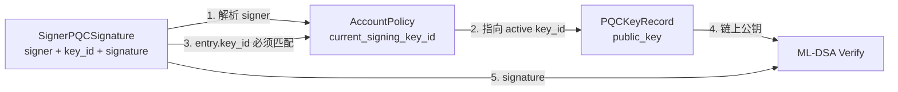

### 细节

- `signer` 与 `signer_index` 同时存在：index 对应 `AuthInfo` 中位置，address 防止 entry 被挪给另一地址。
- Ante 校验：`entry.signer == tx.GetSigners()[entry.signer_index]`。
- 验签路径以策略为准：`GetActiveSigningKey(signer)` → `policy.current_signing_key_id` → `GetKey`，再要求 `entry.key_id` 与 active key 一致。
- `key_id` 由 `AccountKeySequence` 为该账户分配，不是客户端随意编号。

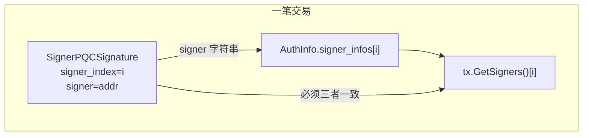

---

## 2. PQCSignDocV1 与 SignerPQCSignature

| | `PQCSignDocV1` | `SignerPQCSignature` |
|---|---|---|
| 角色 | 被签名的 canonical 文档（“签什么”） | 交易里携带的 PQC 证明 entry（“签名结果放哪”） |
| 是否直接进广播 Tx | 通常不进（离线 bundle 可带） | 进 `ExtensionPQCAuth.signatures[]` |
| 主要内容 | network/chain/account/sequence/signer/key/policy + body/auth_info | signer、index、key_id、algorithm、policy_version、**signature** |

### 客户端：签什么 → 签名放哪

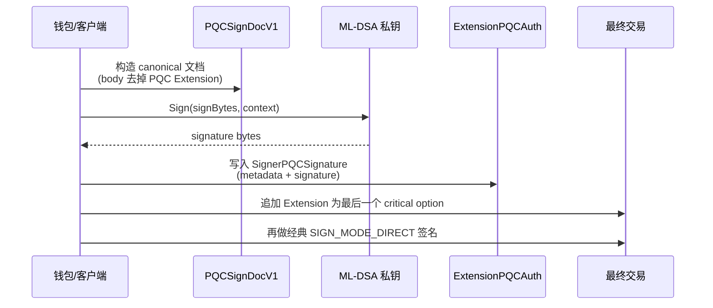

### 节点：重建文档再验

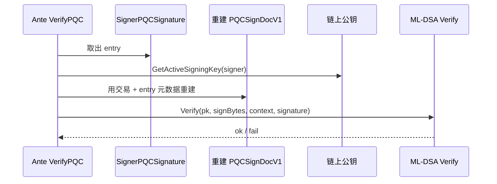

### 为什么需要独立 SignDoc

1. 明确 PQC 第二因子绑定的完整意图（不只 messages，还包括 fee、memo、AuthInfo、其他 extension 等）。
2. 避免循环依赖：PQC 签名要写进 Extension，不能把“含自身签名的最终 body”再签一遍 → 使用 `body_bytes_without_pqc_auth`。
3. 客户端与节点必须对同一份 bytes 签名/验签。
4. 对齐 Cosmos “SignDoc + detached signature” 范式。

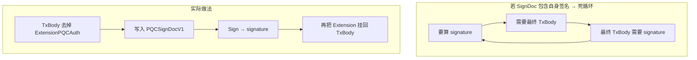

---

## 3. 与 Cosmos 经典签名模型的关系

Cosmos `SIGN_MODE_DIRECT` 本身就是：

```text
SignDoc{ body_bytes, auth_info_bytes, chain_id, account_number }
  → 签名字节放在 TxRaw.signatures（detached）
```

PQC 有意对齐：canonical 文档 + detached 签名 + 节点重建再验。

但不能直接复用经典 `SignDoc`，还要解决：

- 去掉自身 `ExtensionPQCAuth` 消解循环；
- 绑定 `key_id` / `algorithm` / `policy_version`；
- 额外 `network_id`；
- 与经典签名形成 hybrid AND 分工。

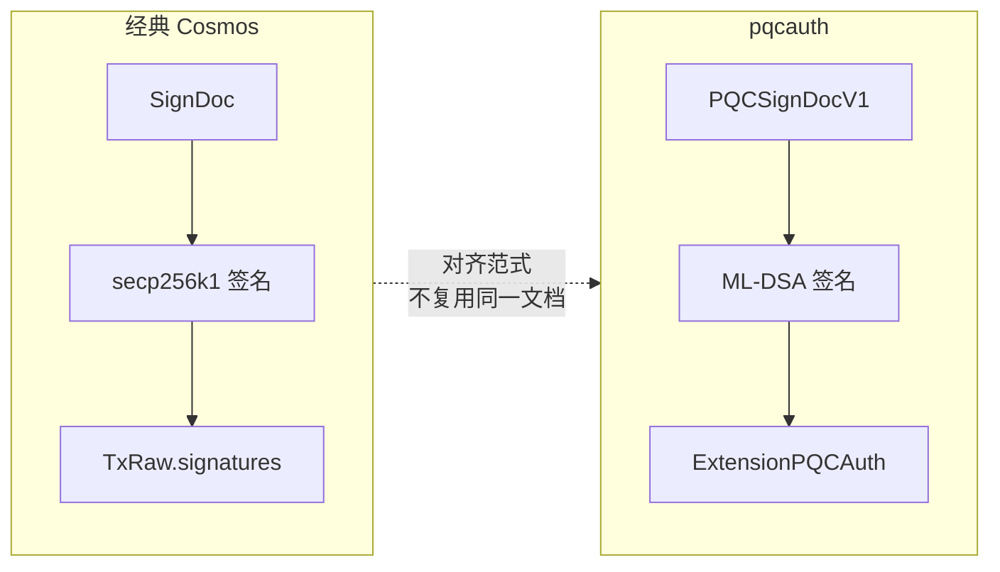

---

## 4. SignDoc 主体：经典 vs PQC

| | 经典 `SignDoc` | `PQCSignDocV1` |
|---|---|---|
| body | **最终** TxBody（在 pqcauth 流程里 **含** PQC Extension） | TxBody **去掉唯一的** `ExtensionPQCAuth`（**其他** extension 仍保留） |
| 其它 | + `auth_info_bytes` + chain_id + account_number | + 完整 AuthInfo + network/chain/account/sequence/signer/key/policy 等 |

```text
PQC signature  → 绑定除自身 Extension 外的交易意图
经典 signature → 绑定包含 PQC Extension 的最终交易
```

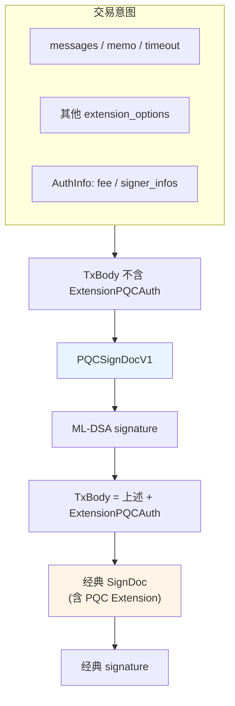

签名顺序（必须）：

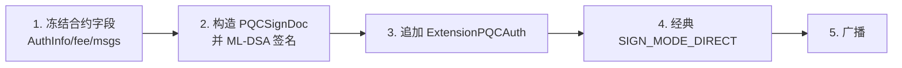

---

## 5. 账户注册 PQC 密钥

### 认证模型（首次注册）

```text
经典 Cosmos 账户签名
+ 新 ML-DSA key 的 PoP（KeyProofDocV1）
（可选：Recovery Key 的 PoP）
```

注册前没有 active PQC，因此不要求交易级 `ExtensionPQCAuth`。  
`MsgRegisterKey` 必须是交易中唯一 top-level message；key/policy 在 **H+1** 生效。

### 端到端数据流

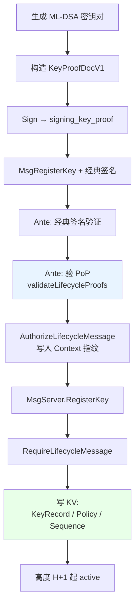

### 操作步骤

```text
1. 生成 ML-DSA-65 密钥对
2. 查 network_id、expected key_id（首次通常为 1）
3. 构造 KeyProofDocV1 并签名 → proof
4. （可选）recovery 同样做 PoP
5. 组装 MsgRegisterKey，经典签名广播
6. Ante：验经典签名 + 验 PoP + 写 lifecycle 授权标记
7. MsgServer：写 PQCKeyRecord / AccountPolicy(pending) / KeySequence
8. 高度 H+1 起 GetActiveSigningKey 可用
```

### H+1 生效

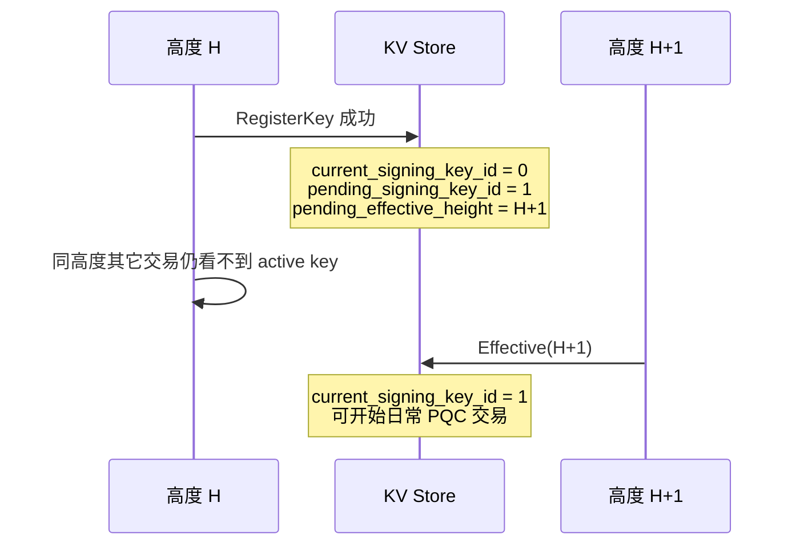

### 写入状态

| Store | 内容 |
|---|---|
| `PQCKeyRecord` | 公钥、role、effective_height=H+1 等 |
| `AccountPolicy` | pending signing key / self_enforce / policy_version=1 |
| `AccountKeySequence` | `next_key_id` 前进 |

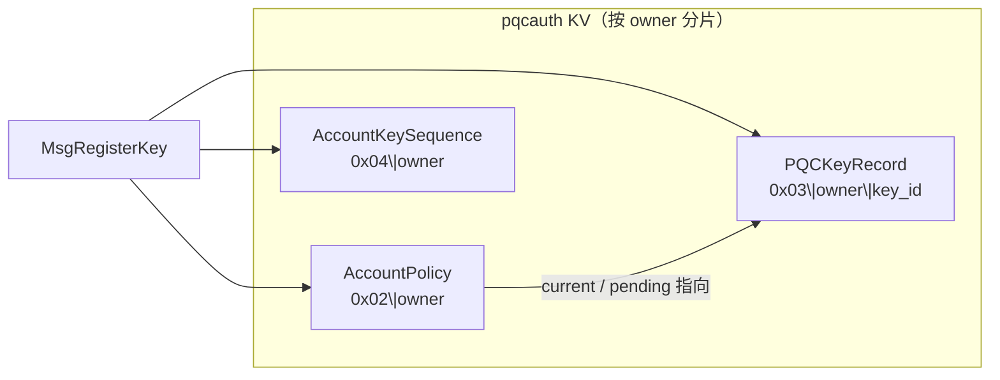

---

## 6. PoP（Proof of Possession）

提交新公钥上链前，用对应私钥对 `KeyProofDocV1` 签名，证明持有该 key，而不是粘贴任意公钥。

| | PoP | 交易级 PQC |
|---|---|---|
| 文档 | `KeyProofDocV1` | `PQCSignDocV1` |
| 目的 | 证明持有 **新** key | 证明 **当前 active key** 授权这笔交易 |
| 存放 | Msg 字段（如 `signing_key_proof`） | `SignerPQCSignature.signature` |
| 验证时机 | Ante `validateLifecycleProofs` | Ante 验 Extension |

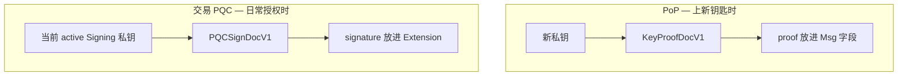

### 客户端生成 ↔ 节点验证

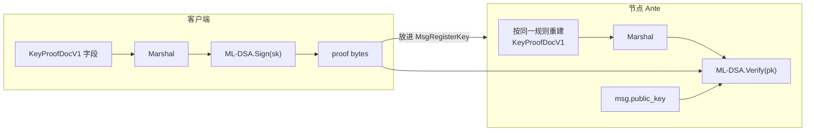

任一字段不一致（owner、key_id、purpose、network…）→ 重建出的 `signBytes` 变了 → 验签失败。  
`purpose` 与 ML-DSA context 做 domain separation（register / rotate / recover 等不可互用）。

---

## 7. `keyChangeAllowed`

```go
func keyChangeAllowed(ctx sdk.Context, params types.Params, enforceRegistrationCutoff bool) error
```

密钥生命周期变更前的策略门禁（不做密码学）：

1. **紧急熔断**：`PAUSE_NEW_KEYS` 或 `PAUSE_PQC_TRANSACTIONS` → `ErrEmergencyPause`。
2. **注册截止（可选）**：仅当 `enforceRegistrationCutoff == true` 且配置了 `RegistrationCutoffHeight` 且当前高度已到 → `ErrRegistrationClosed`。

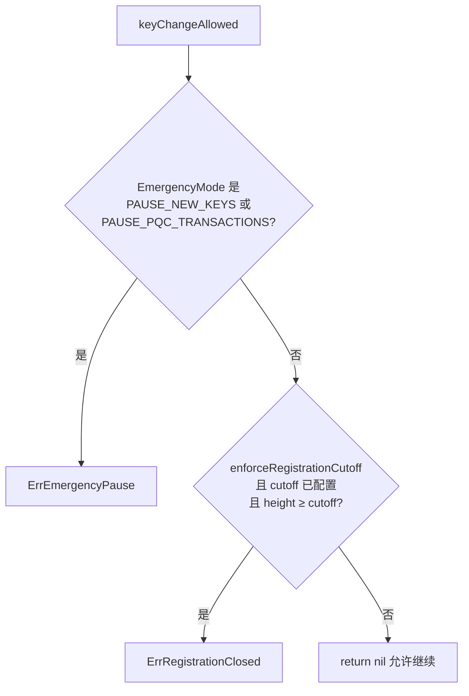

| 消息 | `enforceRegistrationCutoff` |
|---|---|
| `MsgRegisterKey` | `true` |
| Rotate / Recover 等 | `false` |

迁移窗口结束后禁止首次 bootstrap；已注册账户仍可轮换/恢复（除非 emergency）。

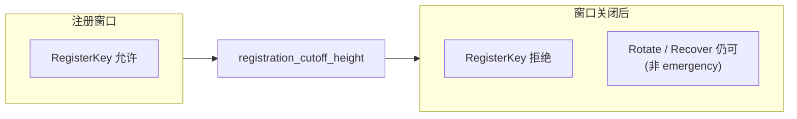

---

## 8. `expected_key_id` 与 `next_key_id`

`next_key_id` **不是**全模块全局自增。每个账户（owner）各自有 `AccountKeySequence.next_key_id`，默认从 **1** 起。

```text
账户 A: 1, 2, 3...
账户 B: 也从 1 起（与 A 无关）
主键语义: (owner, key_id)
```

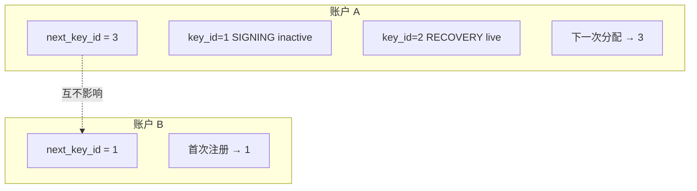

`expected_*_key_id` 必须等于该账户当前的 `next_key_id`。  
原因：PoP 已绑定 `proposed_key_id`；防止旧 proof 在 id 前进后被挪到新 id。

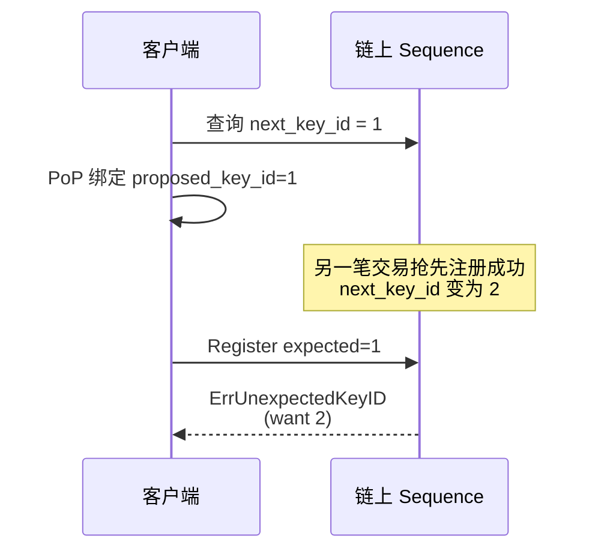

---

## 9. `AccountPolicy`

账户的 PQC 认证配置（指针 + 开关 + 版本），**不是**公钥存储。

| 结构 | 角色 |
|---|---|
| `PQCKeyRecord` | 钥匙本：历史公钥记录 |
| `AccountPolicy` | 门禁设置：现在用哪把、是否强制、版本、H+1 pending |

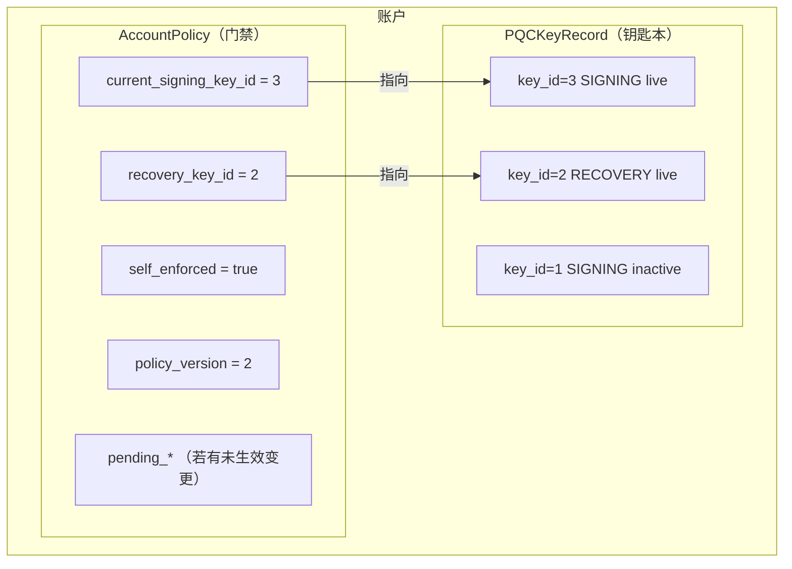

主要字段：

```text
current_signing_key_id / recovery_key_id
self_enforced / policy_version
pending_* + pending_effective_height
```

读取用 `Effective(height)` 做逻辑 H+1 切换，无需 BeginBlock 扫全网。  
`policy_version` 进入 sign document，策略变更后旧签名失效。

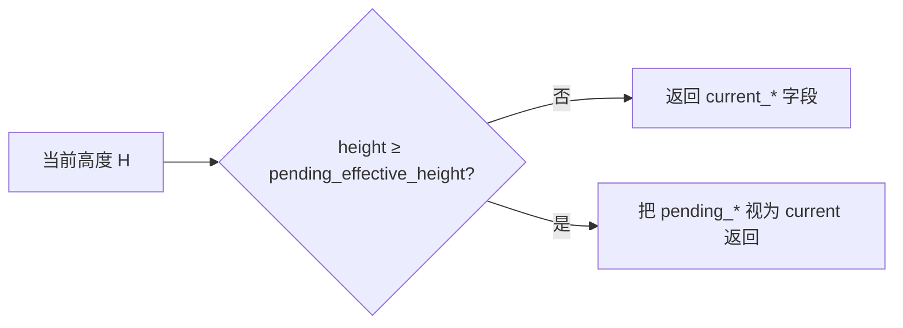

---

## 10. Recovery Key 与 Signing Key

Signing Key 日常热用，易丢/易暴露。Recovery Key 为冷备份，用于 `MsgRecoverKey` 在丢失 signing 时换新 signing（地址不变）。  
不能在保持地址不变的前提下用 Recovery 换经典 BaseAccount 私钥。

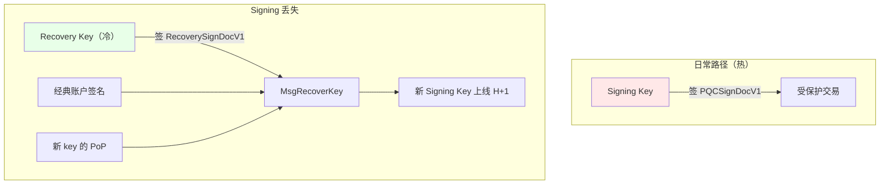

| | 同时 active | 历史记录 |
|---|---|---|
| Signing | **最多 1**（`current_signing_key_id`） | 可多条（轮换/恢复留下） |
| Recovery | **最多 1**（`recovery_key_id`，注册时可选 0） | 可多条 |

终身 key-record 配额（signing + recovery 合计）有上限；失活记录仍占配额。

```mermaid
flowchart LR
    subgraph timeline["某账户 key 历史"]
        T1["id=1 SIGNING<br/>inactive"]
        T2["id=2 RECOVERY<br/>inactive"]
        T3["id=3 SIGNING<br/>active ★"]
        T4["id=4 RECOVERY<br/>active ★"]
    end

    T1 --> T2 --> T3 --> T4
    Policy["AccountPolicy"] -->|"只认 ★"| T3
    Policy -->|"只认 ★"| T4
```

---

## 11. `MsgSetProtection`、`SIGN_MODE_DIRECT`、量子威胁与一钥多地址

### `MsgSetProtection`

开关账户 `self_enforced`：即使全局 `DISABLED`/`OPTIONAL`，该账户仍强制 PQC。  
不换 key；H+1 生效；需经典 + 当前 PQC Signing Key。

```mermaid
flowchart TD
    Mode["全局 EnforcementMode"] --> Q{"账户 self_enforced?"}
    Q -->|true| Req["必须 PQC<br/>全局再松也没用"]
    Q -->|false| M{"看全局 mode"}
    M -->|DISABLED / OPTIONAL| No["可不强制"]
    M -->|REQUIRED_FOR_REGISTERED| Reg{"已注册?"}
    M -->|REQUIRED| Req["必须 PQC"]
    Reg -->|是| Req
    Reg -->|否| No
```

### `SIGN_MODE_DIRECT`

Cosmos 经典签名模式：对 protobuf `SignDoc`（body + auth_info + chain + account）原文签名。  
pqcauth 要求受保护交易使用它，以便与 PQC canonical 编码对齐，避免 amino 等模式语义分叉。

### 量子破经典与已注册 PQC

混合规则是 **AND**。仅破经典、没有 ML-DSA 私钥时，在该账户交易已被强制要求 PQC 的前提下，不足以单方面接管。

```mermaid
flowchart TB
    Att["攻击者只有破掉的经典私钥"] --> C["能伪造经典签名"]
    C --> P{"账户强制 PQC?"}
    P -->|否| Bad["可能 classic-only 接管"]
    P -->|是| M{"有 ML-DSA 私钥?"}
    M -->|否| Safe["过不了 Ante<br/>不足以发受保护交易"]
    M -->|是| Own["双因子齐全 → 被接管"]

    style Safe fill:#e8ffe8
    style Bad fill:#ffe8e8
    style Own fill:#ffe8e8
```

仍危险的情况：

- 已注册但未强制（`OPTIONAL`/`DISABLED` 且 `self_enforced=false`）；
- 尚未注册且注册窗口未关（可被抢注）；
- PQC 私钥也泄露；
- authz 等已授出权限、模块明确不保护的路径。

### 一钥多地址

协议允许：无“公钥全局唯一”约束；不同 owner 可注册相同 `public_key`。  
Sign document 绑定了 owner/signer，不会跨地址挪用签名。  
运维上是单点风险：一钥泄露则所有挂载地址的第二因子同时失效。

```mermaid
flowchart TB
    SK["同一把 ML-DSA 私钥"]
    SK --> A["地址 A 的 KeyProof / 交易签名"]
    SK --> B["地址 B 的 KeyProof / 交易签名"]
    A --> PA["AccountPolicy A"]
    B --> PB["AccountPolicy B"]
```

---

## 12. PQC 强制范围

pqcauth 保护的是 SDK 交易在 Ante 层对 **signer** 的认证，不是“地址出现在任意字段就强制 PQC”。

- 保护点在 Ante：看 Tx 的 signers 是否 required 提供合法 PQC。
- **注册 ≠ 强制**。强制取决于全局 `EnforcementMode` + `self_enforced`。
- recipient（如别人给你转账）不是 signer，不要求你出 PQC。
- 不保护：共识签名、P2P、IBC 轻客户端、合约内授权、已授出的 authz 等。

```mermaid
flowchart TB
    Tx["任意 SDK 交易"] --> Ante["全局 Ante"]
    Ante --> Loop["对每个 signer"]
    Loop --> Req{"pqcRequired?<br/>mode + self_enforced + 是否注册"}
    Req -->|是| Need["必须有合法<br/>SignerPQCSignature"]
    Req -->|否| Skip["可不带 PQC<br/>(若带了仍须验对)"]
    Need --> Biz["MsgServer 业务执行"]
    Skip --> Biz
```

```mermaid
flowchart LR
    subgraph covered["受 Ante PQC 约束（当 required）"]
        S1["你作为 signer 发的 bank/staking/wasm…"]
    end

    subgraph notcovered["不因此自动要求你的 PQC"]
        N1["别人给你转账（你是 recipient）"]
        N2["共识 / P2P / IBC"]
        N3["合约内部鉴权"]
        N4["已授出的 authz 被 grantee 执行"]
    end
```

要“我发起的业务交易一律双因子”：注册 + `self_enforced=true`（或全局 `REQUIRED_FOR_REGISTERED`/`REQUIRED`）。

---

## 13. authz grant 边界与处理

| 类型 | 嵌套路径 |
|---|---|
| PQC **生命周期**消息（rotate / recover / set-protection 等） | `authz.MsgExec` 嵌套 → `ErrNestedLifecycle` |
| 已授出的 **业务**权限（如 MsgSend） | 不保护 granter（v1 明确 non-goal） |

`MsgExec` 的 Tx signer 是 grantee；Ante 只验 grantee。granter 不再签名，也不跑 granter 的 PQC。  
这是 authz“事先委托”语义。

```mermaid
sequenceDiagram
    participant G as Granter（已强制 PQC）
    participant E as Grantee
    participant Ante as Ante
    participant Bank as bank

    Note over G: 过去：MsgGrant 允许 grantee 代发 MsgSend

    E->>Ante: MsgExec{ 内层 MsgSend from=G }
    Note over Ante: signers = [grantee]<br/>只检查 grantee 要不要 PQC
    Ante->>Bank: 执行内层 MsgSend
    Note over G: Granter 未签名、未出 PQC<br/>资产仍可能被划走
```

生命周期嵌套被挡住：

```mermaid
sequenceDiagram
    participant E as Grantee
    participant Ante as Ante
    participant MS as pqcauth MsgServer

    E->>Ante: MsgExec{ 内层 MsgRecoverKey }
    Ante->>Ante: 外层可能通过（看 grantee）
    Ante->>MS: 内层 RecoverKey
    MS-->>E: ErrNestedLifecycle<br/>无 exact-message 授权标记
```

### 处理建议

```text
1. 查询 grants-by-granter
2. 撤销不必要、过宽、长期 grant
3. 检查并清理 feegrant
4. 再开 self_enforced / 依赖 REQUIRED_FOR_REGISTERED
5. 若仍需代理：最小权限 + 限额 + 过期；grantee 自身也可强制 PQC
```

```mermaid
flowchart LR
    A["审计 authz / feegrant"] --> B["Revoke 多余授权"]
    B --> C["注册 PQC + self_enforced"]
    C --> D["如需代理：窄 grant + 过期"]
```

注册 PQC 不会自动清空 authz。协议层 v1 也没有“Exec 时再验 granter PQC”。

攻击者仅有破掉的经典私钥时，一般不能新建 grant（新建 grant 的 tx 需要 granter 当 signer → 要 PQC）；但旧 grant 仍有效，grantee 可继续 `MsgExec`。

---

## 14. `extensionOptionsFingerprint`

`extensionOptionsFingerprint` 是交易 extension options 的内容指纹（SHA-256），用于 Ante 链内部的 **缓存一致性校验**。

它不是密码学签名的一部分，也不是上链字段。

### 背景

PQC Ante 拆成两段：

```text
ValidatePQCStructureDecorator   ← 结构校验、解析 Extension（相对便宜）
    …
经典签名验证 等中间 Decorator
    …
VerifyPQCDecorator              ← 读状态、ML-DSA Verify（贵）
```

Structure 解析结果缓存在 Context 中，避免 Verify 再完整跑一遍 `ExtractExtension`：

```go
type validatedExtensionCache struct {
    optionsFingerprint [sha256.Size]byte
    extension          *types.ExtensionPQCAuth
    found              bool
}
```

中间 Decorator 有可能修改 TxBody 的 critical / non-critical extension。  
若仍用旧缓存，Verify 会拿着过期的 Extension 验签。因此缓存里同时记下“当时 extension 长什么样”的 fingerprint。

### 计算与使用

**计算**（`extensionOptionsFingerprint`）：对当前交易是否实现 `HasExtensionOptionsTx`、所有 critical `extension_options`、所有 non-critical options，做 length-prefixed SHA-256。

**写入**（Structure）：`withValidatedExtension` 存 `fingerprint(当前 tx) + 已解析 extension`。

**读取**（Verify）：`getValidatedExtension` 若 `cached.fingerprint != extensionOptionsFingerprint(tx)`，缓存作废，强制重新 `ExtractExtension`。

```mermaid
sequenceDiagram
    participant S as Structure Decorator
    participant M as 中间 Decorators
    participant V as Verify Decorator
    participant C as Context 缓存

    S->>S: ExtractExtension(tx)
    S->>C: 存 extension + fingerprint(tx.extensions)
    S->>M: next()
    Note over M: 可能改 extension options
    M->>V: next()
    V->>C: getValidatedExtension
    alt fingerprint 仍匹配
        C-->>V: 复用已解析 Extension
    else fingerprint 变了
        C-->>V: cache miss
        V->>V: 重新 ExtractExtension(tx)
    end
```

### 与 lifecycle fingerprint 的区别

| | `extensionOptionsFingerprint` | lifecycle message fingerprint |
|---|---|---|
| 位置 | `ante/structure.go` | `internal/execution/authorization.go` |
| 对象 | 交易的 extension options 列表 | 某条 lifecycle Msg 的 typeURL+bytes |
| 目的 | Ante 缓存是否仍有效 | MsgServer 是否执行 Ante 精确授权过的消息 |
| 不匹配时 | 重新解析 Extension | 拒绝嵌套/未授权执行 |

---

## 15. Ante 三件套：ExtensionOptions / Structure / Verify

`app/ante.go` 里与 PQC 直接相关的三处装配：

```go
ante.NewExtensionOptionsDecorator(
    pqcauthante.ExtensionOptionChecker(options.ExtensionOptionChecker),
),
// ... ValidateBasic / memo / tx size ...
pqcauthante.NewValidatePQCStructureDecorator(options.PQCAuthKeeper),
// ... fee / 经典签名 ...
pqcauthante.NewVerifyPQCDecorator(options.PQCAuthKeeper, options.AccountKeeper),
```

三者职责不同，按 **准入 → 结构 → 密码学与策略** 递进。

```mermaid
flowchart TB
    subgraph early["靠前 · 便宜"]
        EOD["1. ExtensionOptionsDecorator<br/>+ ExtensionOptionChecker"]
        STR["2. ValidatePQCStructureDecorator"]
    end

    subgraph mid["中间"]
        Fee["扣费 / SetPubKey / 经典签名验证"]
    end

    subgraph late["靠后 · 贵"]
        VFY["3. VerifyPQCDecorator"]
    end

    EOD --> STR --> Fee --> VFY
    VFY --> Seq["IncrementSequence"]
```

---

### 1. `ExtensionOptionsDecorator` + `ExtensionOptionChecker`

```go
ante.NewExtensionOptionsDecorator(
    pqcauthante.ExtensionOptionChecker(options.ExtensionOptionChecker),
)
```

**这是 Cosmos SDK 自带的 Decorator**，不是 pqcauth 自己写的校验逻辑。  
它解决的问题是：

> 交易带了 critical `extension_options` 时，节点必须 **事先声明“我认识这个 type URL”**；  
> 不认识就拒绝，避免旧节点把 critical extension **忽略掉** 仍按 classic-only 执行。

`pqcauthante.ExtensionOptionChecker` 只做一件事：在应用原有 checker 外包一层，

```text
if typeURL == ExtensionPQCAuth → 接受
else → 交给 fallback（应用/wasm/其它已有 extension）
```

| 做 | 不做 |
|---|---|
| 允许 `ExtensionPQCAuth` 出现在 critical options 里 | 不解析 Extension 内容 |
| 保留应用其它 extension 的 checker | 不验 ML-DSA、不读 key store |
| 未知 critical option 仍 fail-closed | 不判断签名对不对 |

没有这一层：带 PQC Extension 的交易会在 SDK 默认逻辑里被直接拒掉（“unsupported extension”），PQC 根本进不了后续 Ante。

---

### 2. `ValidatePQCStructureDecorator`

```go
pqcauthante.NewValidatePQCStructureDecorator(options.PQCAuthKeeper)
```

**PQC 专用的“形状检查”**，在 fee 和经典签名之前执行，尽量 **先挡畸形/过大输入**，再让攻击者消耗 ML-DSA CPU。

主要工作（`ExtractExtension` + 少量策略）：

| 检查项 | 含义 |
|---|---|
| PQC 只能在 critical，且最多一个 | 不能塞 non-critical 被旧节点忽略 |
| 必须是 **最后一个** critical extension | 追加/canonical 规则简单、防后面再挂未知 critical |
| 编码大小上限 | 防 oversized payload |
| 可反序列化，且 re-marshal 字节完全一致 | 拒 unknown fields / 非 canonical protobuf |
| `format_version`、signer 数量、index 严格递增 | wire 合法性 |
| entry 的 signer / key_id / policy_version 非空 | 元数据完整 |
| signature 长度 = 算法固定长度 | 形态正确即可，**此处还不 Verify** |
| 若带了 PQC Extension → 要求 `SIGN_MODE_DIRECT` | 与 PQC canonical 对齐 |
| emergency 下禁止带 PQC 的交易 | 熔断 |

通过后：把解析好的 `ExtensionPQCAuth`（或 found=false）写入 Context，并带上 `extensionOptionsFingerprint`，供后面 Verify 复用（见 §14）。

| 做 | 不做 |
|---|---|
| 结构/编码/长度/位置合法性 | **不**调用 CIRCL `Verify` |
| 缓存已解析 Extension | **不**判断该账户是否必须签 PQC |
| 读 params 做上限/emergency | **不**查 active key 是否匹配 entry |

一笔 **没有** PQC Extension 的交易也会过这里：`found=false`，缓存“无 extension”，继续往后。

---

### 3. `VerifyPQCDecorator`

```go
pqcauthante.NewVerifyPQCDecorator(options.PQCAuthKeeper, options.AccountKeeper)
```

**真正的 PQC 安全边界**：读链上状态、判谁必须签、验 PoP、验 ML-DSA。  
放在 **经典签名验证之后**，避免无有效经典签名的攻击者直接烧节点的 ML-DSA CPU。

主要工作：

```text
1. 取 Extension（优先 Context 缓存；fingerprint 变了则重解析）
2. validateLifecycleProofs
   → Register/Rotate/Recover 等的 KeyProof / Recovery 签名
3. 对每个 tx signer：
   → GetActiveSigningKey / policy
   → pqcRequired(mode, self_enforced, 是否注册…)
   → 缺 entry 且 required → 拒绝（或 emergency）
4. 对每个提供的 PQC entry：
   → signer 地址与 index 匹配
   → key_id / algorithm / policy_version 与 active policy 匹配
   → 重建 PQCSignDocV1
   → 扣 gas → ML-DSA.Verify
5. 若是 lifecycle 消息 → AuthorizeLifecycleMessage（exact msg 指纹）
```

| 做 | 不做 |
|---|---|
| 策略：谁必须提供 PQC | 不再重复“是否允许该 type URL”（那是 1 的事） |
| 密码学：交易签名 + lifecycle PoP | 不写 key/policy 状态（那是 MsgServer） |
| 给 MsgServer 写 lifecycle 授权标记 | 不解析业务 Msg 语义（除 lifecycle 特判） |

simulate 模式：仍做结构/状态/required 检查，可跳过真 ML-DSA Verify，但按次数扣固定 gas。

---

### 三者对照

| | ExtensionOptionsDecorator | ValidatePQCStructure | VerifyPQC |
|---|---|---|---|
| 来源 | Cosmos SDK + pqc checker 包装 | `x/pqcauth/ante` | `x/pqcauth/ante` |
| 阶段 | 很早 | fee / 经典签之前 | 经典签之后 |
| 核心问题 | “节点认不认这个 critical extension？” | “Extension 形态合法吗？” | “策略要求的人签对了吗？” |
| 密码学 | 无 | 无（只查长度等） | 有（ML-DSA / PoP） |
| 链上 key | 不读 | 基本不读 | 读 policy + key |
| 无 PQC 的普通交易 | 无 critical PQC 时几乎无感 | 快速 found=false 通过 | 按 mode 决定是否要求 PQC |

```mermaid
flowchart LR
    subgraph q1["① 准入"]
        A["我认识 ExtensionPQCAuth 吗？"]
    end
    subgraph q2["② 结构"]
        B["bytes 合法、唯一、在最后、<br/>字段形状对吗？"]
    end
    subgraph q3["③ 认证"]
        C["该签的人签了吗？<br/>签名密码学通过吗？"]
    end

    A --> B --> C
```

**一句话：**

1. **ExtensionOptionsDecorator**：让链“接纳”PQC critical extension，否则交易进不来。  
2. **ValidatePQCStructureDecorator**：廉价地挡畸形 Extension，并缓存解析结果。  
3. **VerifyPQCDecorator**：在经典签名通过后，做策略判定 + 真 ML-DSA / PoP 验证。

---

## 16. Keplr 钱包如何集成 PQC 注册与后续签名

Keplr 当前管理的是 Cosmos 经典私钥。它可以提供账户地址和经典公钥，也可以对
protobuf `SignDoc` 执行 `SIGN_MODE_DIRECT`，但它不会自动生成、保存或使用
ML-DSA 私钥。

因此产品层需要增加一个长期存在的 **PQC signer**：

```text
Keplr
  → 管理经典 Cosmos/secp256k1 私钥

DORA PQC signer
  → 管理 ML-DSA signing key / recovery key

DORA transaction adapter
  → 组合两种签名并广播最终交易
```

Keplr 相关接口参考：

- [`getKey`](https://docs.keplr.app/api/guide/get-key)：获得当前账户地址和经典公钥；
- [`signDirect`](https://docs.keplr.app/api/guide/sign-a-message)：签署 protobuf `SIGN_MODE_DIRECT` 交易；
- [Keplr 与 CosmJS](https://docs.keplr.app/api/use-with/cosmjs)：通过 `OfflineSigner` 接入 DApp。

### 首次注册流程

钱包或 DORA Portal 应提供“启用量子安全保护”入口：

```mermaid
sequenceDiagram
    participant U as 用户
    participant P as DORA PQC 钱包/插件
    participant K as Keplr
    participant C as Doravota 链

    U->>K: 连接 dora1... 账户
    K-->>P: 返回地址和经典公钥
    P->>P: 本地生成 ML-DSA signing key
    P->>P: 生成独立 recovery key
    P->>U: 引导备份并确认
    P->>C: 查询 network_id / next_key_id / params
    P->>P: 生成 signing/recovery key PoP
    P->>K: 请求签署 MsgRegisterKey
    U->>K: 确认经典签名
    K-->>C: 广播注册交易
    C-->>P: H+1 key 与 policy 生效
    P-->>U: 显示“账户已受 PQC 保护”
```

注册交易的认证条件是：

```text
Keplr 经典账户签名
+ 新 signing key 的 possession proof
+ 可选 recovery key 的 possession proof
```

注册前没有 active PQC key，因此注册交易不要求日常交易使用的
`ExtensionPQCAuth`。如果注册时设置 `self_enforce=true`，从 H+1 开始该账户的
普通交易必须同时具备经典签名和 PQC 签名。

### 后续每笔交易怎么签

只做一次注册页面是不够的。账户受到保护后，每笔交易都必须经过 PQC-aware
签名流程：

```mermaid
sequenceDiagram
    participant D as DApp
    participant A as DORA Adapter
    participant P as PQC Signer
    participant K as Keplr
    participant C as Chain

    D->>A: messages / fee / memo
    A->>C: 查询 account / sequence / active key / policy
    A->>A: 构造 AuthInfo 与 PQCSignDocV1
    A->>P: 请求 ML-DSA 签名
    P-->>A: SignerPQCSignature
    A->>A: 添加 critical ExtensionPQCAuth
    A->>K: signDirect(包含 PQC Extension 的最终 SignDoc)
    K-->>A: 经典签名
    A->>A: 检查 body/auth_info 未被修改
    A->>C: 广播 TxRaw
```

签名顺序必须是：

```text
1. 冻结 messages / fee / gas / memo / timeout / AuthInfo
2. ML-DSA 签名
3. 把 ExtensionPQCAuth 加入 TxBody
4. Keplr 对最终 TxBody 做经典 signDirect
5. 广播
```

PQC 签名绑定 fee、gas、memo、timeout、sequence 和完整 `AuthInfo`。如果 Keplr
返回的 `signed.bodyBytes` 或 `signed.authInfoBytes` 与提交给它的内容不同，旧 PQC
签名就已经失效。Adapter 必须拒绝广播，重新生成 PQC 签名；不能继续使用不匹配的
extension。

### PQC 私钥如何展示和保存

不建议默认把完整 ML-DSA 私钥显示成十六进制文本。ML-DSA-65 完整私钥约 4 KiB，
既不适合人工抄写，也容易在截图、剪贴板或日志中泄漏。

产品 UI 更适合显示：

| 展示内容 | 说明 |
|---|---|
| PQC public-key fingerprint | 让用户核对当前设备和链上 key |
| Key ID / policy version | 显示当前有效代际 |
| 备份状态 | 未备份、已验证备份、需要恢复 |
| 链上状态 | 未注册、等待 H+1、已保护、设备缺少 key |
| Recovery 状态 | 是否配置、是否离线保存 |

私钥应采用以下一种或多种方式保存：

- 浏览器插件的加密 vault；
- 移动设备安全存储；
- 加密 PQC backup 文件；
- 硬件钱包、HSM 或远程 signer；
- 独立离线保存的 recovery seed/key。

CIRCL 的 ML-DSA-65 可以从 32-byte seed 确定性恢复 keypair，因此产品层可以设计
“PQC seed → 备份词 → keypair”的恢复方式。但这需要先冻结并审计正式规范，包括
KDF、network ID、owner address、key role、generation index、版本和 checksum；不能由
不同钱包各自定义不兼容的派生方式。

Signing Key 是日常热钥匙，Recovery Key 应尽量位于不同设备或离线介质。如果两个
key 保存在同一个网页、同一个插件 vault 或同一份未加密备份中，设备被攻破时恢复
机制也会同时失效。

### 不应该怎么做

- 不要求用户把 Keplr 助记词输入 DORA 网页；
- 不从 Keplr 的签名结果派生 PQC 私钥，签名结果不是秘密熵；
- 不把 PQC 私钥明文写入 `localStorage`；
- 不把用户 PQC 私钥上传到普通后端代签；
- 不在用户完成 recovery 备份前默认开启不可撤回的保护；
- 不允许 Keplr 修改交易后继续复用旧 PQC 签名。

### 推荐的产品形态

近期可控方案是 **DORA PQC Companion Extension + Keplr + CosmJS Adapter**：

```mermaid
flowchart LR
    DApp["DORA / 第三方 DApp"] --> Adapter["DoraHybridOfflineSigner"]
    Adapter --> PQC["DORA PQC Extension<br/>ML-DSA key"]
    Adapter --> Keplr["Keplr<br/>Cosmos key"]
    PQC --> Adapter
    Keplr --> Adapter
    Adapter --> Tx["Hybrid TxRaw"]
```

可以对外提供一个包装后的 `OfflineDirectSigner`：

```typescript
const keplrSigner = window.keplr.getOfflineSigner(chainId)
const hybridSigner = new DoraHybridOfflineSigner(
  keplrSigner,
  window.doraPqc,
  pqcauthQueryClient,
)
```

DApp 使用 `hybridSigner` 后，由 Adapter 自动查询 policy、生成 PQC sign document、
调用 PQC signer、追加 extension，再调用 Keplr 的 `signDirect`。

### 现有 Keplr 页面和第三方 DApp 的限制

用户开启 `self_enforced` 后，如果继续从 Keplr 自带的 Send/Stake 页面或未适配的
第三方 DApp 直接签名，这些交易没有 `ExtensionPQCAuth`，会被 Ante 正确拒绝。

因此全网推广前至少要完成一项：

1. DORA 自己的 Send、Stake、Gov、Wasm 页面全部使用 hybrid signer；
2. 发布第三方 DApp 可接入的 npm adapter；
3. 提供 PQC companion extension；
4. 开发独立 DORA Wallet；
5. 推动 Keplr 原生支持 ML-DSA key 和 pqcauth extension。

长期体验最好的是 Keplr 原生支持；近期最可控的是：

```text
Keplr 负责经典签名
+ DORA PQC 插件负责 ML-DSA 签名
+ DORA Adapter 负责组合和广播
```

---

## 17. CLI：从注册到发交易的命令顺序

对应 `dorad tx pqcauth` 子命令。从 **注册 → 生效 → 发普通交易** 分两阶段；  
另有 **在线一把梭** 与 **离线 bundle** 两条发交易路径。

更细的运维说明见 [`docs/pqcauth/operator-runbook-v1.md`](../../docs/pqcauth/operator-runbook-v1.md)。

### 总览

```text
① keygen
② query params / account（network_id、next_key_id）
③ create-key-proof（PoP）
④ register-key（只要经典签名）
⑤ 等 H+1，query account 确认 active
⑥ 发业务交易（经典 + PQC）
```

```mermaid
flowchart LR
    K["keygen"] --> Q["query params"]
    Q --> P["create-key-proof"]
    P --> R["register-key"]
    R --> H["等 H+1"]
    H --> T{"发交易"}
    T --> Online["在线: --pqc-private-key-file"]
    T --> Offline["离线: prepare → sign → broadcast bundle"]
```

要点：

- `register-key` **不用** `prepare-bundle` / `sign-bundle` / `broadcast-bundle`。
- bundle 三件套用于 **已有 active signing key 之后** 的普通交易（或离线 PQC）。
- 生命周期消息（register / rotate / recover 等）必须是交易里唯一 top-level message。

---

### 阶段 A：注册（一次）

#### 1. 生成 ML-DSA 密钥

```bash
# Signing key（日常）
dorad tx pqcauth keygen signing.mldsa65

# 可选：Recovery key（冷备份）
dorad tx pqcauth keygen recovery.mldsa65
```

私钥文件 mode `0600`，不会覆盖已有路径。输出含公钥 base64。

#### 2. 查询链上信息

```bash
dorad query pqcauth params
dorad query pqcauth account <地址>
```

记下：

| 项 | 首次注册典型值 |
|---|---|
| `chain-id` | 链配置 |
| `network_id` | params 中的 base64 |
| `expected-key-id` | 通常 `1`（未注册时 `next_key_id`） |
| `policy-version`（做 proof 时） | 注册用 `0` |

#### 3. 创建 PoP：`create-key-proof`

```bash
# Signing：role=signing, purpose=register-signing
dorad tx pqcauth create-key-proof \
  signing.mldsa65 <owner地址> 1 signing register-signing \
  --network-id <params 的 network_id base64> \
  --chain-id <chain-id> \
  --policy-version 0

# 可选 Recovery：key_id 通常为 2
dorad tx pqcauth create-key-proof \
  recovery.mldsa65 <owner地址> 2 recovery register-recovery \
  --network-id <...> \
  --chain-id <...> \
  --policy-version 0
```

输出 JSON 中的 `PublicKey`、`Proof`（base64）供下一步使用。

#### 4. 提交注册：`register-key`

```bash
# 仅 signing
dorad tx pqcauth register-key \
  1 <signing-pubkey-b64> <signing-proof-b64> \
  --from <账户> --chain-id <...> --fees <...> \
  --self-enforce=true

# 带 recovery
dorad tx pqcauth register-key \
  1 <signing-pubkey-b64> <signing-proof-b64> \
  --recovery-public-key-base64 <rec-pubkey-b64> \
  --recovery-proof-base64 <rec-proof-b64> \
  --from <账户> --chain-id <...> --fees <...> \
  --self-enforce=true
```

此处只有 **经典账户签名**，不附 `ExtensionPQCAuth`。

#### 5. 等待 H+1 并确认

```bash
dorad query pqcauth account <地址>
```

应看到 active signing key、`policy_version`、`self_enforced` 等。未到生效高度前，日常交易仍不能按 active key 验 PQC。

---

### 阶段 B：发交易（注册生效之后）

#### 路径 1：在线（私钥文件在本机）

对 **pqcauth 生命周期**（rotate / set-protection / revoke 等），直接带：

```bash
dorad tx pqcauth rotate-key <expected-new-key-id> <new-pk-b64> <new-proof-b64> \
  --from <账户> \
  --pqc-private-key-file signing.mldsa65 \
  --sign-mode direct \
  --chain-id <...> --fees <...>
```

CLI 内部顺序：

```text
查 policy / active key
  → 构造 PQCSignDocV1
  → ML-DSA 签
  → 挂 ExtensionPQCAuth
  → 经典 SIGN_MODE_DIRECT
  → 广播
```

普通模块交易（如 bank）同样需要客户端支持 PQC 保护包装（`--pqc-private-key-file` 等）；若当前二进制未把所有 `tx` 都包进 protected 路径，用下面的 **离线 bundle** 更稳妥。

#### 路径 2：离线 bundle（air-gap）

```bash
# ① 在线：生成未签名业务 tx
dorad tx bank send <from> <to> 10peaka \
  --from <账户> --chain-id <...> --fees <...> --gas <...> \
  --generate-only > unsigned-tx.json

# ② 在线：冻结状态 + PQC sign document
dorad tx pqcauth prepare-bundle \
  unsigned-tx.json prepared.pqcbundle \
  --from <账户> --chain-id <...> --node <...>

# ③ 离线：ML-DSA 签 bundle
dorad tx pqcauth sign-bundle \
  prepared.pqcbundle signing.mldsa65 signed.pqcbundle

# ④ 在线：复检 + 挂 Extension + 经典签 + 广播
dorad tx pqcauth broadcast-bundle \
  signed.pqcbundle \
  --from <账户> --chain-id <...> --node <...>
```

```mermaid
sequenceDiagram
    participant On as 在线机
    participant Off as 离线机
    participant C as 链

    On->>On: generate-only → unsigned-tx.json
    On->>C: prepare-bundle（查 sequence/key/policy）
    On->>Off: prepared.pqcbundle
    Off->>Off: sign-bundle(signing.mldsa65)
    Off->>On: signed.pqcbundle
    On->>C: broadcast-bundle（复检 + 经典签 + 广播）
```

注意：

- `broadcast-bundle` **不能**再改 fee / gas / memo / sequence 等（已冻进 PQC 签名）。
- 若链上 sequence、policy、active key 在准备后已变，broadcast 会失败，需重新 prepare。

---

### 子命令用途对照

| 命令 | 注册阶段 | 日常发交易 | 说明 |
|------|----------|------------|------|
| `keygen` | ✅ 最先 | — | 也可为 rotate 再生成新 key |
| `create-key-proof` | ✅ 注册前 | rotate / recover 时 | 产出 PoP |
| `register-key` | ✅ 提交 | — | 只要经典签 |
| `prepare-bundle` | — | ✅ 离线 ① | 冻结 unsigned tx + 链上状态 |
| `sign-bundle` | — | ✅ 离线 ② | 离线 ML-DSA |
| `broadcast-bundle` | — | ✅ 离线 ③ | 复检 + 经典签 + 广播 |
| `rotate-key` | — | 换 signing | 需 active PQC |
| `rotate-recovery-key` | — | 换 recovery | 需 active signing PQC |
| `set-protection` | — | 开/关 self_enforced | 需 active PQC |
| `revoke-key` | — | 吊销历史 key | 需 active PQC |
| `recover-key` + recovery-bundle | — | signing 丢失 | 用 recovery，非日常路径 |
| `sign-recovery-bundle` / `broadcast-recovery-bundle` | — | 仅 recover | |

---

### 最短 happy path

```text
keygen signing.mldsa65
  → query pqcauth params
  → create-key-proof ... register-signing
  → register-key 1 <pk> <proof> --from ... --self-enforce=true
  → （等 1 个块）query pqcauth account
  → 发交易：
       在线: 业务 tx + --pqc-private-key-file signing.mldsa65 --sign-mode direct
       或离线: generate-only → prepare-bundle → sign-bundle → broadcast-bundle
```

常见误用：

- 注册阶段调用 `prepare-bundle` / `sign-bundle`（不需要，也没有 active key 可绑日常交易）。
- 已 `self_enforced` 后只做经典 `tx bank send`、不带 PQC → Ante 拒绝。
- recovery 私钥与 signing 混在同一热设备且未做独立备份。

---

## 18. v1 未覆盖边界与多签能力

威胁模型将部分目标写成 **explicit non-goals**；另有 bootstrap、委托旁路与客户端能力边界。  
权威说明见 [`docs/pqcauth/threat-model-v1.md`](../../docs/pqcauth/threat-model-v1.md)、[`README.md`](./README.md)。

### 从 Cosmos 生态看：v1 管到哪

```text
┌─────────────────────────────────────────────┐
│  pqcauth v1 管到：SDK Tx 的账户 signer 认证  │
│  经典 sig AND ML-DSA（在 required 时）       │
└─────────────────────────────────────────────┘
        不管 ▼
  共识 / P2P / IBC / 合约内逻辑 / 旧 authz /
  经典钥丢失换地址 / threshold PQC /
  未在截止前完成的注册 bootstrap
```

---

### 未覆盖 / 明确不解决的部分

#### 1. 共识与跨链层

| 未覆盖 | 含义 |
|--------|------|
| **验证人共识签名** | CometBFT 出块/投票密钥不在本模块 |
| **P2P 节点身份** | 节点握手身份不换 |
| **IBC 轻客户端 / 对端签名** | 跨链信任仍按 IBC 原模型 |

保护的是 **SDK 账户发起的交易**，不是整条 Cosmos 安全栈。

#### 2. 账户与密钥模型

| 未解决 | 说明 |
|--------|------|
| **经典私钥丢失且地址不变** | 地址由经典公钥派生；Recovery 只能换 PQC Signing Key |
| **注册 bootstrap 窗口** | 首次注册仍依赖经典可信；量子可伪造经典后，未注册账户可被抢注 → 靠 `registration_cutoff` 关窗；治理不能代人注册 |
| **Recovery 无挑战期** | H+1 切换，无更长 challenge / 社会恢复 timelock |
| **Threshold ML-DSA** | 没有 m-of-n 拆分 ML-DSA |

#### 3. 业务组合中的旁路

| 未解决 | 说明 |
|--------|------|
| **已存在的 `x/authz` grant** | granter 强制 PQC 后，旧 grant 仍可让 grantee `MsgExec` |
| **合约内部授权** | wasm 自建鉴权不走 pqcauth Ante |
| **feegrant 等委托** | 需单独审计 |
| **group / 嵌套执行** | lifecycle 被挡住；业务类委托不自动变双因子 |

#### 4. 钱包与生态集成

| 缺口 | 说明 |
|------|------|
| Keplr 原生页 / 未适配 DApp | 只出经典签 → 强制 PQC 后被拒 |
| 仅 `SIGN_MODE_DIRECT` | 不用 LEGACY_AMINO、TEXTUAL 等 |
| 客户端主路径偏单 signer | 见下文多签 |

---

### 多签：支持到什么程度

不能简单回答“支持”或“不支持”，要分三层。

#### 1. 共识 wire：多 **独立 signer** 格式支持

`ExtensionPQCAuth` 含 `repeated SignerPQCSignature`，按 `signer_index` 对齐 `AuthInfo.signer_infos`。  
`max_pqc_signers` 默认 8，绝对上限 32。

含义：一笔交易里可以有 **多个独立 Cosmos 账户**，各出自己的经典签名 + 自己的 PQC entry。  
Ante 对每个 required 的 signer 分别查 policy、验 entry。

#### 2. v1 **明确不支持** 的多签形态

威胁模型 / README：

```text
不支持 Threshold ML-DSA
不支持 Legacy Amino multisig
```

| 形态 | v1 |
|------|-----|
| Cosmos **Legacy Amino Multisig** 账户（经典 m-of-n） | ❌ 与只允许 `SIGN_MODE_DIRECT`、以及 multisig 嵌套语义冲突 |
| **Threshold ML-DSA**（一把 PQC 钥 m-of-n） | ❌ |
| 单账户多把 **同时 active** signing key 任选 | ❌（policy 只有一把 current） |

只允许 `SIGN_MODE_DIRECT` 的原因之一：Legacy Amino、TEXTUAL、multisig 的签名表示不同，v1 故意收窄。

#### 3. 钱包 / CLI：主路径是单 signer

- 协议 / Ante：多 `SignerPQCSignature` 方向支持  
- 当前客户端：`prepareSingleDirectSigner`、bundle 等主要做 **signer index 0**

```text
“多账户各签各的”     → 协议与 Ante 支持；钱包编排多为后续工作
“经典 Multisig 账户 + PQC” → v1 不支持
“PQC 门限多签”         → v1 不支持
```

```mermaid
flowchart TB
    subgraph yes["v1 方向支持"]
        A["单账户 hybrid<br/>经典 + ML-DSA"]
        B["一笔 tx 多个独立账户<br/>各签经典 + 各签 PQC"]
    end

    subgraph no["v1 不支持"]
        C["Legacy Amino Multisig 账户"]
        D["Threshold ML-DSA"]
        E["共识 / IBC / P2P 换钥"]
    end
```

---

### 速查对照

| 能力 | v1 现状 |
|------|---------|
| 单账户 hybrid（经典 + ML-DSA） | ✅ 核心目标 |
| 一笔 tx 多个独立 signer 各出 PQC | ✅ 格式 + Ante；客户端未完全产品化 |
| Legacy Amino / 经典 multisig 账户 | ❌ |
| Threshold ML-DSA | ❌ |
| 验证人 / IBC / P2P | ❌ non-goal |
| 已有 authz 保护 granter | ❌ non-goal |
| 经典钥丢了仍保地址 | ❌ 做不到 |
| 量子时代未注册账户 bootstrap | ❌ 靠 cutoff 关死，不能安全继续只靠经典注册 |

**一句话：** v1 解决的是 **账户交易的 hybrid 第二因子**；不解决共识/跨链/合约内鉴权、旧委托旁路、经典地址恢复与门限 PQC。多签方面 **不是** Cosmos Multisig / 门限 ML-DSA，而是 **多账户各签各的** 协议能力，工具链仍以单 signer + `SIGN_MODE_DIRECT` 为主。
