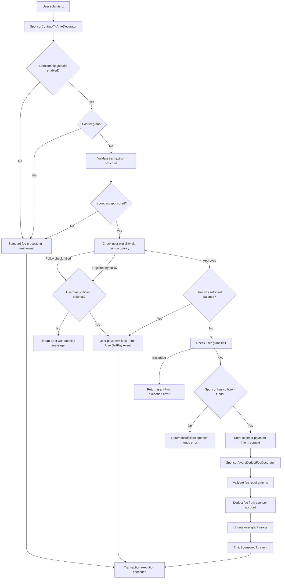

# Sponsor Contract Transaction Module

## Overview

The **Sponsor Contract Transaction Module** (`x/sponsor-contract-tx`) enables CosmWasm contracts to automatically sponsor transaction fees for their users. It removes onboarding friction (users do not need tokens up-front) while giving contract owners fine-grained control over who is sponsored, how much gas can be consumed, and how sponsor funds are spent.

## Table of Contents

- [Motivation & Problem Statement](#motivation--problem-statement)
- [Solution Architecture](#solution-architecture)
- [Core Components](#core-components)
- [Transaction Flow](#transaction-flow)
- [Latest Design Updates](#latest-design-updates)
- [Spam Prevention](#spam-prevention)
- [Security Model](#security-model)
- [Event System](#event-system)
- [CLI Usage Guide](#cli-usage-guide)
- [Query Commands](#query-commands)
- [Module Parameters](#module-parameters)
- [Integration Guide](#integration-guide)
- [Security Considerations](#security-considerations)
- [Implementation Status](#implementation-status)

## Motivation & Problem Statement

### Current Limitations

1. **Fee Grant Module Constraints**: Cosmos SDK's native fee grant module requires pre-known grantee addresses, making it unsuitable for onboarding new users who haven't interacted with the chain.

2. **Granularity Issues**: Current fee grant mechanisms operate at the module level (`/cosmwasm.wasm.v1.MsgExecuteContract`), allowing potential abuse where users sponsored for contract A could consume resources on contract B.

3. **User Onboarding Friction**: New users must acquire tokens before any blockchain interaction, creating barriers to adoption.

### Our Solution

A dedicated sponsorship module that provides:

- **Contract-specific sponsorship**: Each contract manages its own fee sponsorship independently
- **Policy-based eligibility**: Contracts implement custom logic to determine user eligibility
- **Secure fund management**: Built-in usage limits and abuse prevention mechanisms
- **Event-driven monitoring**: Comprehensive event emission for all operations

## Solution Architecture

### Core Components

#### 1. Sponsor Registry (`ContractSponsor`)

```protobuf
message ContractSponsor {
  string contract_address = 1;
  string creator_address = 2;    // Address of the sponsor registration creator (admin)
  string sponsor_address = 3;    // The derived address that actually pays for sponsorship fees
  bool is_sponsored = 4;
  int64 created_at = 5;
  int64 updated_at = 6;
  repeated cosmos.base.v1beta1.Coin max_grant_per_user = 7;
}
```

## Latest Design Updates

The current design includes the following hardenings and behavior refinements:

- Deterministic execute-message parsing
  - Enforce exactly one top-level JSON field in each `MsgExecuteContract` targeted for policy checks
  - Use the raw JSON bytes from the transaction (no lossy conversions)
- Policy checks with strict gas accounting
  - Execute contract `check_policy` in a gas-limited context (`max_gas_per_sponsorship`)
  - Always charge gas used back to the main context on both success and failure
- Early and conservative gating in CheckTx
  - Enforce validator min gas prices before any policy/JSON work
  - Zero-fee transactions bypass sponsorship checks in CheckTx (mempool optimization)
- Resource caps and preflight checks
  - Per-transaction cap on the number of `MsgExecuteContract` to the sponsored contract
  - Per-message raw JSON payload size cap before any parsing or contract work
  - Early short-circuits: user grant-vs-fee, early sponsor balance
- Single-signer invariant and feegrant precedence
  - Sponsored path requires exactly one consistent signer across messages
  - If FeeGranter is set, feegrant takes precedence and sponsorship is skipped
- Events and observability
  - New events: `sponsorship_skipped` (with sanitized reason)
- Error and privacy hardening
  - Sanitize strings in events/logs; avoid leaking sponsor balances in user-visible errors
- Admin fallback on ClearAdmin
  - When contract admin is cleared, original sponsor `creator_address` retains sponsor management rights

## Spam Prevention

The module uses layered defenses to reduce spam and resource exhaustion while keeping sponsored UX smooth.

- Economic costs
  - Enforce validator min gas prices in CheckTx before any contract/policy work.
  - Zero‑fee transactions bypass sponsorship checks in CheckTx (mempool optimization).
  - Gas consumed by policy checks is always charged to the main context on both success and failure.

- Resource caps and deterministic processing
  - Cap the number of `MsgExecuteContract` to the sponsored contract per tx (`max_exec_msgs_per_tx_for_sponsor`).
  - Cap the raw JSON payload size per message before any parsing (`max_policy_exec_msg_bytes`).
  - Enforce a single top‑level JSON key and use raw tx JSON to avoid non‑deterministic map iteration.

- Early preflight short‑circuits
  - Self‑pay preference: users with sufficient balance pay their own fees (sponsorship skipped).
  - Early grant vs fee check: skip sponsorship if the fee exceeds the user’s remaining sponsored grant.
  - Early sponsor balance check: skip costly policy queries when sponsor cannot afford the fee.

- Observability and controls
  - Events: `sponsorship_skipped` (sanitized reason).
  - Governance parameters to tune caps and gas limits; global toggle to disable sponsorship.

- Notes and limitations
  - Excessively heavy contract policies may still hit gas caps; keep on‑chain policy logic lean.

**Important: Funding Mechanism**
- `creator_address`: Address of the creator who sets contract sponsorship status (used only for permission verification)
- `sponsor_address`: The derived address that actually pays for sponsorship fees (deterministically derived from contract address using "sponsor" suffix)
- **Actual funding account**: The sponsor_address bears all sponsorship fees
- **Address derivation**: `sponsor_address = sdk.AccAddress(address.Derive(contract_address, []byte("sponsor")))`
- **Workflow**: 
  1. Admin sets up sponsorship using `set-sponsor` command
  2. Query the generated `sponsor_address` using `query sponsor sponsor-info [contract-address]`
  3. Transfer funds to the `sponsor_address` (not the contract address!)
  4. Sponsor address automatically pays eligible user fees

#### 2. User Grant Tracking (`UserGrantUsage`)

```protobuf
message UserGrantUsage {
  string user_address = 1;
  string contract_address = 2;
  repeated cosmos.base.v1beta1.Coin total_grant_used = 3;
  int64 last_used_time = 4;
}
```

#### 3. AnteHandler Integration

- **SponsorContractTxAnteDecorator**: Validates sponsored transactions and checks policies
- **SponsorAwareDeductFeeDecorator**: Handles sponsored fee deduction

## Transaction Flow



## Security Model

### Transaction Validation Rules

All sponsored transactions must pass structural checks **before** the contract policy is evaluated:

**✅ ALLOWED: Single contract, multiple messages**

```json
[
  {
    "@type": "/cosmwasm.wasm.v1.MsgExecuteContract",
    "contract": "dora1contract"
  },
  {
    "@type": "/cosmwasm.wasm.v1.MsgExecuteContract",
    "contract": "dora1contract"
  }
]
```

**❌ REJECTED: Mixed message types**

```json
[
  {
    "@type": "/cosmwasm.wasm.v1.MsgExecuteContract",
    "contract": "dora1contract"
  },
  { "@type": "/cosmos.bank.v1beta1.MsgSend", "from_address": "..." }
]
```

**❌ REJECTED: Multiple different contracts**

```json
[
  {
    "@type": "/cosmwasm.wasm.v1.MsgExecuteContract",
    "contract": "dora1contractA"
  },
  {
    "@type": "/cosmwasm.wasm.v1.MsgExecuteContract",
    "contract": "dora1contractB"
  }
]
```

- **❌ Multi-signer batches** are rejected – sponsored transactions must have exactly one signer to prevent signature hijacking.
- **💡 Zero-fee optimisation** – in CheckTx a zero-fee transaction bypasses sponsorship checks (mempool optimisation). DeliverTx will still run the fallback logic.

### Access Control

- Only contract admins can register/modify sponsorship settings
- Admin verification through wasm keeper queries
- Immutable sponsorship settings by unauthorized parties

### Anti-Abuse Mechanisms

1. **User Grant Limits**: Per-user spending caps per contract
2. **Policy Queries**: Contract-defined eligibility checks with gas limiting
3. **Balance Checks**: Users with sufficient funds pay their own fees (anti-abuse priority)
4. **Usage Tracking**: Comprehensive monitoring of grant consumption
5. **Gas Limiting**: Contract policy queries are limited by `max_gas_per_sponsorship` parameter
6. **Transaction Structure Validation**: Only single-contract, multiple-message transactions allowed
7. **Feegrant Priority**: Feegrant takes precedence over sponsorship to prevent conflicts
8. **Global Toggle**: Sponsorship can be globally disabled via governance parameters
9. **Deterministic Policy Input**: Enforce a single top-level JSON field and pass the exact raw JSON to `check_policy`

## Event System

The module emits comprehensive events for monitoring and auditing:

### Transaction Events

- `sponsored_transaction`: Successful sponsored transaction
  - Attributes: `contract_address`, `sponsor_address`, `user`, `sponsor_amount`, `is_sponsored`
- `sponsor_insufficient_funds`: Sponsor cannot pay fees
  - Attributes: `contract_address`, `sponsor_address`, `user`, `fee_amount`
- `user_self_pay`: User paid own fees (eligible but has sufficient balance)
  - Attributes: `contract_address`, `user`, `reason`, `fee_amount`
- `sponsor_withdraw_funds`: Admin withdrew funds from derived sponsor address to recipient
  - Attributes: `creator`, `contract_address`, `sponsor_address`, `recipient`, `sponsor_amount`
- `sponsor_usage_updated`: User grant usage updated (internal tracking)
- `sponsorship_disabled`: Sponsorship globally disabled
  - Attributes: `reason`
- `sponsorship_skipped`: Sponsorship path skipped (structure/caps/policy)
  - Attributes: `contract_address` (if available), `reason`


### Management Events

- `set_sponsor`: Contract sponsorship registered
  - Attributes: `contract_address`, `creator_address`, `sponsor_address`, `is_sponsored`, `max_grant_per_user`
- `update_sponsor`: Contract sponsorship settings updated
  - Attributes: `contract_address`, `creator_address`, `sponsor_address`, `is_sponsored`, `max_grant_per_user`
- `delete_sponsor`: Contract sponsorship removed
  - Attributes: `contract_address`, `creator_address`
- `update_params`: Module parameters updated via governance
  - Attributes: Updated parameter values

## CLI Usage Guide

### Prerequisites

```bash
# Ensure you have the dorad binary built
make build

# Set up your key
dorad keys add admin
dorad keys add user

# Fund accounts (for testing)
# Admin needs funds to pay for registration transactions
# Derived sponsor_address needs funds to sponsor user transactions
```

### Contract Sponsorship Management

#### 1. Register Contract for Sponsorship

```bash
# Basic sponsorship registration
dorad tx sponsor set-sponsor [contract-address] true \
  --from admin \
  --chain-id [chain-id] \
  --gas auto \
  --gas-adjustment 1.5 \
  --gas-prices 100000000000peaka

# With custom grant limit per user (1 DORA = 10^18 peaka)
dorad tx sponsor set-sponsor [contract-address] true 1000000000000000000peaka \
  --from admin \
  --chain-id [chain-id] \
  --gas auto \
  --gas-adjustment 1.5 \
  --gas-prices 100000000000peaka

#### 2. Update Sponsorship Settings

```bash
# Disable sponsorship
dorad tx sponsor update-sponsor [contract-address] false \
  --from admin \
  --chain-id [chain-id] \
  --gas auto \
  --gas-adjustment 1.5 \
  --gas-prices 100000000000peaka

# Update grant limits
dorad tx sponsor update-sponsor [contract-address] true \
  --max-grant-per-user 2000000000000000000peaka \
  --from admin \
  --chain-id [chain-id] \
  --gas auto \
  --gas-adjustment 1.5 \
  --gas-prices 100000000000peaka
```

#### 3. Remove Sponsorship

```bash
dorad tx sponsor delete-sponsor [contract-address] \
  --from admin \
  --chain-id [chain-id] \
  --gas auto \
  --gas-adjustment 1.5 \
  --gas-prices 100000000000peaka
```

### Fund Management

#### Transfer Funds to Sponsor Address (for sponsorship)

```bash
# IMPORTANT: sponsor_address pays for sponsorship fees
# First, query to get the sponsor_address
dorad query sponsor sponsor-info [contract-address]

# Then transfer funds TO the sponsor_address, not the contract or creator address
dorad tx bank send [admin-address] [sponsor-address] 10000000000000000000peaka \
  --from admin \
  --chain-id [chain-id] \
  --gas auto \
  --gas-adjustment 1.5 \
  --gas-prices 100000000000peaka
```

**Key Points**:
- Funds must be transferred to the **sponsor_address**, not the contract or creator address
- sponsor_address is derived from contract_address and directly serves as the funding account for all sponsorship fees
- `creator_address` is only used for permission verification and does not participate in actual funding

#### Withdraw Funds from Sponsor Address (admin only)

The derived sponsor address has no private key and cannot sign. To reclaim or move funds, the contract admin must execute a module message which transfers from the sponsor address to a specified recipient.

```bash
# Withdraw 1 DORA (10^18 peaka) from the sponsor address to RECIPIENT_ADDR
dorad tx sponsor withdraw-sponsor-funds [contract-address] [recipient-address] 1DORA \
  --from admin \
  --chain-id [chain-id] \
  --gas auto \
  --gas-adjustment 1.5 \
  --gas-prices 100000000000peaka

# Alternatively specify peaka directly (example: 3,000 peaka)
dorad tx sponsor withdraw-sponsor-funds [contract-address] [recipient-address] 3000peaka \
  --from admin \
  --chain-id [chain-id] \
  --gas auto \
  --gas-adjustment 1.5 \
  --gas-prices 100000000000peaka
```

Notes:
- Only the contract admin (as recorded by the CosmWasm contract) can withdraw funds.
- `recipient` is the target address to receive the withdrawn funds (e.g., project treasury, multisig, ops account).
- The module validates denomination (`peaka` only) and available balance before transfer.
- An event `sponsor_withdraw_funds` is emitted with attributes: creator, contract_address, sponsor_address, recipient, sponsor_amount.

## Query Commands

### Sponsorship Status Queries

#### 1. Get Sponsor Details

```bash
dorad query sponsor sponsor-info [contract-address] \
  --chain-id [chain-id] \
  --gas auto \
  --gas-adjustment 1.5 \
  --gas-prices 100000000000peaka

# Example output:
# sponsor:
#   contract_address: dora1contract...
#   creator_address: dora1admin...    # Admin who registered sponsorship
#   sponsor_address: dora1sponsor...  # Derived address that actually pays fees
#   is_sponsored: true
#   created_at: "1640995200"
#   updated_at: "1640995200"
#   max_grant_per_user:
#   - denom: peaka
#     amount: "1000000000000000000"
# Note: sponsor_address (dora1sponsor...) is the actual funding source
```

#### 2. List All Sponsors

```bash
dorad query sponsor all-sponsors \
  --page 1 --limit 50 \
  --page-key <base64> \
  --chain-id [chain-id] \
  --gas auto \
  --gas-adjustment 1.5 \
  --gas-prices 100000000000peaka

# This query supports standard pagination flags
```


### User Grant Queries

#### 1. Get User Grant Usage

```bash
dorad query sponsor grant-usage [user-address] [contract-address]

# Example output:
# usage:
#   user_address: dora1user...
#   contract_address: dora1contract...
#   total_grant_used:
#   - denom: peaka
#     amount: "500000000000000000"
#   last_used_time: "1640995800"
```

### Module Parameters

```bash
dorad query sponsor params

# Example output:
# params:
#   sponsorship_enabled: true
#   max_gas_per_sponsorship: "2500000"
```

**Parameter Details (governance-controlled):**

- `sponsorship_enabled` (bool): Global toggle for sponsorship (default: `true`).
- `max_gas_per_sponsorship` (uint64): Max gas for contract policy checks (default: `2_500_000`, hard cap `50_000_000`).
- `max_exec_msgs_per_tx_for_sponsor` (uint32): Max number of `MsgExecuteContract` to the sponsored contract per tx (default: `25`; `0` disables cap).
- `max_policy_exec_msg_bytes` (uint32): Per-message raw JSON payload cap for policy checks in bytes (default: `16384`; `0` disables; hard cap `1,048,576`).

**Denomination**

- `SponsorshipDenom` is `peaka` and is used for all grants and fee accounting within this module.

**Governance Control:**

Parameters can be updated via governance proposals using `MsgUpdateParams`.

## Integration Guide
> We have implemented a sample contract in the  `doravota/contracts` directory, which is a `counter` contract that records user addresses as a `whitelist`. In our business logic, we want users on the whitelist to be able to have their transactions sponsored by our sponsor system. Therefore, we first need to register the contract address with the `sponsor-contract-tx` module through the admin of the counter contract, set the appropriate `Usage limit`, and ensure that the **derived sponsor_address has sufficient balance** to sponsor transactions.
Any user on the whitelist can enjoy transaction sponsorship paid by the sponsor_address.

### For Contract Developers

#### 1. Implement CheckPolicy Query

Your contract must implement the following query method:

```rust
#[cw_serde]
#[derive(QueryResponses)]
pub enum QueryMsg {
    #[returns(CheckPolicyResponse)]
    CheckPolicy { 
        sender: String,
        msg_data: String, // Complete ExecuteMsg JSON
    },
}

#[cw_serde]
pub struct CheckPolicyResponse {
    pub eligible: bool,
    pub reason: Option<String>,
}

pub fn query_check_policy(
    deps: Deps, 
    sender: String, 
    msg_data: String
) -> StdResult<CheckPolicyResponse> {
    // IMPORTANT: msg_data contains the complete ExecuteMsg JSON
    // For example: {"increment": {"amount": 3}} NOT just {"amount": 3}
    
    // Parse the complete ExecuteMsg from msg_data
    let exec_msg: ExecuteMsg = serde_json::from_str(&msg_data)
        .map_err(|e| cosmwasm_std::StdError::generic_err(
            format!("Failed to parse ExecuteMsg from msg_data: {}", e)
        ))?;

    // Implement your custom logic here based on the parsed ExecuteMsg
    // Examples:
    // - Check whitelist
    // - Verify user registration  
    // - Check usage patterns (like period limit)
    // - Validate business rules (like zero knowledge proof verification)
    // - Validate message parameters (amount limits, etc.)

    let (eligible, reason) = match exec_msg {
        ExecuteMsg::Increment { amount } => {
            check_increment_eligibility(&deps, &sender, amount)?
        }
        ExecuteMsg::Decrement {} => {
            check_decrement_eligibility(&deps, &sender)?
        }
        // Add other message types as needed
        _ => (false, Some("Message type not supported for sponsorship".to_string())),
    };

    Ok(CheckPolicyResponse { eligible, reason })
}
```

#### 2. Fund Your Sponsor Address

```bash
# First, get the sponsor address after registration
dorad query sponsor sponsor-info [contract-address]

# Ensure your sponsor address has sufficient balance for sponsorship
dorad tx bank send [admin] [sponsor-address] [amount]peaka --from admin
```

#### 3. Register for Sponsorship

```bash
# Only contract admin can register
dorad tx sponsor set-sponsor [contract-address] true <LIMIT_AMOUNT_DORA> \
  --from [contract-admin]
```

### For Frontend Developers

#### 1. Check Sponsorship Status

```bash
# Before submitting transactions, check if contract supports sponsorship
dorad query sponsor sponsor-info [contract-address]
```

#### 2. Submit Sponsored Transactions

Transactions are automatically sponsored only if **all** of the following hold:

- Contract is registered and `is_sponsored=true`
- Contract policy (`check_policy`) returns `eligible=true`
- User has insufficient spendable balance to cover the fee (users with sufficient balance always self-pay)
- Sponsor address has enough spendable balance
- User has not exceeded `max_grant_per_user`
- Transaction does not specify a feegrant (feegrant takes precedence)
- Global parameter `sponsorship_enabled` is `true`

```bash
# Normal transaction - will be automatically sponsored if eligible
dorad tx wasm execute [contract-address] '{"increment":{"amount":3}}' \
  --from user \
  --gas-adjustment 1.5 \
  --gas-prices 100000000000peaka

# The contract will receive CheckPolicy query with:
# {
#   "check_policy": {
#     "sender": "dora1user...",
#     "msg_data": "{\"increment\":{\"amount\":3}}"
#   }
# }
```

## Implementation Details

### Contract Policy Query Format

When a sponsored transaction is submitted, the module calls the contract with the following query:

```json
{
  "check_policy": {
    "sender": "dora1user...",
    "msg_data": "{\"increment\":{\"amount\":3}}"
  }
}
```

**Important Notes:**
- `msg_data`: Complete ExecuteMsg JSON string, NOT just the parameters
- The contract must parse `msg_data` as a complete `ExecuteMsg` to access parameters

### AnteHandler Chain

The sponsor module integrates into the Cosmos SDK AnteHandler chain:

1. **SponsorContractTxAnteDecorator**: Validates transactions and checks policies
2. **SponsorAwareDeductFeeDecorator**: Handles sponsored fee deduction
3. Standard Cosmos SDK decorators continue processing

### Gas Management

- Policy queries are gas-limited by `max_gas_per_sponsorship`
- Gas consumed by policy checks is charged to the main transaction context (success and failure)
- CheckTx enforces validator min-gas before any policy/JSON work; zero-fee txs bypass sponsorship checks in CheckTx
- Oversized payloads or too many exec messages cause an early sponsorship skip and fallback

## Security Considerations

### 1. Admin Verification

- Critical for preventing unauthorized sponsorship registration
- Verified through wasm keeper queries to ensure only actual contract admins can register

### 2. Policy Implementation

- Contracts must implement secure and efficient `check_policy` logic
- Policy queries consume gas during ante handler execution
- Consider gas limits in node configuration (`query_gas_limit`)
- Return descriptive `reason` strings so users can diagnose denials

### 3. Fund Management

- **Sponsor addresses need sufficient balance monitoring**
- Implement spending alerts/auto-top-up flows for sponsor_address accounts
- `max_grant_per_user` must be non-empty when sponsorship is enabled; tune it to your budget
- Sponsor addresses have no private keys; withdrawals must use `withdraw-sponsor-funds`

### 4. Abuse Prevention

- Strict transaction structure validation prevents fee leeching
- Users with sufficient balance always self-pay, even if policy returns eligible (anti-abuse priority)
- Per-user grant limits prevent excessive consumption; additional throttling (time windows, frequency caps) should live in `check_policy`
- Event monitoring enables abuse detection (`sponsorship_skipped`, `user_self_pay`, `sponsor_insufficient_funds`)

### 5. Gas Considerations

- Policy queries consume gas during transaction validation
- Set appropriate gas limits for contract queries
- Keep contract policy logic simple; heavy logic risks hitting `max_gas_per_sponsorship`

### Operational Best Practices

- Monitor sponsor balances and usage via queries/events; automate replenishment where possible.
- Keep `max_grant_per_user` aligned with expected contract usage; update via `update-sponsor` when business logic changes.
- Record fallback events (`sponsorship_skipped`) to diagnose policy issues or missing contracts.
- Add integration tests that cover CheckTx and DeliverTx behaviour, contract upgrades, and admin transfers.

## Implementation Status

- ✅ Core module implementation with protobuf serialization
- ✅ AnteHandler integration with comprehensive validation
- ✅ Admin verification system through wasm keeper
- ✅ Policy query mechanism with gas limiting
- ✅ User grant usage tracking and limits
- ✅ Comprehensive event system for monitoring
- ✅ Error handling with proper error returns
- ✅ Full CLI command support
- ✅ Complete test coverage
- 🔄 Third-party security audit (current phase)
- 🔄 Community review and feedback integration

## Testing

### Local Testing Setup

1. **Clone and Build**

```bash
git clone https://github.com/DoraFactory/doravota.git
cd doravota
git checkout sponsor-contract-tx
make build
```

2. **Set Up Local Network**

```bash
# Initialize local chain
dorad init test --chain-id test-chain
dorad keys add admin
dorad keys add user

# Add genesis accounts
dorad add-genesis-account $(dorad keys show admin -a) 1000000000000000000000peaka
dorad add-genesis-account $(dorad keys show user -a) 100000000000000000peaka

# Start chain
dorad start
```

3. **Deploy Test Contract**

```bash
# Deploy the included counter contract
dorad tx wasm store contracts/counter/target/wasm32-unknown-unknown/release/counter.wasm \
  --from admin --gas auto --gas-adjustment 1.2

# Instantiate contract
dorad tx wasm instantiate 1 '{}' \
  --label "test-counter" \
  --admin $(dorad keys show admin -a) \
  --from admin --gas auto
```

4. **Test Sponsorship**

```bash
# Register contract for sponsorship
dorad tx sponsor set-sponsor [contract-address] true 1000000000000000000peaka \
  --from admin \
  --gas auto \
  --gas-adjustment 1.5 \
  --gas-prices 100000000000peaka

# Get sponsor address first
SPONSOR_ADDR=$(dorad query sponsor sponsor-info [contract-address] --output json | jq -r '.sponsor.sponsor_address')

# Fund sponsor address for sponsorship
dorad tx bank send $(dorad keys show admin -a) $SPONSOR_ADDR 10000000000000000000peaka \
  --from admin \
  --gas auto \ 
  --gas-adjustment 1.5 \
  --gas-prices 100000000000peaka

# Test sponsored transaction
dorad tx wasm execute [contract-address] '{"increment":{}}' \
  --from user \
  --gas auto \
  --gas-adjustment 1.5 \
  --gas-prices 100000000000peaka
```

## Conclusion

This module provides a secure, flexible, and comprehensive solution for contract-sponsored transactions while maintaining full compatibility with existing Cosmos SDK patterns. The implementation includes robust error handling, comprehensive event emission, and strong security measures to prevent abuse.

**Key Features for Audit:**

- Complete transaction flow validation
- Comprehensive access control mechanisms
- Event-driven monitoring and logging
- Proper error handling throughout the system
- Protection against known attack vectors
- Extensive test coverage

We welcome third-party security audits and community feedback to ensure the highest level of security and reliability.
