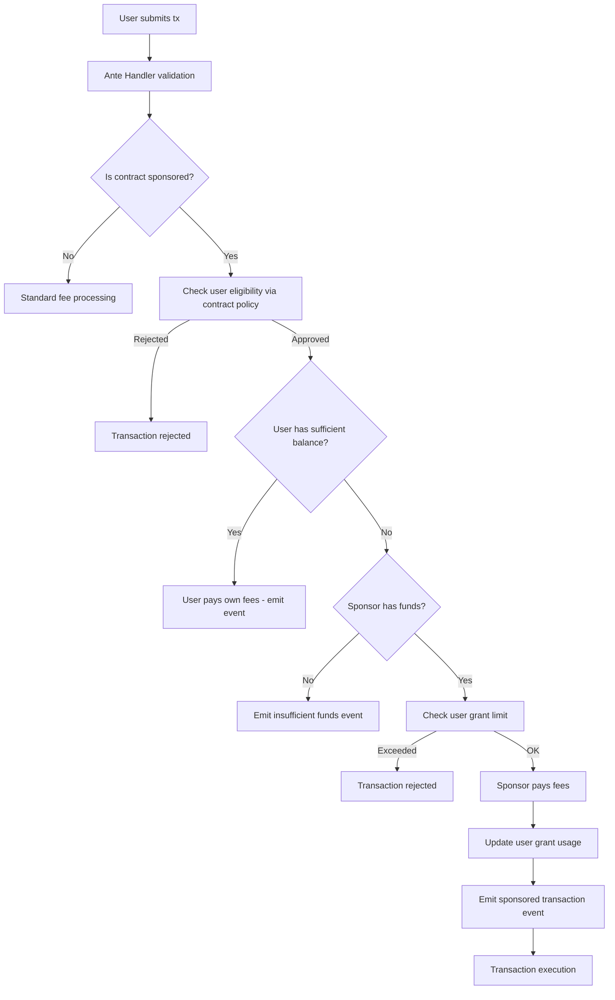

# Sponsor Contract Transaction Module

## Overview

The **Sponsor Contract Transaction Module** (`x/sponsor-contract-tx`) enables smart contracts to automatically sponsor transaction fees for their users on Cosmos-based blockchains. This module solves the cold start problem in Web3 applications where new users need tokens to interact with CosmWasm smart contracts.

## Table of Contents

- [Motivation & Problem Statement](#motivation--problem-statement)
- [Solution Architecture](#solution-architecture)
- [Core Components](#core-components)
- [Transaction Flow](#transaction-flow)
- [Security Model](#security-model)
- [Event System](#event-system)
- [CLI Usage Guide](#cli-usage-guide)
- [Query Commands](#query-commands)
- [Integration Guide](#integration-guide)
- [Security Considerations](#security-considerations)
- [Implementation Status](#implementation-status)

## Motivation & Problem Statement

### Current Limitations

1. **Fee Grant Module Constraints**: Cosmos SDK's native fee grant module requires pre-known grantee addresses, making it unsuitable for onboarding new users who haven't interacted with the chain.

2. **Granularity Issues**: Current fee grant mechanisms operate at the module level (`/cosmwasm.wasm.v1.MsgExecuteContract`), allowing potential abuse where users sponsored for contract A could consume resources on contract B.

3. **User Onboarding Friction**: New users must acquire tokens before any blockchain interaction, creating barriers to adoption.

### Our Solution

A dedicated sponsorship module that provides:

- **Contract-specific sponsorship**: Each contract manages its own fee sponsorship independently
- **Policy-based eligibility**: Contracts implement custom logic to determine user eligibility
- **Secure fund management**: Built-in usage limits and abuse prevention mechanisms
- **Event-driven monitoring**: Comprehensive event emission for all operations

## Solution Architecture

### Core Components

#### 1. Sponsor Registry (`ContractSponsor`)

```protobuf
message ContractSponsor {
  string contract_address = 1;
  string sponsor_address = 2;
  bool is_sponsored = 3;
  int64 created_at = 4;
  int64 updated_at = 5;
  repeated cosmos.base.v1beta1.Coin max_grant_per_user = 6;
}
```

#### 2. User Grant Tracking (`UserGrantUsage`)

```protobuf
message UserGrantUsage {
  string user_address = 1;
  string contract_address = 2;
  repeated cosmos.base.v1beta1.Coin total_grant_used = 3;
  int64 last_used_time = 4;
}
```

#### 3. AnteHandler Integration

- **SponsorContractTxAnteDecorator**: Validates sponsored transactions and checks policies
- **SponsorAwareDeductFeeDecorator**: Handles sponsored fee deduction

## Transaction Flow



## Security Model

### Transaction Validation Rules

**✅ ALLOWED: Single contract, multiple messages**

```json
[
  {
    "@type": "/cosmwasm.wasm.v1.MsgExecuteContract",
    "contract": "dora1contract"
  },
  {
    "@type": "/cosmwasm.wasm.v1.MsgExecuteContract",
    "contract": "dora1contract"
  }
]
```

**❌ REJECTED: Mixed message types**

```json
[
  {
    "@type": "/cosmwasm.wasm.v1.MsgExecuteContract",
    "contract": "dora1contract"
  },
  { "@type": "/cosmos.bank.v1beta1.MsgSend", "from_address": "..." }
]
```

**❌ REJECTED: Multiple different contracts**

```json
[
  {
    "@type": "/cosmwasm.wasm.v1.MsgExecuteContract",
    "contract": "dora1contractA"
  },
  {
    "@type": "/cosmwasm.wasm.v1.MsgExecuteContract",
    "contract": "dora1contractB"
  }
]
```

### Access Control

- Only contract admins can register/modify sponsorship settings
- Admin verification through wasm keeper queries
- Immutable sponsorship settings by unauthorized parties

### Anti-Abuse Mechanisms

1. **User Grant Limits**: Per-user spending caps per contract
2. **Policy Queries**: Contract-defined eligibility checks
3. **Balance Checks**: Users with sufficient funds pay their own fees
4. **Usage Tracking**: Comprehensive monitoring of grant consumption

## Event System

The module emits comprehensive events for monitoring and auditing:

### Transaction Events

- `sponsored_transaction`: Successful sponsored transaction
- `sponsor_insufficient_funds`: Sponsor cannot pay fees
- `user_self_pay`: User paid own fees despite sponsorship availability
- `sponsor_usage_updated`: User grant usage updated

### Management Events

- `set_sponsor`: Contract sponsorship registered
- `update_sponsor`: Contract sponsorship settings updated
- `delete_sponsor`: Contract sponsorship removed

### Query Events

- `get_sponsor`: Sponsor data retrieved
- `get_user_grant_usage`: User grant usage queried
- `check_sponsorship`: Sponsorship status checked
- `query_sponsors`: Sponsor list queried

## CLI Usage Guide

### Prerequisites

```bash
# Ensure you have the dorad binary built
make build

# Set up your key
dorad keys add admin
dorad keys add user

# Fund accounts (for testing)
# Admin needs funds to pay for registration transactions
# Contract needs funds to sponsor user transactions
```

### Contract Sponsorship Management

#### 1. Register Contract for Sponsorship

```bash
# Basic sponsorship registration
dorad tx sponsor set-sponsor [contract-address] true \
  --from admin \
  --chain-id [chain-id] \
  --gas auto \
  --gas-adjustment 1.2 \
  --fees 1000peaka

# With custom grant limit per user (1 DORA = 10^18 peaka)
dorad tx sponsor set-sponsor [contract-address] true \
  --max-grant-per-user 1000000000000000000peaka \
  --from admin \
  --chain-id [chain-id] \
  --gas auto \
  --gas-adjustment 1.2 \
  --fees 1000peaka

# Example with real addresses
dorad tx sponsor set-sponsor dora1contractaddr123... true \
  --max-grant-per-user 500000000000000000peaka \
  --from admin \
  --chain-id dora-vota-1 \
  --gas auto \
  --gas-adjustment 1.2 \
  --fees 1000peaka
```

#### 2. Update Sponsorship Settings

```bash
# Disable sponsorship
dorad tx sponsor update-sponsor [contract-address] false \
  --from admin \
  --chain-id [chain-id] \
  --gas auto \
  --fees 1000peaka

# Update grant limits
dorad tx sponsor update-sponsor [contract-address] true \
  --max-grant-per-user 2000000000000000000peaka \
  --from admin \
  --chain-id [chain-id] \
  --gas auto \
  --fees 1000peaka
```

#### 3. Remove Sponsorship

```bash
dorad tx sponsor delete-sponsor [contract-address] \
  --from admin \
  --chain-id [chain-id] \
  --gas auto \
  --fees 1000peaka
```

### Fund Management

#### Transfer Funds to Contract (for sponsorship)

```bash
# Contract needs funds to sponsor user transactions
dorad tx bank send [admin-address] [contract-address] 10000000000000000000peaka \
  --from admin \
  --chain-id [chain-id] \
  --gas auto \
  --fees 1000peaka
```

## Query Commands

### Sponsorship Status Queries

#### 1. Check if Contract is Sponsored

```bash
dorad query sponsor is-sponsored [contract-address]

# Example output:
# is_sponsored: true
```

#### 2. Get Sponsor Details

```bash
dorad query sponsor sponsor [contract-address]

# Example output:
# sponsor:
#   contract_address: dora1contract...
#   sponsor_address: dora1admin...
#   is_sponsored: true
#   created_at: "1640995200"
#   updated_at: "1640995200"
#   max_grant_per_user:
#   - denom: peaka
#     amount: "1000000000000000000"
```

#### 3. List All Sponsors

```bash
dorad query sponsor sponsors

# With pagination
dorad query sponsor sponsors --limit 50 --offset 0
```

#### 4. Get Sponsor Statistics

```bash
# Total sponsor count
dorad query sponsor sponsor-count

# Active sponsor count
dorad query sponsor active-sponsor-count
```

### User Grant Queries

#### 1. Get User Grant Usage

```bash
dorad query sponsor user-grant-usage [user-address] [contract-address]

# Example output:
# usage:
#   user_address: dora1user...
#   contract_address: dora1contract...
#   total_grant_used:
#   - denom: peaka
#     amount: "500000000000000000"
#   last_used_time: "1640995800"
```

#### 2. Check User Grant Limit

```bash
dorad query sponsor max-grant-per-user [contract-address]

# Example output:
# max_grant:
# - denom: peaka
#   amount: "1000000000000000000"
```

### Module Parameters

```bash
dorad query sponsor params

# Example output:
# params:
#   max_gas_per_sponsorship: "100000"
```

## Integration Guide

### For Contract Developers

#### 1. Implement CheckPolicy Query

Your contract must implement the following query method:

```rust
#[cw_serde]
#[derive(QueryResponses)]
pub enum QueryMsg {
    #[returns(CheckPolicyResponse)]
    CheckPolicy { address: String },
}

#[cw_serde]
pub struct CheckPolicyResponse {
    pub eligible: bool,
}

pub fn query_check_policy(
    deps: Deps,
    address: String,
) -> StdResult<CheckPolicyResponse> {
    // Implement your custom logic here
    // Examples:
    // - Check whitelist
    // - Verify user registration
    // - Check usage patterns
    // - Validate business rules

    let eligible = check_user_eligibility(&deps, &address)?;
    Ok(CheckPolicyResponse { eligible })
}
```

#### 2. Fund Your Contract

```bash
# Ensure your contract has sufficient balance for sponsorship
dorad tx bank send [admin] [contract-address] [amount]peaka --from admin
```

#### 3. Register for Sponsorship

```bash
# Only contract admin can register
dorad tx sponsor set-sponsor [contract-address] true \
  --max-grant-per-user [limit] \
  --from [contract-admin]
```

### For Frontend Developers

#### 1. Check Sponsorship Status

```bash
# Before submitting transactions, check if contract supports sponsorship
dorad query sponsor is-sponsored [contract-address]
```

#### 2. Submit Sponsored Transactions

Transactions are automatically sponsored if:

- Contract is registered for sponsorship
- User passes contract's CheckPolicy
- User has insufficient funds for fees
- Contract has sufficient balance
- User hasn't exceeded grant limits

```bash
# Normal transaction - will be automatically sponsored if eligible
dorad tx wasm execute [contract-address] '{"increment":{}}' \
  --from user \
  --gas auto
```

## Security Considerations

### 1. Admin Verification

- Critical for preventing unauthorized sponsorship registration
- Verified through wasm keeper queries to ensure only actual contract admins can register

### 2. Policy Implementation

- Contracts must implement secure and efficient `CheckPolicy` logic
- Policy queries consume gas during ante handler execution
- Consider gas limits in node configuration (`query_gas_limit`)

### 3. Fund Management

- Contracts need sufficient balance monitoring
- Implement spending alerts and automatic funding mechanisms
- Consider setting reasonable `max_grant_per_user` limits

### 4. Abuse Prevention

- Strict transaction structure validation prevents fee leeching
- Per-user grant limits prevent excessive consumption
- Event monitoring enables abuse detection

### 5. Gas Considerations

- Policy queries consume gas during transaction validation
- Set appropriate gas limits for contract queries
- Consider implementing simple boolean flags for basic use cases

## Implementation Status

- ✅ Core module implementation with protobuf serialization
- ✅ AnteHandler integration with comprehensive validation
- ✅ Admin verification system through wasm keeper
- ✅ Policy query mechanism with gas limiting
- ✅ User grant usage tracking and limits
- ✅ Comprehensive event system for monitoring
- ✅ Error handling with proper error returns
- ✅ Full CLI command support
- ✅ Complete test coverage
- 🔄 Third-party security audit (current phase)
- 🔄 Community review and feedback integration

## Testing

### Local Testing Setup

1. **Clone and Build**

```bash
git clone https://github.com/DoraFactory/doravota.git
cd doravota
git checkout sponsor-contract-tx
make build
```

2. **Set Up Local Network**

```bash
# Initialize local chain
dorad init test --chain-id test-chain
dorad keys add admin
dorad keys add user

# Add genesis accounts
dorad add-genesis-account $(dorad keys show admin -a) 1000000000000000000000peaka
dorad add-genesis-account $(dorad keys show user -a) 100000000000000000peaka

# Start chain
dorad start
```

3. **Deploy Test Contract**

```bash
# Deploy the included counter contract
dorad tx wasm store contracts/counter/target/wasm32-unknown-unknown/release/counter.wasm \
  --from admin --gas auto --gas-adjustment 1.2

# Instantiate contract
dorad tx wasm instantiate 1 '{}' \
  --label "test-counter" \
  --admin $(dorad keys show admin -a) \
  --from admin --gas auto
```

4. **Test Sponsorship**

```bash
# Register contract for sponsorship
dorad tx sponsor set-sponsor [contract-address] true \
  --max-grant-per-user 1000000000000000000peaka \
  --from admin

# Fund contract for sponsorship
dorad tx bank send $(dorad keys show admin -a) [contract-address] 10000000000000000000peaka \
  --from admin

# Test sponsored transaction
dorad tx wasm execute [contract-address] '{"increment":{}}' \
  --from user --gas auto
```

## Conclusion

This module provides a secure, flexible, and comprehensive solution for contract-sponsored transactions while maintaining full compatibility with existing Cosmos SDK patterns. The implementation includes robust error handling, comprehensive event emission, and strong security measures to prevent abuse.

**Key Features for Audit:**

- Complete transaction flow validation
- Comprehensive access control mechanisms
- Event-driven monitoring and logging
- Proper error handling throughout the system
- Protection against known attack vectors
- Extensive test coverage

We welcome third-party security audits and community feedback to ensure the highest level of security and reliability.
