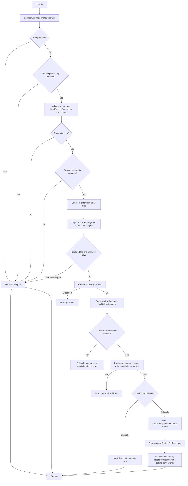

# Sponsor Contract Transaction Module

## Overview

The **Sponsor Contract Transaction Module** (`x/sponsor-contract-tx`) enables CosmWasm contracts to automatically sponsor transaction fees for their users. It removes onboarding friction (users do not need tokens up-front) while giving contract owners fine-grained control over who is sponsored, how much gas can be consumed, and how sponsor funds are spent.

## Table of Contents

- [Motivation & Problem Statement](#motivation--problem-statement)
- [Solution Architecture](#solution-architecture)
- [Core Components](#core-components)
- [Transaction Flow](#transaction-flow)
- [Latest Design Updates](#latest-design-updates)
- [Spam Prevention](#spam-prevention)
- [Security Model](#security-model)
- [Event System](#event-system)
- [CLI Usage Guide](#cli-usage-guide)
- [Query Commands](#query-commands)
- [Module Parameters](#module-parameters)
- [Integration Guide](#integration-guide)
- [Security Considerations](#security-considerations)
- [Implementation Status](#implementation-status)

## Motivation & Problem Statement

### Current Limitations

1. **Fee Grant Module Constraints**: Cosmos SDK's native fee grant module requires pre-known grantee addresses, making it unsuitable for onboarding new users who haven't interacted with the chain.

2. **Granularity Issues**: Current fee grant mechanisms operate at the module level (`/cosmwasm.wasm.v1.MsgExecuteContract`), allowing potential abuse where users sponsored for contract A could consume resources on contract B.

3. **User Onboarding Friction**: New users must acquire tokens before any blockchain interaction, creating barriers to adoption.

### Our Solution

A dedicated sponsorship module that provides:

- **Contract-specific sponsorship**: Each contract manages its own fee sponsorship independently
- **Ticket-based eligibility**: Admin or delegated issuer pre‑issues method‑bound tickets to eligible users; execute requires a valid ticket
- **Secure fund management**: Built‑in usage limits, per‑user caps, and sponsor balance checks
- **Event-driven monitoring**: Comprehensive event emission for all operations

## Solution Architecture

### Core Components

#### 1. Sponsor Registry (`ContractSponsor`)

```protobuf
message ContractSponsor {
  string contract_address = 1;
  // Optional delegated issuer that can issue/revoke policy tickets besides admin
  string ticket_issuer_address = 2;
  string creator_address = 3;    // Address that created/manages this sponsor configuration
  string sponsor_address = 4;    // Derived address that actually pays for sponsorship fees
  bool is_sponsored = 5;
  int64 created_at = 6;
  int64 updated_at = 7;
  repeated cosmos.base.v1beta1.Coin max_grant_per_user = 8;
}
```

## Latest Design Updates

Two‑phase, method‑ticket based sponsorship:

- Method tickets only (no contract probe)
  - Eligibility is determined by pre‑issued method tickets;
  - Each ticket binds one top‑level method. Storage key is `m:<sha256(contract || "method:" || method)>` under `(contract,user,digest)`.

- Roles and permissions
  - Admin can set/update/delete sponsorship, set optional `ticket_issuer_address`, withdraw funds, issue/revoke tickets.
  - When `ticket_issuer_address` is set, both admin and issuer can issue/revoke.
  - Issuing/revoking requires the sponsor to exist for the contract.

- Deterministic, efficient parsing
  - Enforce exactly one top‑level key for sponsored messages; scan via streaming JSON decoder.
  - Guards: per‑message bytes cap, method name length cap, and JSON depth cap when skipping nested values.

- Mempool/runtme behavior
  - Self‑pay priority in both CheckTx and DeliverTx when user can afford declared fee.
  - With a valid ticket and user cannot self‑pay: CheckTx marks a gate after prechecks; DeliverTx injects sponsor payment and consumes tickets.
  - Feegrant precedence over sponsorship.

- Events and housekeeping
  - `policy_ticket_issued`, `policy_ticket_revoked` (revoked includes `method`), `ticket_uses_clamped`, `policy_ticket_issue_conflict`.
  - `sponsored_transaction` summary event; and one `sponsored_tx_ticket` event per digest with pre/post uses and consumed counts (DeliverTx only).
  - Per‑block GC removes expired tickets (`ticket_gc_per_block`). Genesis import/export supports tickets with duplicate detection.

## Spam Prevention

Layered defenses to reduce spam/DoS:

- Economic costs
  - Enforce validator min‑gas‑price via txFeeChecker in CheckTx prior to JSON/ticket work.
  - Zero‑fee tx are bypassed in CheckTx (mempool optimization).

- Structural/resource caps
  - Cap `MsgExecuteContract` count per tx to the same contract (`max_exec_msgs_per_tx_for_sponsor`).
  - Cap per‑message raw JSON bytes (`max_policy_exec_msg_bytes`).
  - Single top‑level key; streaming JSON scan with `max_method_json_depth` bound when skipping nested values.

- Early short‑circuits
  - Self‑pay in both CheckTx/DeliverTx when user can afford the declared fee.
  - With a valid ticket and user cannot self‑pay, CheckTx validates user grant limit and sponsor balance against the declared fee to avoid mempool pollution.

- Accounting and visibility
  - Per‑user grant usage accounting; clamp events and skip reasons emit for observability.

**Important: Funding Mechanism**
- `creator_address`: Address of the creator who sets contract sponsorship status (used only for permission verification)
- `sponsor_address`: The derived address that actually pays for sponsorship fees (deterministically derived from contract address using "sponsor" suffix)
- **Actual funding account**: The sponsor_address bears all sponsorship fees
- **Address derivation**: `sponsor_address = sdk.AccAddress(address.Derive(contract_address, []byte("sponsor")))`
- **Workflow**: 
  1. Admin sets up sponsorship using `set-sponsor` command
  2. Query the generated `sponsor_address` using `query sponsor sponsor-info [contract-address]`
  3. Transfer funds to the `sponsor_address` (not the contract address!)
  4. Sponsor address automatically pays eligible user fees

#### 2. User Grant Tracking (`UserGrantUsage`)

```protobuf
message UserGrantUsage {
  string user_address = 1;
  string contract_address = 2;
  repeated cosmos.base.v1beta1.Coin total_grant_used = 3;
  int64 last_used_time = 4;
}
```

#### 3. AnteHandler Integration

- **SponsorContractTxAnteDecorator**: Validates sponsored transactions and checks policies
- **SponsorAwareDeductFeeDecorator**: Handles sponsored fee deduction

## Transaction Flow



Notes
- Two‑phase gating via method tickets only; no runtime contract policy/query on execute.
- CheckTx enforces validator min‑gas‑price before parsing and KV reads; zero‑fee tx bypass sponsorship checks in CheckTx。
- Self‑pay优先：用户能自付则直接走标准扣费路径（在方法解析之前判定）。
- Feegrant优先：设置 FeeGranter 时直接走标准扣费逻辑，跳过 sponsorship。
- 在进入方法解析前，还会执行结构与资源上限校验（同合约消息条数/每条原始 JSON 字节上限）。

## Security Model

### Transaction Validation Rules

All sponsored transactions must pass structural checks **before** ticket/eligibility checks are performed:

**✅ ALLOWED: Single contract, multiple messages**

```json
[
  {
    "@type": "/cosmwasm.wasm.v1.MsgExecuteContract",
    "contract": "dora1contract"
  },
  {
    "@type": "/cosmwasm.wasm.v1.MsgExecuteContract",
    "contract": "dora1contract"
  }
]
```

**❌ REJECTED: Mixed message types**

```json
[
  {
    "@type": "/cosmwasm.wasm.v1.MsgExecuteContract",
    "contract": "dora1contract"
  },
  { "@type": "/cosmos.bank.v1beta1.MsgSend", "from_address": "..." }
]
```

**❌ REJECTED: Multiple different contracts**

```json
[
  {
    "@type": "/cosmwasm.wasm.v1.MsgExecuteContract",
    "contract": "dora1contractA"
  },
  {
    "@type": "/cosmwasm.wasm.v1.MsgExecuteContract",
    "contract": "dora1contractB"
  }
]
```

- **❌ Multi-signer batches** are rejected – sponsored transactions must have exactly one signer to prevent signature hijacking.
- **💡 Zero-fee optimisation** – in CheckTx a zero-fee transaction bypasses sponsorship checks (mempool optimisation). DeliverTx will still run the fallback logic.

### Access Control

- Only contract admins can register/modify sponsorship settings
- Admin verification through wasm keeper queries
- Immutable sponsorship settings by unauthorized parties

### Anti-Abuse Mechanisms

1. **User Grant Limits**: Per-user spending caps per contract
2. **Method Tickets**: Eligibility via pre‑issued method tickets (no contract query)
3. **Balance Checks**: Users with sufficient funds pay their own fees (anti-abuse priority)
4. **Usage Tracking**: Comprehensive monitoring of grant consumption
5. **Gas Limiting**: JSON scanning bounded by size and depth; no contract query gas
6. **Transaction Structure Validation**: Only single-contract, multiple-message transactions allowed
7. **Feegrant Priority**: Feegrant takes precedence over sponsorship to prevent conflicts
8. **Global Toggle**: Sponsorship can be globally disabled via governance parameters
9. **Deterministic Method Extraction**: Enforce a single top‑level JSON field and extract method deterministically from raw tx JSON
10. **Whitelist by Design (Recommended)**: The method‑ticket model is a whitelist. Only users who receive tickets from the contract admin or a delegated issuer can receive sponsorship. Admin/issuer can:
   - Maintain an off‑chain/on‑chain whitelist and issue tickets to listed users only
   - Limit each ticket via `uses` and `ttl` (expiry blocks)
   - Revoke a user's ticket at any time by method
   - Delegate issuing/revoking to `ticket_issuer_address` for scalable operations

## Event System

The module emits comprehensive events for monitoring and auditing:

### Transaction Events

- `sponsored_transaction`: Successful sponsored transaction
  - Attributes: `contract_address`, `sponsor_address`, `user`, `sponsor_amount`, `is_sponsored`, `digest_type=method`
  - When a single digest is used, includes: `uses_remaining` (pre‑consumption), `expiry_height`.
  - When multiple digests are used, includes the minimum across tickets: `uses_remaining` (min), `expiry_height` (min) for quick health insight.
- `sponsored_tx_ticket`: Per‑digest ticket details (one per digest when sponsored)
  - Attributes: `contract_address`, `user`, `digest`, `method`, `uses_consumed`, `uses_remaining_pre`, `uses_remaining_post`, `expiry_height`
- `sponsor_insufficient_funds`: Sponsor cannot pay fees
  - Attributes: `contract_address`, `sponsor_address`, `user`, `fee_amount`
- `user_self_pay`: User paid own fees (eligible but has sufficient balance)
  - Attributes: `contract_address`, `user`, `reason`, `fee_amount`
- `sponsor_withdraw_funds`: Admin withdrew funds from derived sponsor address to recipient
  - Attributes: `creator`, `contract_address`, `sponsor_address`, `recipient`, `sponsor_amount`
- `sponsor_usage_updated`: User grant usage updated (internal tracking)
- `sponsorship_disabled`: Sponsorship globally disabled
  - Attributes: `reason`
- `sponsorship_skipped`: Sponsorship path skipped (structure/caps/policy)
  - Attributes: `contract_address` (if available), `reason`


### Management Events

- `set_sponsor`: Contract sponsorship registered
  - Attributes: `contract_address`, `creator_address`, `sponsor_address`, `is_sponsored`, `max_grant_per_user`
- `update_sponsor`: Contract sponsorship settings updated
  - Attributes: `contract_address`, `creator_address`, `sponsor_address`, `is_sponsored`, `max_grant_per_user`
- `delete_sponsor`: Contract sponsorship removed
  - Attributes: `contract_address`, `creator_address`
- `update_params`: Module parameters updated via governance
  - Attributes: Updated parameter values

## CLI Usage Guide

### Prerequisites

```bash
# Ensure you have the dorad binary built
make build

# Set up your key
dorad keys add admin
dorad keys add user

# Fund accounts (for testing)
# Admin needs funds to pay for registration transactions
# Derived sponsor_address needs funds to sponsor user transactions
```

### Contract Sponsorship Management

#### 1. Register Contract for Sponsorship

```bash
# Basic sponsorship registration
dorad tx sponsor set-sponsor [contract-address] true \
  --from admin \
  --chain-id [chain-id] \
  --gas auto \
  --gas-adjustment 1.5 \
  --gas-prices 100000000000peaka

# With custom grant limit per user (1 DORA = 10^18 peaka)
dorad tx sponsor set-sponsor [contract-address] true 1000000000000000000peaka \
  --from admin \
  --chain-id [chain-id] \
  --gas auto \
  --gas-adjustment 1.5 \
  --gas-prices 100000000000peaka

#### 2. Update Sponsorship Settings

```bash
# Disable sponsorship
dorad tx sponsor update-sponsor [contract-address] false \
  --from admin \
  --chain-id [chain-id] \
  --gas auto \
  --gas-adjustment 1.5 \
  --gas-prices 100000000000peaka

# Update grant limits
dorad tx sponsor update-sponsor [contract-address] true \
  --max-grant-per-user 2000000000000000000peaka \
  --from admin \
  --chain-id [chain-id] \
  --gas auto \
  --gas-adjustment 1.5 \
  --gas-prices 100000000000peaka
```

#### 3. Remove Sponsorship

```bash
dorad tx sponsor delete-sponsor [contract-address] \
  --from admin \
  --chain-id [chain-id] \
  --gas auto \
  --gas-adjustment 1.5 \
  --gas-prices 100000000000peaka
```

### Fund Management

#### Transfer Funds to Sponsor Address (for sponsorship)

```bash
# IMPORTANT: sponsor_address pays for sponsorship fees
# First, query to get the sponsor_address
dorad query sponsor sponsor-info [contract-address]

# Then transfer funds TO the sponsor_address, not the contract or creator address
dorad tx bank send [admin-address] [sponsor-address] 10000000000000000000peaka \
  --from admin \
  --chain-id [chain-id] \
  --gas auto \
  --gas-adjustment 1.5 \
  --gas-prices 100000000000peaka
```

**Key Points**:
- Funds must be transferred to the **sponsor_address**, not the contract or creator address
- sponsor_address is derived from contract_address and directly serves as the funding account for all sponsorship fees
- `creator_address` is only used for permission verification and does not participate in actual funding

#### Withdraw Funds from Sponsor Address (admin only)

The derived sponsor address has no private key and cannot sign. To reclaim or move funds, the contract admin must execute a module message which transfers from the sponsor address to a specified recipient.

```bash
# Withdraw 1 DORA (10^18 peaka) from the sponsor address to RECIPIENT_ADDR
dorad tx sponsor withdraw-sponsor-funds [contract-address] [recipient-address] 1DORA \
  --from admin \
  --chain-id [chain-id] \
  --gas auto \
  --gas-adjustment 1.5 \
  --gas-prices 100000000000peaka

# Alternatively specify peaka directly (example: 3,000 peaka)
dorad tx sponsor withdraw-sponsor-funds [contract-address] [recipient-address] 3000peaka \
  --from admin \
  --chain-id [chain-id] \
  --gas auto \
  --gas-adjustment 1.5 \
  --gas-prices 100000000000peaka
```

Notes:
- Only the contract admin (as recorded by the CosmWasm contract) can withdraw funds.
- `recipient` is the target address to receive the withdrawn funds (e.g., project treasury, multisig, ops account).
- The module validates denomination (`peaka` only) and available balance before transfer.
- An event `sponsor_withdraw_funds` is emitted with attributes: creator, contract_address, sponsor_address, recipient, sponsor_amount.

## Query Commands

### Sponsorship Status Queries

#### 1. Get Sponsor Details

```bash
dorad query sponsor sponsor-info [contract-address] \
  --chain-id [chain-id] \
  --gas auto \
  --gas-adjustment 1.5 \
  --gas-prices 100000000000peaka

# Example output:
# sponsor:
#   contract_address: dora1contract...
#   creator_address: dora1admin...    # Admin who registered sponsorship
#   sponsor_address: dora1sponsor...  # Derived address that actually pays fees
#   is_sponsored: true
#   created_at: "1640995200"
#   updated_at: "1640995200"
#   max_grant_per_user:
#   - denom: peaka
#     amount: "1000000000000000000"
# Note: sponsor_address (dora1sponsor...) is the actual funding source
```

#### 2. List All Sponsors

```bash
dorad query sponsor all-sponsors \
  --page 1 --limit 50 \
  --page-key <base64> \
  --chain-id [chain-id] \
  --gas auto \
  --gas-adjustment 1.5 \
  --gas-prices 100000000000peaka

# This query supports standard pagination flags
```


### Policy Ticket Queries

```bash
# Get ticket by digest
dorad query sponsor policy-ticket [contract-address] [user-address] [digest]

# Get ticket by method (server computes digest)
dorad query sponsor policy-ticket-by-method [contract-address] [user-address] [method]

# List tickets under a contract (optional user filter)
# By contract
dorad query sponsor policy-tickets [contract-address] --limit 50 --page-key <key>
# By contract+user
dorad query sponsor policy-tickets [contract-address] --user [user-address] --limit 50

# Query sponsor balance (derived sponsor address + spendable peaka)
dorad query sponsor sponsor-balance [contract-address]
```

### User Grant Queries

#### 1. Get User Grant Usage

```bash
dorad query sponsor grant-usage [user-address] [contract-address]

# Example output:
# usage:
#   user_address: dora1user...
#   contract_address: dora1contract...
#   total_grant_used:
#   - denom: peaka
#     amount: "500000000000000000"
#   last_used_time: "1640995800"
```

### Module Parameters

```bash
dorad query sponsor params
```

Governance‑controlled parameters:

- `sponsorship_enabled` (bool)
- `policy_ticket_ttl_blocks` (uint32, [1, 1000])
- `max_exec_msgs_per_tx_for_sponsor` (uint32, 0 disables cap)
- `max_policy_exec_msg_bytes` (uint32, <= 1,048,576)
- `max_method_ticket_uses_per_issue` (uint32, [1, 100])
- `ticket_gc_per_block` (uint32)
- `max_method_name_bytes` (uint32, 0 = no cap; must be <= 256 when set)
- `max_method_json_depth` (uint32, 0 = default 20; must be <= 64 when set)

Denomination: `peaka` for all grants and fee accounting. Update via governance `MsgUpdateParams`.

## Integration Guide
> The sample `contracts/counter` shows a whitelist contract. In the current design, whitelist is implemented via admin/issuer‑issued method tickets rather than runtime contract policy queries. Register the contract for sponsorship, fund the derived sponsor_address, then issue method tickets to users on the whitelist.

### Workflow

1. Register contract for sponsorship (admin)
2. Query the derived `sponsor_address` and fund it with `peaka`
3. Optionally set a `ticket_issuer_address` for delegated issuance
4. Issue method tickets to users (`issue-ticket --method <name> [--uses N] [--ttl-blocks M]`)
5. Users submit transactions; if they cannot self‑pay and hold a valid ticket, fees are sponsored

### Roles & Permissions
- Admin: set/update/delete sponsor, set ticket issuer, withdraw funds, issue/revoke tickets
- Ticket issuer: issue/revoke tickets (when configured)
- Issue/Revoke requires sponsor to exist; revoke only works on unconsumed tickets

### Ticket Management (CLI)

```bash
# Issue a method ticket (admin or ticket issuer)
dorad tx sponsor issue-ticket [contract-address] [user-address]   --method increment --uses 3   --from admin --gas auto --gas-prices 100000000000peaka

# Revoke a ticket by method (unconsumed only). The chain computes the digest.
dorad tx sponsor revoke-ticket [contract-address] [user-address] [method]   --from admin --gas auto --gas-prices 100000000000peaka
```
## Security Considerations

### 1. Admin Verification

- Critical for preventing unauthorized sponsorship registration
- Verified through wasm keeper queries to ensure only actual contract admins can register

### 2. Policy Implementation

- No contract policy query is required in the two‑phase method‑ticket design
- Implement your own off‑chain workflow to decide who receives tickets and how many uses/TTL they get

### 3. Fund Management

- **Sponsor addresses need sufficient balance monitoring**
- Implement spending alerts/auto-top-up flows for sponsor_address accounts
- `max_grant_per_user` must be non-empty when sponsorship is enabled; tune it to your budget
- Sponsor addresses have no private keys; withdrawals must use `withdraw-sponsor-funds`

### 4. Abuse Prevention

- Strict transaction structure validation prevents fee leeching
- Users with sufficient balance always self-pay, even if policy returns eligible (anti-abuse priority)
- Per‑user grant limits prevent excessive consumption; add additional throttling off‑chain (e.g., rate limiting issuance)
- Event monitoring enables abuse detection (`sponsorship_skipped`, `user_self_pay`, `sponsor_insufficient_funds`)

### 5. Gas Considerations

- Policy queries consume gas during transaction validation
- Set appropriate gas limits for contract queries
  Keep contract logic efficient; avoid heavy on-chain work regardless of sponsorship

### Operational Best Practices

- Monitor sponsor balances and usage via queries/events; automate replenishment where possible.
- Keep `max_grant_per_user` aligned with expected contract usage; update via `update-sponsor` when business logic changes.
- Record fallback events (`sponsorship_skipped`) to diagnose policy issues or missing contracts.
- Add integration tests that cover CheckTx and DeliverTx behaviour, contract upgrades, and admin transfers.

## Implementation Status

- ✅ Core module implementation with protobuf serialization
- ✅ AnteHandler integration with comprehensive validation
- ✅ Admin verification system through wasm keeper
  (legacy) Policy query gas limiting removed
- ✅ User grant usage tracking and limits
- ✅ Comprehensive event system for monitoring
- ✅ Error handling with proper error returns
- ✅ Full CLI command support
- ✅ Complete test coverage
- 🔄 Third-party security audit (current phase)
- 🔄 Community review and feedback integration

## Testing

### Local Testing Setup

1. **Clone and Build**

```bash
git clone https://github.com/DoraFactory/doravota.git
cd doravota
git checkout sponsor-contract-tx
make build
```

2. **Set Up Local Network**

```bash
# Initialize local chain
dorad init test --chain-id test-chain
dorad keys add admin
dorad keys add user

# Add genesis accounts
dorad add-genesis-account $(dorad keys show admin -a) 1000000000000000000000peaka
dorad add-genesis-account $(dorad keys show user -a) 100000000000000000peaka

# Start chain
dorad start
```

3. **Deploy Test Contract**

```bash
# Deploy the included counter contract
dorad tx wasm store contracts/counter/target/wasm32-unknown-unknown/release/counter.wasm \
  --from admin --gas auto --gas-adjustment 1.2

# Instantiate contract
dorad tx wasm instantiate 1 '{}' \
  --label "test-counter" \
  --admin $(dorad keys show admin -a) \
  --from admin --gas auto
```

4. **Test Sponsorship**

```bash
# Register contract for sponsorship
dorad tx sponsor set-sponsor [contract-address] true 1000000000000000000peaka \
  --from admin \
  --gas auto \
  --gas-adjustment 1.5 \
  --gas-prices 100000000000peaka

# Get sponsor address first
SPONSOR_ADDR=$(dorad query sponsor sponsor-info [contract-address] --output json | jq -r '.sponsor.sponsor_address')

# Fund sponsor address for sponsorship
dorad tx bank send $(dorad keys show admin -a) $SPONSOR_ADDR 10000000000000000000peaka \
  --from admin \
  --gas auto \ 
  --gas-adjustment 1.5 \
  --gas-prices 100000000000peaka

# Test sponsored transaction
dorad tx wasm execute [contract-address] '{"increment":{}}' \
  --from user \
  --gas auto \
  --gas-adjustment 1.5 \
  --gas-prices 100000000000peaka
```

## Conclusion

This module provides a secure, flexible, and comprehensive solution for contract-sponsored transactions while maintaining full compatibility with existing Cosmos SDK patterns. The implementation includes robust error handling, comprehensive event emission, and strong security measures to prevent abuse.

**Key Features for Audit:**

- Complete transaction flow validation
- Comprehensive access control mechanisms
- Event-driven monitoring and logging
- Proper error handling throughout the system
- Protection against known attack vectors
- Extensive test coverage

We welcome third-party security audits and community feedback to ensure the highest level of security and reliability.
